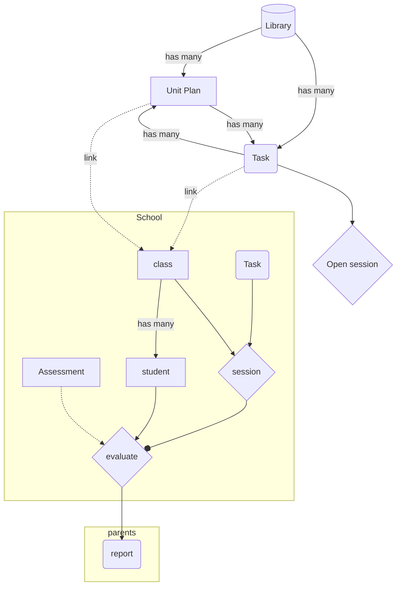

## 大纲

> mermaid文档:
https://github.com/mermaid-js/mermaid/blob/develop/README.zh-CN.md

> 在线编辑器
https://mermaidjs.github.io/mermaid-live-editor/

```mermaid
graph TD
    Lib[(Library)] -->|has many| A
    Lib -->|has many| T
    A[Unit Plan] -->|has many| T(Task)
    T -->|has many| A
    T --> S2{Open session}
    T -.->|link| D
    A -.->|link| D
    subgraph School
        T2(Task) --> S{session}
        S --o E{evaluate}
        D[class] --> S
        M --> E
        D -->|has many| M[student]
        As[Assessment] -.-> E
    end
    subgraph parents
        E --> R(report)
    end
```