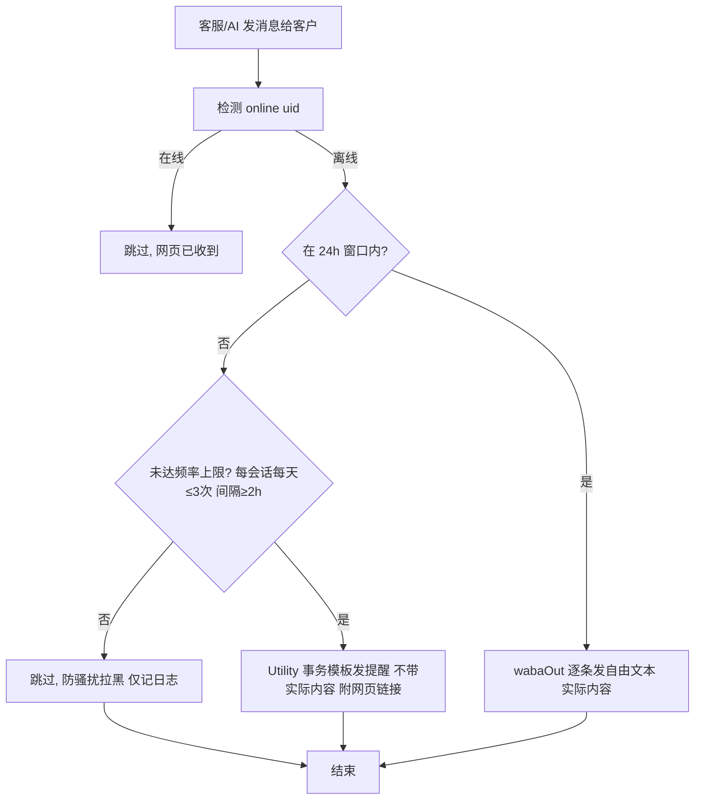
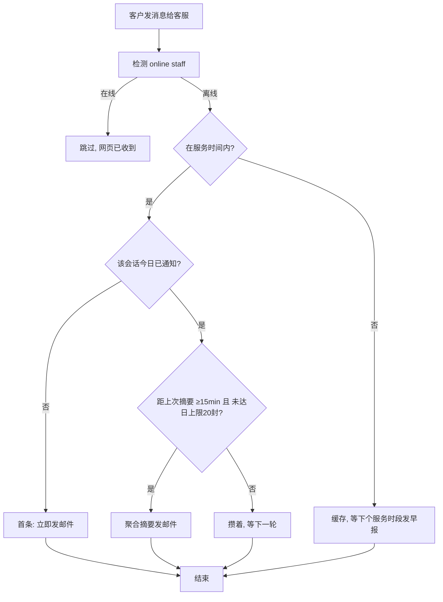
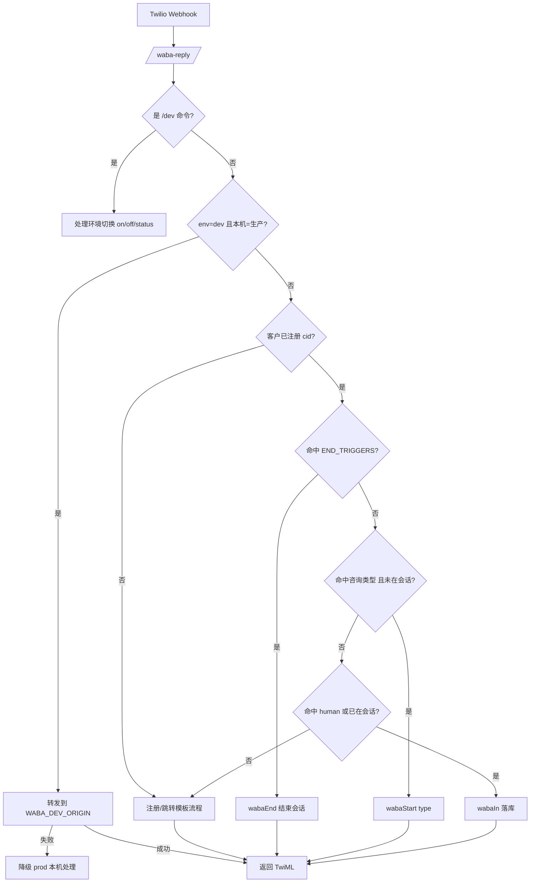
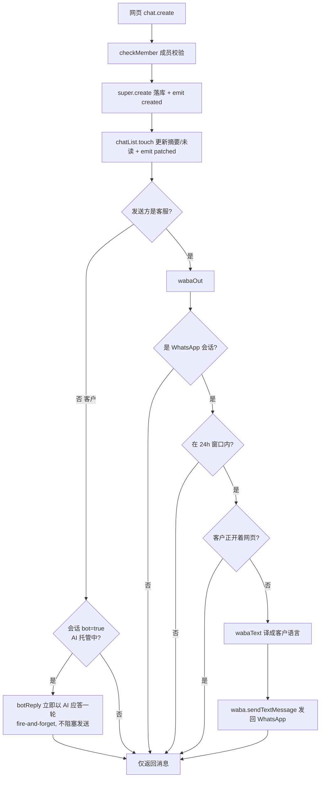
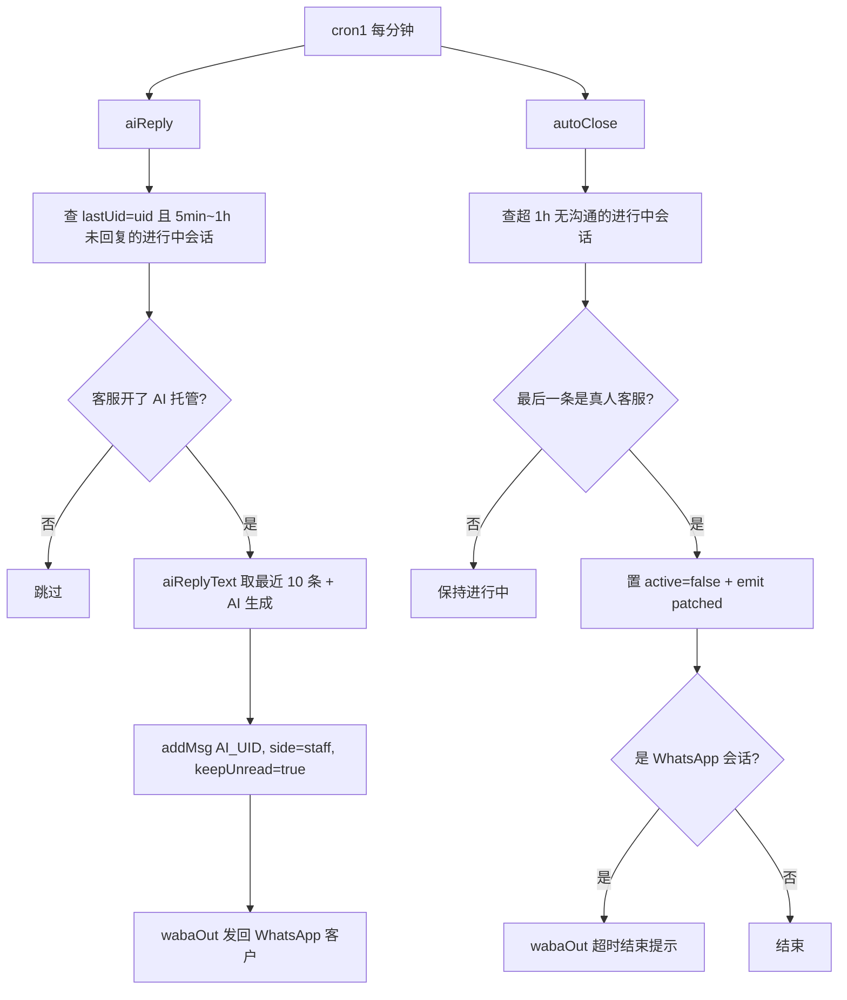
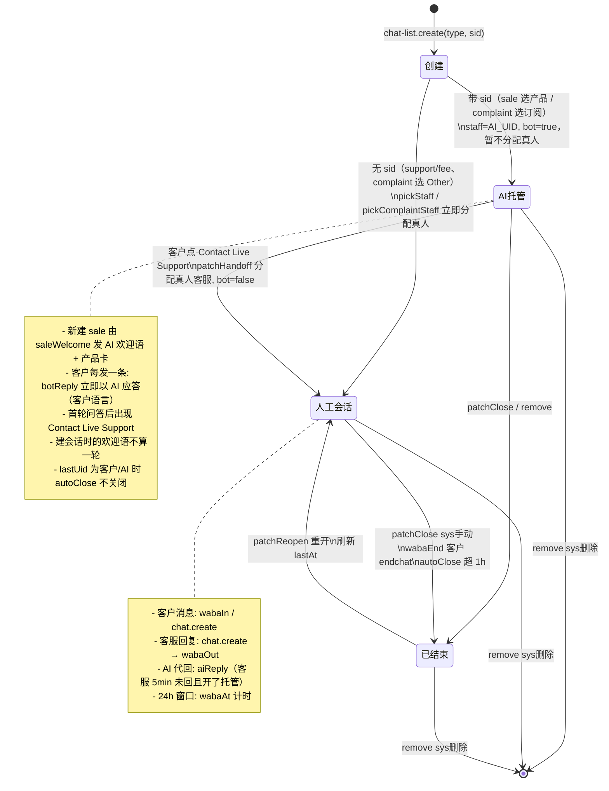
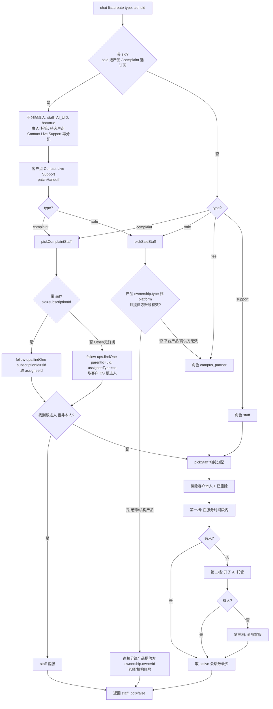

# 客服会话与消息收发逻辑


## 离线消息通知规划（草案）

### 背景与现状

- **客服 → 客户**：`chat.create` / `aiReply` 中已有 `wabaOut`：客户离线（`online(uid)=false`）时把回复发回 WhatsApp。
  - 24h 窗口内：走自由文本，逐条发实际内容。
  - 24h 窗口外：走 Utility 事务模板，**只发提醒通知（如「客服给您发了新消息，点击查看」），不携带实际消息内容**，客户需点链接打开页面才能查看。
  - 频率/次数限制：避免被 WhatsApp 判定为骚扰拉黑。建议每客户每会话每天最多 N 次（如 3 次），两次提醒间隔 ≥ X 小时（如 2h）；超限仅记日志，不再发送。
- **客户 → 客服**：客户消息经 `wabaIn` / `chat.create` 落库后，仅靠网页红点+未读提醒；客服离线时**无任何主动通知**，可能漏看新消息。

> 离线判定复用 `chat-list.online(uid)`；服务时间复用 `inServiceHours`；定时调度挂在每分钟 `cron1`。


### 离线通知流程图 — 客户侧（WhatsApp）



### 离线通知流程图 — 客服侧（邮件）



### 4. 待确认点

1. `email` 服务是否已注册？是否已有邮件模板？
2. 客服邮箱取自 `users.email` 还是 `StaffSetting.notifyEmail`？
3. 聚合窗口（15min？）与每日上限（20 封？）的具体数值。
4. 非服务时间「早报」机制是否需要。
5. Utility 事务模板用哪个 `contentSid`？是否已在 `WHATSAPP_TEMPLATES` 注册？（现有 `user_account_routing_utility` 是已注册的 Utility 模板）
6. 窗口外 Utility 提醒的频率上限具体数值（每天 3 次、间隔 2h 是否合适）？


## 流程图（Mermaid）

### 1. WhatsApp 客户消息入站



### 2. 网页端发送 / WhatsApp 出站



### 3. AI 托管与自动关闭（每分钟 cron1）



### 4. 会话生命周期



### 5. 客服分配优先级

> 说明：会话类型固定为 4 种：`sale`（Product Inquiry）、`support`（Usage / Technical Issues）、`fee`（Billing / Payment Issues）、`complaint`（Complaints & Suggestions）。原 `human` 类型已移除（WhatsApp 里「人工客服」关键词归入 `support`）。



- **带 `sid` 的会话默认 AI 托管（bot）**：create 时 `bot = !!sid`。sale 选产品、complaint 选中订阅都带 sid，此时**不立即分配真人客服**，`staff = AI_UID`、`bot = true`；客户在聊天页点「Contact Live Support」触发 `patchHandoff` 才真正分配（complaint 走 `pickComplaintStaff(uid, sid)`、sale 走 `pickSaleStaff(uid, sid)`），分配后置 `bot = false`。不带 sid 的会话（support / fee、complaint 选 Other）在 create 时即按下图立即分配真人客服。
- `complaint` 先走 `pickComplaintStaff(uid, sid)`：选中某条有效订阅时 `sid=subscriptionId`，取该订阅 `follow-ups.assigneeId`；选「Other」或无有效订阅时不带 `sid`，取客户名下 `assigneeType='cs'` 的跟进人；都查不到再回落 `pickStaff('complaint')`（staff 角色均摊）。
- `sale` 走 `pickSaleStaff(uid, sid)`：`sid=subs-plans._id`，按**产品提供方**分配——产品 `ownership.type` 非 platform（老师/机构产品）且 `ownership.ownerId` 账号存在未删除时，直接分给该老师/机构账号；平台产品（Classcipe）或提供方无效时回落 `pickStaff('sale')`（campus_partner 均摊）。注意 sale 的 sid 是产品 id 而非订阅 id，`follow-ups` 无产品维度字段，故不复用 `pickComplaintStaff` 的跟进人查询。
- `sid`（关联业务 id）语义：`sale` 存所选套餐 `subs-plans._id`；`complaint` 存所选订阅 `user-subscriptions._id`。`sid` 同时参与会话去重——sale 的「进行中复用」按所选产品 `sid` 匹配（换产品即新建会话并重新发欢迎消息），complaint 按订阅 `sid` 匹配（无 `sid` 视为一组），避免不同产品/订阅错误复用同一会话。
- **复用已关闭会话时自动重新激活**：create 先查 `active:true` 的进行中会话直接复用；查不到再按 `{uid, staff, type, sid}` 兜底查（含 `active:false` 的已关闭会话）。若命中的是**已关闭**会话，则把它 `active` 置回 `true` **并刷新 `lastAt`**（`lastAt` 是 `autoClose` 的计时依据、也是前端 `isActive` 的判断依据，不刷新会被计划任务立刻再次关闭、页面也会误显「已关闭」），然后 emit `patched` 推送两端并复用——不重复建会话、不重发欢迎语；命中的是进行中会话则直接复用。前端发起入口（ProductInquiry / SupportPage）统一走 store `createSession`，用 create 返回值合并会话缓存，避免跳转后 `getSession` 命中旧的已关闭缓存。


## 网页端发起咨询入口（/lite/support）

家长端首页右下角「客服」按钮进入 Support 页，列出 4 类咨询，点击后按类型分流：

```mermaid
flowchart TD
    A[Support 页选择咨询类型] --> B{type?}
    B -- sale Product Inquiry --> S1[跳转二级页 /lite/support/product-inquiry]
    S1 --> S2[加载可选产品]
    S2 --> S3[平台产品: subs-plans.platformPlans 始终展示\nBy Classcipe]
    S2 --> S4[老师/机构产品: 仅当有 trialing/active 订阅\nuser-subscription planType in teacher_plan/org_plan\nBy 老师名]
    S3 --> S5[选中产品]
    S4 --> S5
    S5 --> S6[点 Confirm: create type=sale sid=subs-plans._id → 进入聊天页]
    S6 --> S7[默认 AI 托管 bot=true, staff=AI_UID\nsaleWelcome 以 AI_UID 自动发欢迎消息\nHi! What would you like to know about 产品名?\n并附带产品卡片 card={kind:product,name,by}]
    B -- support/fee --> D1[直接 create type 无 sid → 立即分配真人 → 进入聊天页]
    B -- complaint --> C1[查有效订阅 user-subscription status in trialing/active]
    C1 --> C2{有有效订阅?}
    C2 -- 否 --> C5[create type=complaint 无 sid\n立即按客户 CS 跟进人分配真人]
    C2 -- 是 --> C3[弹窗 ComplaintSubsDialog 选择相关订阅 或 Other]
    C3 --> C4{选择?}
    C4 -- 选中订阅 --> C6[create type=complaint sid=subscriptionId\n默认 AI 托管 bot=true, 转人工时按该订阅跟进人分配]
    C4 -- Other --> C5
    C6 --> E[进入聊天页]
    C5 --> E
    D1 --> E
    S6 --> E
```

- **AI 托管与转人工（bot / Contact Live Support）**：所有**带 `sid`** 的会话（Product Inquiry 选产品、Complaints 选中订阅）创建时 `bot=true`、`staff=AI_UID`，**不分配真人客服**，统一先由 AI 接管：
  - sale 新会话由 `saleWelcome` 以 AI 身份发欢迎消息（带产品卡片）；
  - 之后客户每发一条消息，`chat.create` 内 fire-and-forget 触发 [`botReply`](../../learn-api/src/services/chat-list/chat-list.class.ts)，立即以 AI 身份按客户语言应答一轮（区别于人工会话的 `aiReply`——那是客服 5 分钟未回且开了托管才代回）；
  - `botReply` 每次 AI 应答客户时，若会话尚未标记则置 `botRound=true`（欢迎语由 `saleWelcome` 发送、不经此方法，故**建会话时的欢迎语不算一轮**），并 emit `patched` 推给两端；
  - 前端聊天页 [ChatPage.vue](../../../web/src/pages/lite/ChatPage.vue) 在输入区上方显示「Contact Live Support」按钮，条件 `showHandoff`：`session.bot && session.botRound`，且当前是客户本人（`side==='uid'` 且 `uid===当前用户`）、非只读。用服务端 `botRound` 标记而非扫描本地消息，避免消息分页窗口（每次仅拉最新 10 条）导致长会话下判断失真；
  - 客户点击 → store `handoff(rid)` → `chat-list.patch('handoff')` → [`patchHandoff`](../../learn-api/src/services/chat-list/chat-list.class.ts)：仅客户本人可调用，按类型分配真人客服（complaint 走 `pickComplaintStaff(uid, sid)`、sale 走 `pickSaleStaff(uid, sid)` 分给产品提供方老师/机构，其余走 `pickStaff`），置 `bot=false` 并 emit `patched`；按钮随 `bot=false` 消失，真人客服经会话推送在自己列表看到该会话。
- **Product Inquiry（sale）**：二级页 [ProductInquiry.vue](../../../web/src/pages/lite/home/ProductInquiry.vue) 用 `subs-plans.get('platformPlans')` 取平台产品；用 `user-subscription.find({planType:['teacher_plan','org_plan'], status:['trialing','active']})` 取已订阅的老师/机构产品（按 planId 去重）。选中产品后点底部 Confirm，`create({type:'sale', sid:产品id})` 建会话（默认 AI 托管）并进入聊天页。服务端对**新建**的 sale 会话调用 `saleWelcome`：以 AI 身份（`AI_UID`，客服侧）自动发一条欢迎消息「Hi! What would you like to know about 〈产品名〉?」，并在消息的 `card` 字段附带产品卡片 `{kind:'product', id, name, by}`（`by`：平台产品为 Classcipe，老师/机构产品取其 nickname/name，由 `subs-plans.ownership` 关联 users 得到）；聊天页在欢迎气泡内把 `card` 渲染成描边产品卡（产品名 + By 提供方）。复用已有会话时不重复发。
- **Complaints & Suggestions（complaint）**：独立弹窗组件 [ComplaintSubsDialog.vue](../../../web/src/pages/lite/home/ComplaintSubsDialog.vue)（网页内弹出，非聊天界面）。有 `trialing/active` 订阅时列出各订阅（产品名 / By Classcipe 或老师名 / 学生头像+姓名）并附「Other」项；无有效订阅则不弹窗直接建会话。**选中订阅**带 `sid=subscriptionId` → 默认 AI 托管，转人工时按该订阅跟进人分配；**选 Other / 无订阅**不带 `sid` → 创建即按客户 CS 跟进人立即分配真人客服（见上图 `pickComplaintStaff`）。
- **support / fee**：直接 `create({type})` 建会话进入聊天页，不带 sid → 创建即由 `pickStaff` 按角色均摊立即分配真人（support→staff，fee→campus_partner）。

