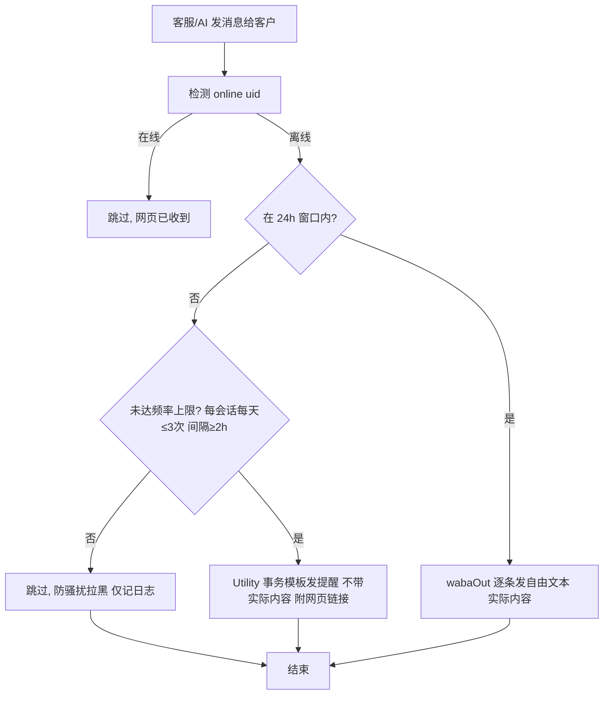
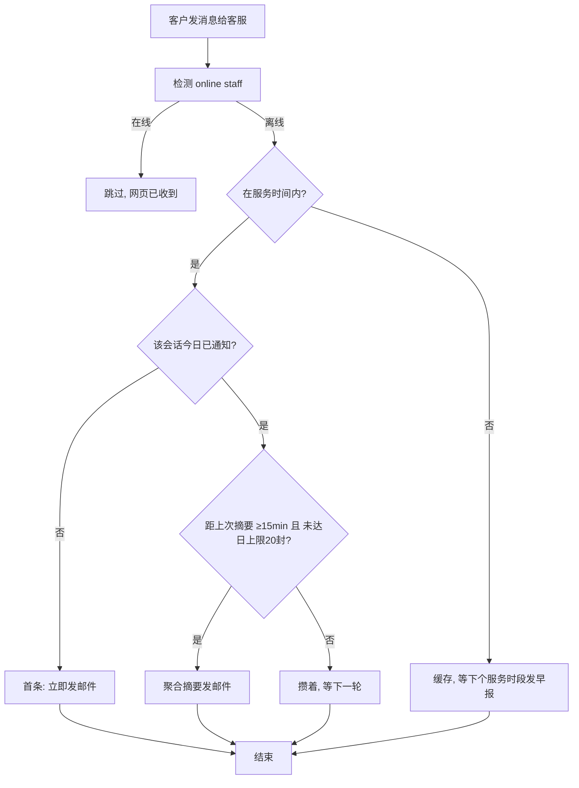
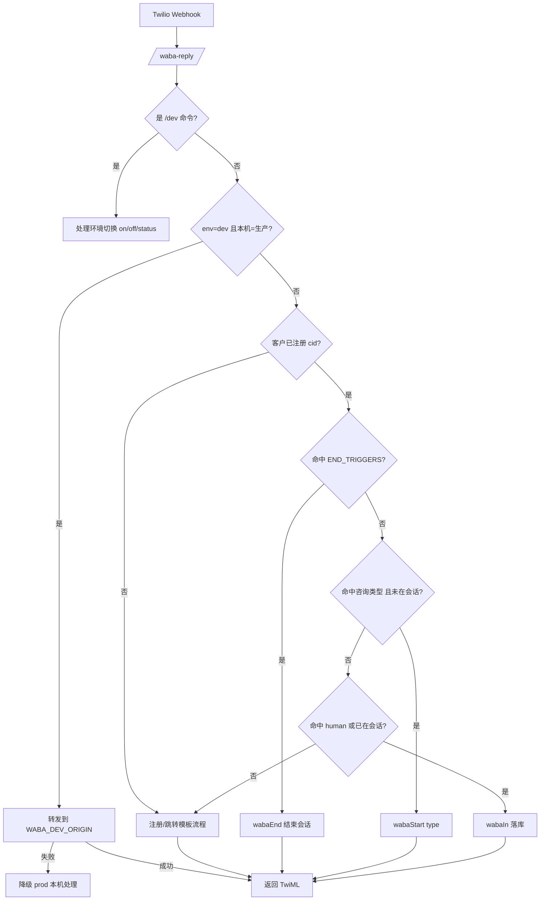
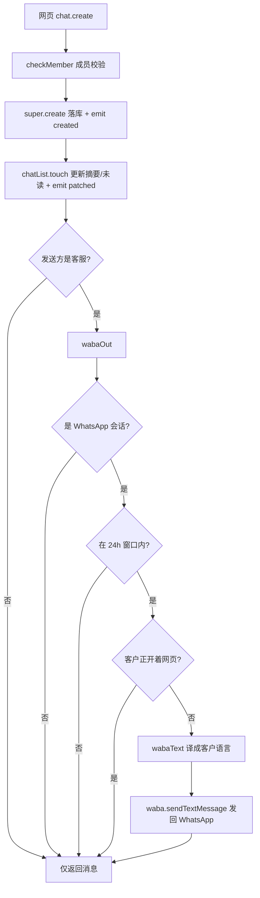
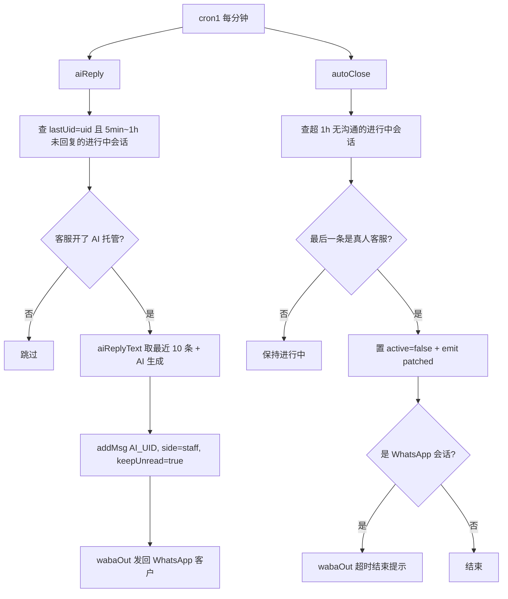
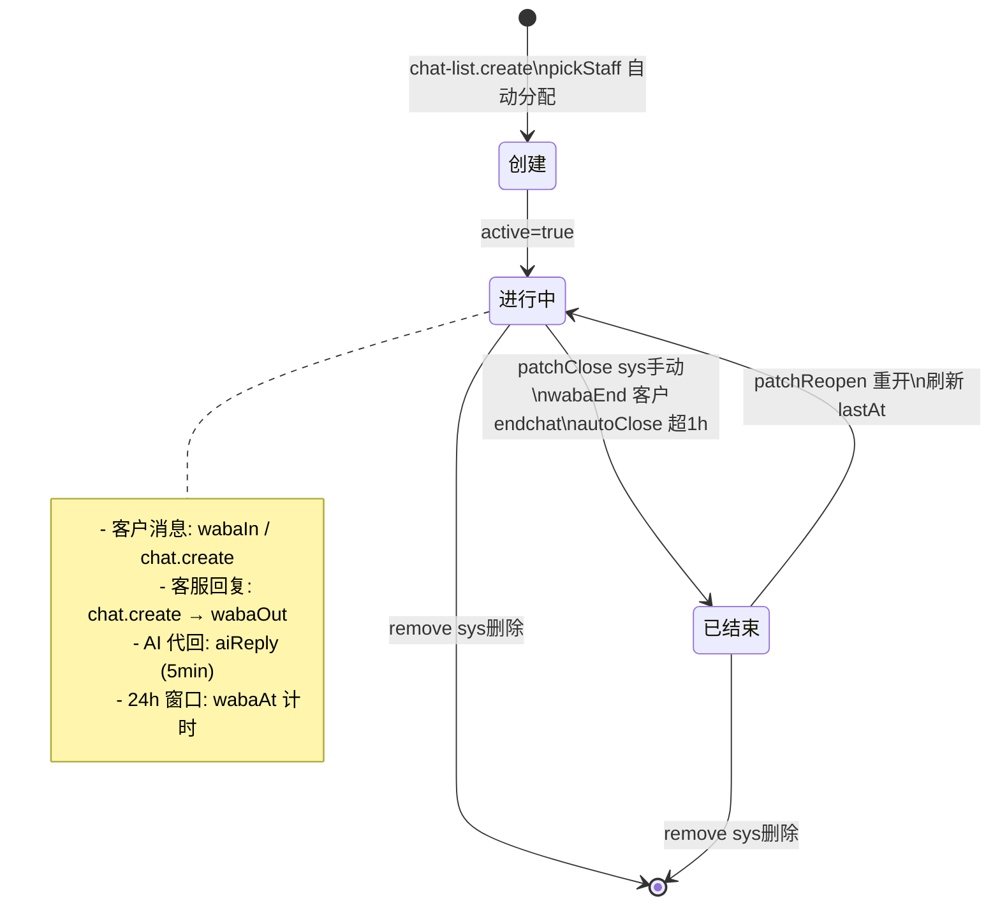
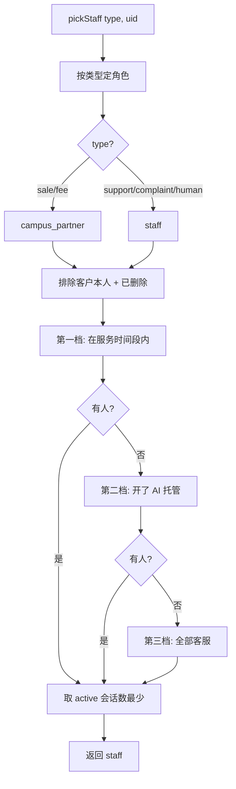

# 客服会话与消息收发逻辑

## 离线消息通知规划（草案）

### 背景与现状

- **客服 → 客户**：`chat.create` / `aiReply` 中已有 `wabaOut`：客户离线（`online(uid)=false`）时把回复发回 WhatsApp。
  - 24h 窗口内：走自由文本，逐条发实际内容。
  - 24h 窗口外：走 Utility 事务模板，**只发提醒通知（如「客服给您发了新消息，点击查看」），不携带实际消息内容**，客户需点链接打开页面才能查看。
  - 频率/次数限制：避免被 WhatsApp 判定为骚扰拉黑。建议每客户每会话每天最多 N 次（如 3 次），两次提醒间隔 ≥ X 小时（如 2h）；超限仅记日志，不再发送。
- **客户 → 客服**：客户消息经 `wabaIn` / `chat.create` 落库后，仅靠网页红点+未读提醒；客服离线时**无任何主动通知**，可能漏看新消息。

> 离线判定复用 `chat-list.online(uid)`；服务时间复用 `inServiceHours`；定时调度挂在每分钟 `cron1`。

### 离线通知流程图 — 客户侧（WhatsApp）

### 离线通知流程图 — 客服侧（邮件）

### 4. 待确认点

1. `email` 服务是否已注册？是否已有邮件模板？
2. 客服邮箱取自 `users.email` 还是 `StaffSetting.notifyEmail`？
3. 聚合窗口（15min？）与每日上限（20 封？）的具体数值。
4. 非服务时间「早报」机制是否需要。
5. Utility 事务模板用哪个 `contentSid`？是否已在 `WHATSAPP_TEMPLATES` 注册？（现有 `user_account_routing_utility` 是已注册的 Utility 模板）
6. 窗口外 Utility 提醒的频率上限具体数值（每天 3 次、间隔 2h 是否合适）？

## 流程图（Mermaid）

### 1. WhatsApp 客户消息入站

### 2. 网页端发送 / WhatsApp 出站

### 3. AI 托管与自动关闭（每分钟 cron1）

### 4. 会话生命周期

### 5. 客服分配优先级

