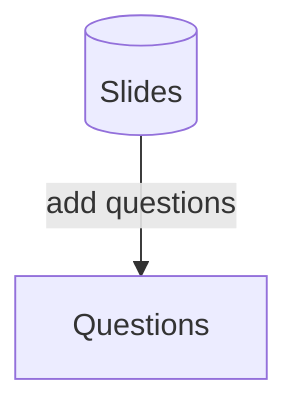

### takeaway



## Rooms

### Rooms model

```js
sid: String, // class_id
members: [{ // 进入过课堂的学生列表
  _id: String, // user._id
  nickname: String,
  avatar: String,
  email: String,
  group: String, // rooms.groups._id
  feel: String, // After class feeling, on room closed
  last: Date
}],
groups: [{
  name: String, // 组名
}],
groupMax: Number, // 最大组员
attend: [String], // 出勤
block: [String], // 黑名单
teachers: [{ // 进入过课堂的老师列表
  _id: String, // user._id
  nickname: String,
  avatar: String,
  email: String,
  last: Date
}],
```

### Rooms API

> 通过课堂短 sid 查询 room

```js
// get rooms
const doc = await App.service("rooms").get("rooms._id or session.sid");
```

#### students join room only once

```js
const doc = await App.service("rooms").patch("joinRoom", { _id: "rooms._id" });
```

#### 老师加入课堂 only once

```js
const doc = await App.service("rooms").patch("joinRoomTeacher", {
  _id: "rooms._id",
});
```

### 学生/老师 上线离线接口

```js
// 通过学生端进入课堂，与用户的role无关，只需要初始化调用一次，除非websocket重连
App.service("auth").patch(null, {
  on: "connect",
  from: "login",
  role: "student",
  _sid: session.sid,
});
// 通过老师端进入课堂，与用户的role无关，只需要初始化调用一次，除非websocket重连
App.service("auth").patch(null, {
  on: "connect",
  from: "login",
  role: "teacher",
  _sid: session.sid,
});

// 监听课堂用户连接
App.service("auth").on("patched", (rs) => {
  const { on, role, user, from, _sid, __sid } = rs;
  // _sid = session.sid
  // __sid = websocket连接的唯一id，每次建立连接都会变化
  if (on === "connect") {
    // 课堂用户连接事件
    if (role === "teacher") {
      // 老师端连接
      // 是用 user 维护老师数据列表
    } else {
      // 学生端连接
      // 是用 user 维护学生数据列表
    }
  } else if (on === "disconnect") {
    // 课堂用户离线事件，websokcet连接结束的时候会自动触发
    if (role === "teacher") {
      // 老师端离线
      // 是用 user 维护老师数据列表
    } else {
      // 学生端离线
      // 是用 user 维护学生数据列表
    }
  }
});
```

#### block/attend student

```js
// block students
const doc = await App.service('rooms').patch(doc._id, {$addToSet: {block: 'user._id'}})
// unblock students
const doc = await App.service('rooms').patch(doc._id, {$pull: {block: 'user._id'}})
// attend students
const doc = await App.service('rooms').patch(doc._id, {$addToSet: {attend: 'user._id'}})
// un attend students
const doc = await App.service('rooms').patch(doc._id, {$pull: {attend: 'user._id'}})


// batch block students
const doc = await App.service('rooms').patch(doc._id, {block: [...]})
```

### self-study countdown mode counter

```js
// start countdown for student, return start time
const sec = await App.service("rooms").patch("countdownStart", { sid });
// get countdown for student, return start time
const sec = await App.service("rooms").get("countdownStart", {
  query: { sid },
});

// get countdown list for teacher
const list = await App.service("rooms").get("countdownList", {
  query: { sid },
});
// list = {[user._id]: startTime, ....}

// get self counter for student
// const sec = await App.service('rooms').get('counter', {query: {sid}})
// patch counter, patch every 10 seconds for student
// const sec = await App.service('rooms').patch('counter', {sid, sec: 10})
// get counter all members sec for teacher
// const list = await App.service('rooms').get('counterAll', {query: {sid}})
// list = {[user._id]: sec, ....}
```

### find rooms status count

1、通过列表接口获取报名人数（workshop 类取 regNum，班级 session 取 students 数量）  
2、其他统计通过以下接口获取 锁屏人数: block，实际进入课堂人数：members（通过链接实际人数）

```js
await App.service('rooms').get('countStatus', {query: {sid: {$in: [sid, ...]}}})
```

### save teacher draw by pageid

```js
// get draw doc by pageId
const doc = {
  _id, sid, pageId, ppt: {...}, blank: {...}
} = await App.service('session-draw').get('byPageId', {query: {sid: session.sid, pageId: session.pages._id}})

// ppt draw save
await App.service('session-draw').patch(doc._id, {ppt: {...}})

// blank draw save
await App.service('session-draw').patch(doc._id, {blank: {...}})
```

## response model

```js
sid: String, // session.sid
uid: String, // user._id
nickname: String,
page: String, // page_id
type: String, // question.type
teacherSharing: Boolean, // 由老师替学生上传的答案, 不可修改
content: String,
answer: [String], // for radio, checkbox
locked: Boolean, // for radio, checkbox
point: Mixed, // comment point
json: Mixed, // draw json comment.task = { id, cover, name }
```

### response api

> Get  
> `App.service('response').get(_id)`

> create

```js
App.service('response').create({
  sid: '', // session.sid
  page: '', // page_id
  type: '', // question.type
  content: '', // text or url
  answer?: [], // for radio, checkbox, choice data
  locked?: false, // for radio, checkbox, Boolean
  point?: {}, // for comment, json
  json?: {} // draw json
})
```

> patch  
> `App.service('response').patch(_id, {content: '',...})`

> remove  
> `App.service('response').remove(_id)`


## comments model
```js
sid: {type: String}, // session.sid
rid: {type: String, required: true}, // response._id
page: {type: String, required: true}, // session.page_id
// receiver
to: {type: String, required: true}, // receiver user._id
receiver: {type: String, required: true}, // receiver user.nickname
otype: {type: String, required: true}, // original type
otext: {type: String, trim: true}, // original text
// sender
from: {type: String, required: true}, // sender user._id
sender: {type: String, required: true}, // sender user.nickname
review: {type: String, required: true},
point: {type: Schema.Types.Mixed},
read: {type: Boolean, default: false}, // read status
```

### 标记为已读
> `App.service('comments').patch(_id, {read: true})`

### 删除评论
> `App.service('comments').remove(_id)`
