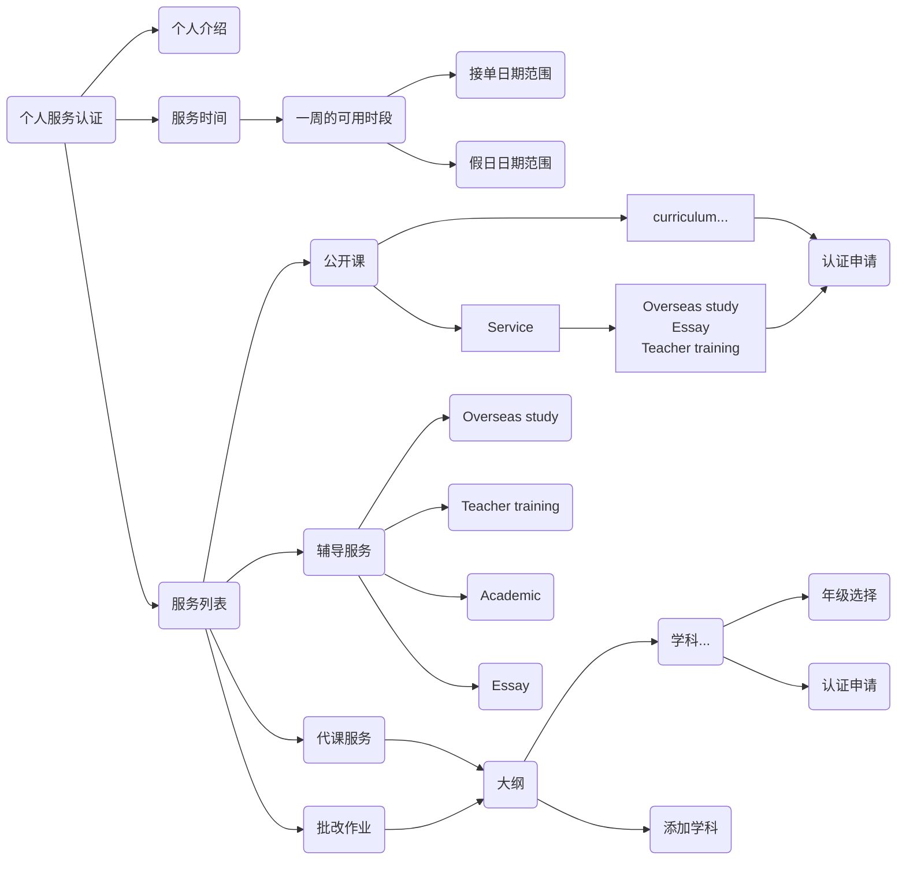

## Service

```mermaid
graph LR
    T(个人服务认证) --> P(个人介绍)
    T --> S(服务时间)
    S --> S1(一周的可用时段)
    S1 --> S2(接单日期范围)
    S1 --> S3(假日日期范围)
    T --> C(服务列表)
    C --> W(公开课)
    W --> W1[curriculum...]
    W1 --> W11(认证申请)
    W --> W2[Service]
    W2 --> W3[Overseas study<br>Essay<br>Teacher training]
    W3 --> W11(认证申请)
    C --> C2(批改作业)
    C --> C3(代课服务)
    C3 --> C20(大纲)
    C2 --> C20(大纲)
    C20 --> C21(学科...)
    C21 --> C212(年级选择)
    C21 --> C211(认证申请)
    C20 --> C22(添加学科)
    C --> C4(辅导服务)
    C4 --> C41(Overseas study)
    C4 --> C42(Teacher training)
    C4 --> C43(Academic)
    C4 --> C44(Essay)
```
