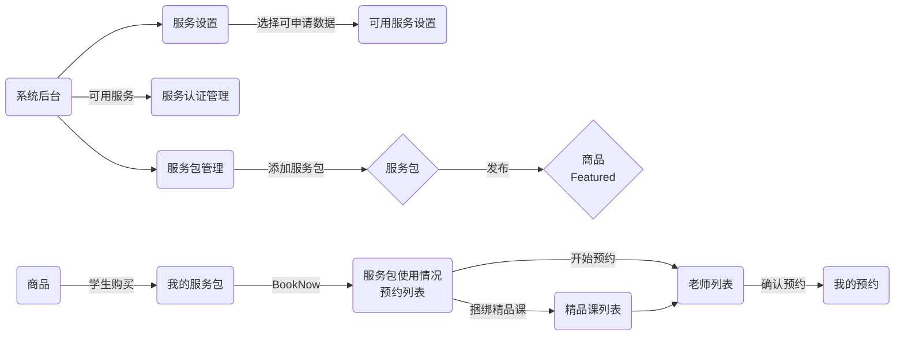
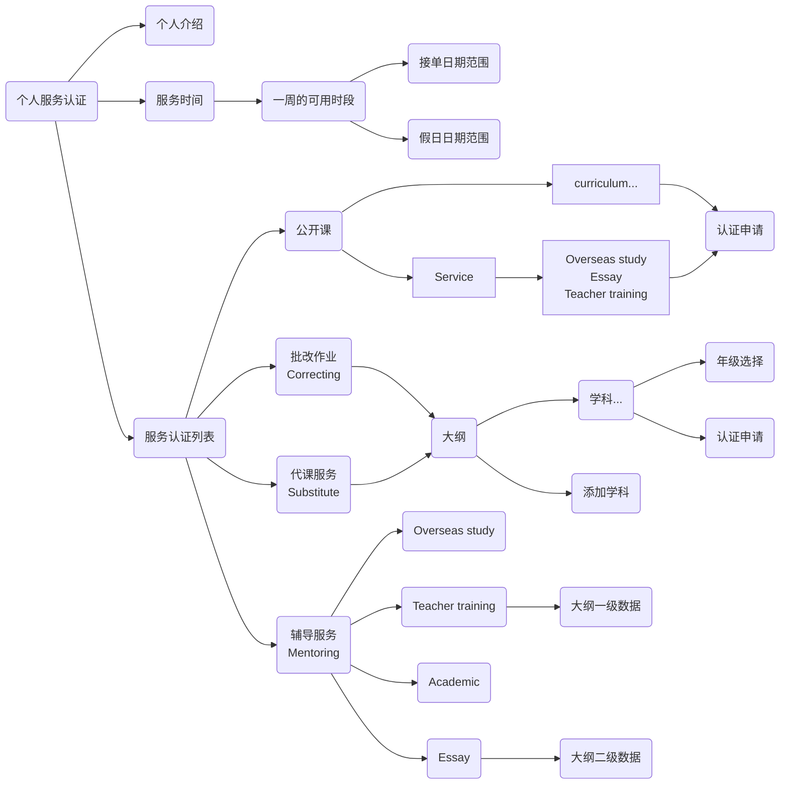

## Service

### 服务整体关系



### 服务认证申请



## 服务设置

```js
// 获取
await App.service("conf").get(`Service:${type}:${mentoringType}`).catch(e => {
  if (e.code === 404) return await App.service("conf").create({_id: `Service:${type}:${mentoringType}`, val: {}})
})
// 更新
await App.service("conf").patch(`Service:${type}:${mentoringType}`, {
  val: {
    desc: '', // 申请描述
    countryCode: [], // 国家代码
    curriculum: [{
      code: '', // 大纲代码
      subject: [], // 学科
    }],
    ...
  }
});
```

## 服务认证

### Enum

```js
ServiceType: ['workshop', 'teaching', 'mentoring', 'substitute', 'correcting'],
MentoringType: ['essay', 'academic', 'overseasStudy', 'teacherTraining'], // professionalDevelopment, subject
```

### service-auth model

```js
uid: {type: String, required: true},
type: {type: String, required: true, enum: Agl.ServiceType}, // 服务类型
mentoringType: {type: String, enum: Agl.MentoringType}, // 辅导类型
countryCode: {type: String, trim: true}, // 国家代码
curriculum: {type: String, trim: true},
subject: {type: String, trim: true},
gradeGroup: {type: [String], trim: true}, // 年级组
grades: {type: [String], trim: true}, // 实际年级
status: {type: Number, default: 0}, // 0: 未申请, 1:申请中, 2: 通过, -1: 拒绝
attachments: [{ // 附件
  filename: {type: String, trim: true}, // 文件名
  mime: {type: String, trim: true}, // 文件 MIME
  hash: {type: String, trim: true}, // 文件SHA1, files._id
}],
reason: {type: String, trim: true}, // 原因
```

### 服务认证接口

```js
// 服务认证列表
await App.service("service-auth").find({});
// 已认证列表
await App.service("service-auth").find({ query: { status: 2 } });
// 提交申请
await App.service("service-auth").patch(doc._id, { status: 1 });
// 审批申请
await App.service("service-auth").patch(doc._id, {
  status: 2 / -1,
  reason: "",
});
```

## 用户服务配置

### service-conf model

```js
introduction: {type: String, trim: true}, // 自我介绍
audio: {type: String, trim: true}, // 音频文件 hash files._id
audioTime: {type: Number}, // 音频时长（秒）
hours: {type: [[Date, Date], ...], required: true}, // 一周服务可用时间段, [[start, end], [Date, Date], ...]
validDate: {type: [[Date, Date], ...], required: true}, // 有效日期, 当前用户的一天的开始时间, 格式: [[start, end], [Date, Date], ...]
holiday: {type: [[Date, Date], ...], required: true}, // 假日日期, 格式: [[start, end], [Date, Date], ...]
enable: {type: Schema.Types.Mixed}, // 服务启用状态, {[`${type}${mentoringType}`]: true, ...}
```

### 用户服务配置接口

```js
// 获取用户的服务配置
const doc = await App.service("service-conf").get(pub.user._id).catch(async (e) => {
  if(e.code === 404) return await App.service("service-conf").create({_id: pub.user._id, hours: []})
})
// 设置一周服务可用时间, 格式
await App.service("service-conf").patch(pub.user._id, {hours: [[start, end], ['2024-01-18T05:00:00.000Z', '2024-01-18T12:00:00.000Z'], ...]})
// 设置假日日期, 当前用户的一天的开始时间
await App.service("service-conf").patch(pub.user._id, {holiday:  [[start, end], ['2024-01-18T05:00:00.000Z', '2024-01-18T12:00:00.000Z'], ...]})
// 设置有效日期
await App.service("service-conf").patch(pub.user._id, {validDate:  [[start, end], ['2024-01-18T05:00:00.000Z', '2024-01-18T12:00:00.000Z'], ...]})

// 启用服务
await App.service("service-conf").patch(pub.user._id, {[`enable.${type}${mentoringType}`]: true]})
// 禁用服务
await App.service("service-conf").patch(pub.user._id, {[`enable.${type}${mentoringType}`]: false]})
```

## 服务包

### service-pack model

```js
name: {type: String, trim: true}, // 服务包名称
cover: {type: String, trim: true}, // files._id
coverName: {type: String, trim: true}, // 图片名称
points: {type: [String], trim: true}, // selling points
type: {type: String, required: true, enum: Agl.ServiceType}, // 服务类型
mentoringType: {type: String, enum: Agl.MentoringType}, // 辅导类型
countryCode: {type: String, trim: true}, // 国家代码
curriculum: {type: String, trim: true},
subject: {type: String, trim: true},
gradeGroup: {type: [String], trim: true}, // 年级组
price: {type: Number, trim: true}, // 单次价格 *100，cc，美分
discount: [{
  count: {type: Number}, // 数量
  discount: {type: Number}, // 折扣 %
}],
freq: {type: Number, enum: [7, 14, 30, 120]}, // 每张的可用多少天
duration: {type: Number}, // session duration
break: {type: Number}, // session break
status: {type: Boolean, default: false}, // 发布状态
count: { // 统计
  sold: {type: Number}, // 已售
  valid: {type: Number}, // 有效数量
},
```

### 服务包接口

```js
// 统计认证老师数量
await App.service("service-auth").get("stats", { query: { type, mentoringType? } });
// 发布服务
await App.service("service-pack").patch(doc._id, { status: true });
// 下架服务
await App.service("service-pack").patch(doc._id, { status: false });
```

## 用户购买的服务包

### service-pack-user model

```js
price: {type: Number, default: 0}, // 订单金额
total: {type: Number, default: 0}, // 总次数
used: {type: Number, default: 0}, // 已经使用
expired: [{type: Date, default: 0}], // 过期列表
order: {type: String, required: true}, // 关联 order._id
session: {type: String}, // 关联 session._id
snapshot: {type: Schema.Types.Mixed, required: true}, // service-pack 快照
status: {type: Boolean, default: true},
```

### 支付完成创建用户的服务包

```js

```
