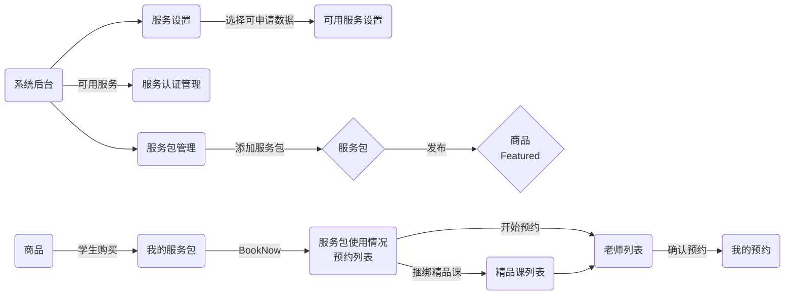
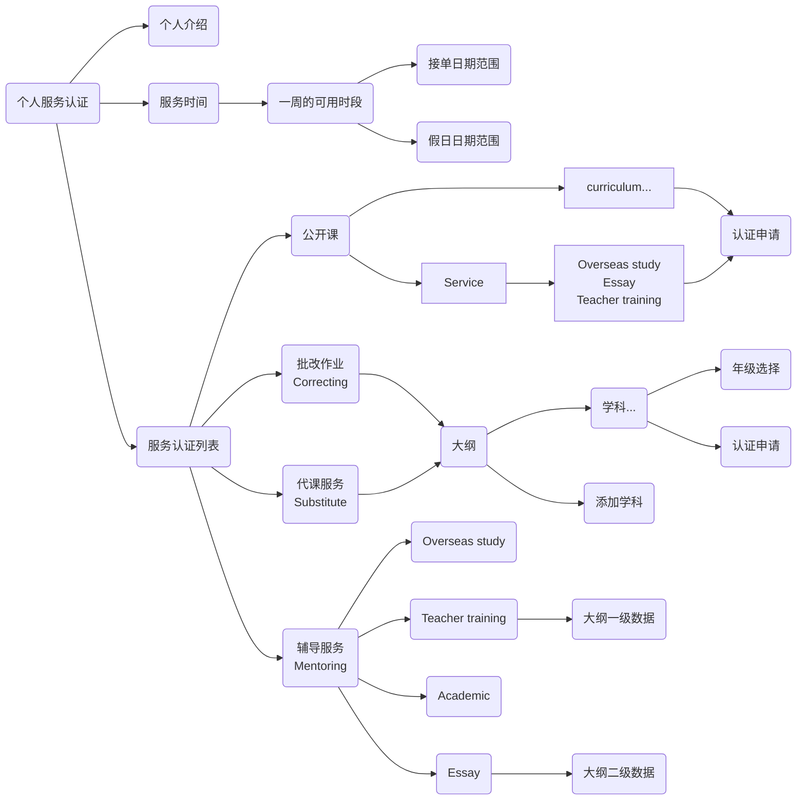
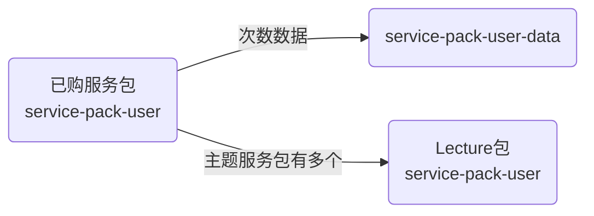
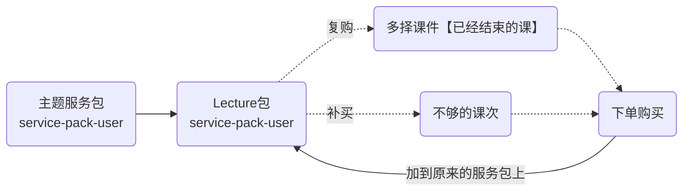
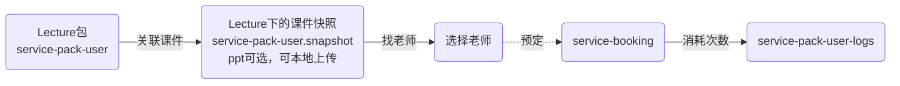

## Service

### 服务整体关系



### 服务认证申请



### 用户服务包



> Lecture 包补买



> Lecture 包预约



## 服务设置

### 服务设置接口

```js
// 批量获取
const [...] = await App.service('conf').get(`Service:${type}:.*`)

// 获取
await App.service("conf").get(`Service:${type}:${mentoringType}`).catch(e => {
  if (e.code === 404) return await App.service("conf").create({_id: `Service:${type}:${mentoringType}`, val: {}})
})
// 更新
await App.service("conf").patch(`Service:${type}:${mentoringType}`, {
  val: {
    desc: '', // 申请描述
    countryCode: [], // 国家代码
    curriculum: [{
      code: '', // 大纲代码
      subject: [], // 学科
    }],
    topic: [{
      _id: '',
      label: ['level 1', 'level 2', ...]
    }, ...],
    attachmentType: ['', ...], // 前端固定，附件类型, 用于 service-auth.attachments.type
    hourRate: [{ // 小时工资
      price: '1500',
      value: ['xxx', ...], // 二级数据（学科/topic）
      default: true, // 是否默认
      qualification: '', // 资质
      curriculum?: '', // 大纲
      topic?: ''
    }]
  }
});
// 精品课认证设置更新
await App.service("conf").patch(`Service:${type}`, {
  val: {
    '服务类型': {
      desc: '', // 申请描述
    }
  }
}
```

## 服务认证

### Enum

```js
ServiceRoles: ['mentoring', 'substitute', 'correcting', 'consultant', 'onCampus', 'contentContributor'],
ServiceType: ['workshop', 'content', 'teaching', 'mentoring', 'correcting', 'substituteAcademic', 'substituteService'],
MentoringType: [
  'essay',
  'academic',
  'overseasStudy',
  'teacherTraining',
  'teacherTrainingSubject',
  'steam',
  'academicPlanning',
  'personalStatement',
  'interest',
],
ConsultantType: ['carer', 'interview', 'interviewTeacher'], // 顾问类型
ServicePackUserType: ['order', 'booking', 'cancel', 'timeout', 'expired', 'refund', 'teachingAccident', 'gift', 'point', 'cash'],
ServicePackVideoType: ['AcademicValue', 'Features', 'QA'],
ServiceSalesTarget: ['personal', 'school'],

```

### 老师发布公开课捆绑服务包

```js
await App.service("serssion").create({
  ...,
  premium: true/false, // 是否为精品公开课
  promotion: true/false, // 是否为推广课
  servicePack: {
    _id: '', // service-pack._id 服务包的id
    times, // live直播课的数量
    price, // 美分，服务包价格 = service-pack.discount 折扣 * live直播课的数量
  },
});
```

### service-pack-user-logs model

```js
packUser: {type: String, required: true}, // 关联购买的服务包 service-pack-user._id
times: {type: Number, required: true}, // 增减次数, 分钟数(代课服务)
compensation: {type: Number}, // 分钟数(代课服务 补贴时长)
type: {type: String, enum: Agl.ServicePackUserType}, // 变化类型
remaining: {type: Number}, // 剩余次数
expireSoon: {type: Date}, // 新的有效期
start: {type: Date}, // booking start
name: {type: String}, // session.name
servicer: {
  uid: {type: String}, // users._id
  avatar: {type: String}, // users.avatar
  name: {type: [String]}, // users.name
},
packUserData: [
  {
    _id: {type: String, required: true}, // 关联购买的服务包次数 service-pack-user-data._id
    payMethod: {type: String, trim: true}, // 支付方式
    order: {type: String, trim: true}, // order
    expired: {type: Date}, // 过期
  },
],
session: {type: String}, // session._id
packUserSnapshot: {type: Schema.Types.Mixed}, // service-pack-user 快照
```

### 支付完成创建用户的服务包

> 后端接口内部调用

```js
// 首次创建购买的服务包
await this.service("service-pack-user").buyByOrder({
  packId, // service-pack._id
  order, // order._id
  session?, // session._id 捆绑购买的session
  total: 10, // 购买的分钟数，代课服务需要传
  price, // 服务包支付的实际价格
  gift, // 是否赠送的服务包
});

// 对已经购买的服务包 消耗次数
await this.service("service-pack-user-data").used({
  packUser, // service-pack-user._id
  type, // 日志类型
  times, // 次数
  order?, // 关联 order 消耗
  servicer?, oldSession?, start?
});
// 对已经购买的服务包 增加次数
await this.service("service-pack-user-data").add({
  packUser, // service-pack-user._id
  packUserData?,
  packUserTasks?, // Lecture包复购的课件id数组, 预定取消/复购/补买调用
  type, // 日志类型
  times, // 次数
  gift?, // 是否赠送的服务包
  isNew?, // 首次创建服务包的时候增加次数
  order?, // 关联 order
  servicer?, oldSession?, start?
});
```

### 主题服务包购买后的处理逻辑

```js
// 创建主题服务包及Lecture包
const {..., childs} = await this.service("service-pack-user").buyByOrder(...)
// 批量对Lecture包增加服务次数数据
for(const o of childs) {
  await this.service("service-pack-user-data").add({...})
}
```

### 代课服务包

```js
// 增加分钟数
await this.service("service-pack-user-data").addSubstitute({...})
// 消耗分钟数
await this.service("service-pack-user-data").usedSubstitute({...})
```

### 服务包使用记录

```js
// 根据服务包id, 查询使用记录
await App.service("service-pack-user-logs").find({
  query: { packUser: packUser._id },
});
```

#### 老师对预约进行排课

```js
// 走创建课程流程, 带上预订的 service-booking._id
await App.service("session").create({
  ...,
  booking, // service-booking._id 学生预订的id
});
```

#### 老师取消课程

```js
// - 从 session 中点击取消，删除 session 本身
await App.service("session").remove(sessionId);
```

## 用户评价数据

### service-rating model

```js
session: {type: String}, // session._id
booking: {type: String}, // service-booking._id
servicer: {type: String, required: true}, // 老师
booker: {type: String, required: true}, // 学生
feel: {type: Boolean, required: true}, // 是否满意
tags: {type: [String], trim: true}, // 标签
message: {type: String, required: true}, // 留言
```

### 评价接口

```js
// 创建评价
await App.service("service-rating").create({
  session: "session._id",
  booking: "service-booking._id",
  servicer: "servicer._id",
  feel: true/false,
  tags: [...],
  message: '...',
});

// 更新评价
await App.service("service-rating").patch({
  tags: [...],
  message: '...',
});

// 老师的标签统计数据
await App.service("service-rating").get("tagsCount", {
  query: { servicer: users._id },
});
// 老师的所有评价数据
await App.service("service-rating").find({
  query: { servicer: users._id },
});
// 通过预订id获取评价数据
await App.service("service-rating").find({
  query: { booking: "service-booking._id" },
});
// 通过session获取评价数据
await App.service("service-rating").find({
  query: { session: "session._id" },
});
```

## 服务者粉丝

### service-fans model

```js
_id: {type: ObjectID}, // 用户 user._id
servicer: {type: [String], required: true}, // 服务者
```

### 粉丝接口

```js
// 我关注的老师数据
await App.service("service-fans").get(pub.user._id);
// 关注老师
await App.service("service-fans").patch(pub.user._id, {
  $addToSet: { servicer: "user._id" },
});
// 取消关注
await App.service("service-fans").patch(pub.user._id, {
  $pull: { servicer: "user._id" },
});
```

## Example

```js
// service-pack create > publish > buy
var doc = await App.service("service-pack").create({
  name: Date.now().toString(32),
  points: ["test points", "test points2"],
  type: "mentoring",
  mentoringType: "academic",
  curriculum: "au",
  subject: ["64d99bcc0476f7faf45ef0d8"],
  gradeGroup: ["Intermediate"],
  price: 1000,
  discount: [{ count: 10, discount: 90 }],
  freq: 7,
  duration: 30,
  break: 10,
});
await App.service("service-pack").patch(doc._id, { status: true });
// buy in api
var packUser = await App.service("service-pack-user").get("buyByOrder", {
  query: {
    packId: "65b47af5a70318050560dc25",
    order: "65b45c361e0529e3d990cc19",
    total: 10,
  },
});

// teacher auth, create > apply
var confDoc = await App.service("service-conf")
  .get(pub.user._id)
  .catch(async (e) => {
    if (e.code === 404)
      return await App.service("service-conf").create({
        _id: pub.user._id,
        hours: [],
      });
  });
confDoc = await App.service("service-conf").patch(confDoc._id, {
  introduction: "test introduction",
});
var doc = await App.service("service-auth").create({
  type: "mentoring",
  mentoringType: "academic",
  curriculum: "au",
  subject: "64d99bcc0476f7faf45ef0d8",
  gradeGroup: ["Intermediate"],
  grades: ["Grade 1", "Grade 2"],
});
// 提交申请
await App.service("service-auth").patch(doc._id, { status: 1 });
// 通过申请
await App.service("service-auth").patch(doc._id, { status: 2 });

// 老师列表通过服务包查找
await App.service("service-conf").get("teachersByPack", {
  query: { packUserId: packUser._id, subject: ["64d99bcc0476f7faf45ef0d8"] },
});
// 创建预约
var nt = Date.now();
await App.service("service-booking").create({
  packUser: "65b9c284b5d0b55bf51037de",
  servicer: "634b275c15c7439ecd28d610",
  start: new Date(nt + 3600000).toISOString(),
  end: new Date(nt + 3600000 * 2).toISOString(),
  duration: 30,
  times: 2,
  message: "test message",
});
```

### 主题服务报名

### service-pack-apply model

```js
  uid: {type: String, required: true},
  servicePack: {type: String, required: true}, // service-pack._id
  sharedSchool: {type: String}, // school-plan._id 从学校分享购买的,分享的学校id
  name: [{type: String, trim: true}], // [ firstname, lastname ]
  nickname: {type: String, sparse: true, trim: true},
  gender: {type: String, trim: true}, // gender
  mobile: {type: String, trim: true}, // E.164 format, maximum of 15 digits, +1001XXX5550100, +440201234567 => +44201234567
  email: {type: String, lowercase: true, trim: true},
  emailType: {type: String, enum: ['student', 'parent']},
  mentoringType: {type: String, enum: Agl.MentoringType}, // 辅导类型
  serviceTicket: {type: [String], default: []}, // service-pack-ticket._id 分配的ticket
  order: {type: [String]}, // 关联 order._id
  withinSchool: {type: Boolean, default: false}, // 校内/校外
  needOrder: {type: Boolean, default: false}, // 只有从学校报名,且该学校priceEnable=false时,无需下单;其余情况都需下单
  attachments: [
    // 附件Classcipe1
    {
      filename: {type: String, trim: true},
      mime: {type: String, trim: true},
      hash: {type: String, trim: true},
      date: {type: Date}, // 上传时间
      type: {type: String, trim: true}, // 认证类型, conf.val.attachmentType
      size: {type: Number}, // 文件大小
    },
  ],
  academicStatus: {type: Number, default: 0}, // 学术审核结果 0:pending, 1:approved, -1:rejected
  needAcademic: {type: Boolean, default: false}, // 是否需要学术审核
  interviewStatus: {type: Number, default: 0}, // 面试审核结果 0:pending, 1:approved, -1:rejected
  needInterview: {type: Boolean, default: false}, // 是否需要面试审核
  interviewInvited: {type: Boolean, default: false}, // 面试邀请是否发送
  reason: {type: String, trim: true}, //拒绝理由
  status: {type: Number, default: 0}, // 0:申请中/pending, 1: 通过/approved, -1: 拒绝/rejected, 2: 未申请/withdraw
  interviewPack: {type: String}, // 面试服务包id
  interviewOrder: {type: String}, // 购买的面试服务包订单id
  interviewApply: {type: Boolean, default: false}, // 面试已预约
  takeaway: {type: String}, // takeaway url
  takeawayId: {type: String}, // takeaway _id
  takeawayCreatedAt: {type: Date},
  archive: {type: Boolean, default: false},
  contentOrientated: [
    {
      premium: {type: String}, // contentOrientated === true 才有，取认证过的精品课
      times: {type: Number}, // 最少授课次数，必须大于0
      price: {type: Number, trim: true}, // 单次价格 *100，cc，美分
      schoolPrice: {type: Number, trim: true}, // 给机构的价格 单次价格 *100，cc，美分
      servicePack: {type: String}, // 捆绑的服务包, service-pack._id 服务包id
    },
  ],
  purchaseExpireAt: {type: Date}, //可购买过期时间 1.申请通过+7天, 2.更新报价+7天
  interviewPurchaseExpireAt: {type: Date}, // 面试可购买过期时间 1.邀请+7天,
  interviewPurchaseExpired: {type: Boolean, default: false}, // 面试购买过期
  follower: {type: String}, // 跟进人 user._id
  followedAt: {type: Date}, // 开始跟进时间
  schoolOfFollower: {type: String}, // school-plan._id 学校管理员所属学校
  feedback: {
    // 留言反馈
    message: {type: String}, // 用户留言内容
    date: {type: Date}, // 留言时间
    read: {type: Boolean, default: false}, // read status
    reply: {type: String}, // 后台回复内容
    replyDate: {type: Date},
    replyRead: {type: Boolean, default: false}, // read status
  },
```

### 报名接口

```js
// 创建
await App.service("service-pack-apply").create({
  uid: "user._id",
  servicePack: "service-pack._id",
  sharedSchool: "school-plan._id",
});

// withdraw
await App.service("service-pack-apply").patch("_id", { status: 0 });

// find
await App.service("service-pack-school-price").find({
  query: {
    uid: "user._id",
    servicePack: "service-pack._id",
    sharedSchool: "school-plan._id",
  },
});

// 按mentoringType统计
await App.service("service-pack-apply").get("countType");

// 校内外统计
await App.service("service-pack-apply").get("count", {
  query: { sharedSchool: "school-plan._id", status, servicePack, archive },
});

// 当前面试服务包下,可预约面试的申请
await App.service("service-pack-apply").find({
  query: {
    status: 0,
    interviewInvited: true,
    interviewPack: "service-pack._id",
  },
});

// 单独更新报价 需同时更新字段purchaseExpireAt
await App.service("service-pack-apply").patch("_id", {
  contentOrientated: [],
  purchaseExpireAt: Date.now() + 7 * 24 * 3600 * 1000,
});

// 重置面试数据
await App.service("service-pack-apply").get("interviewReturn", {
  query: { id: "_id" },
});

// 获取follower列表 按项目数排序 字段count为项目数
await App.service("service-pack-apply").get("groupByFollower");
```

### 机构售卖分享设置

### service-pack-school-price model

```js
  school: {type: String}, // school-plan._id
  servicePack: {type: String, required: true}, // service-pack._id
  priceEnable: {type: Boolean, default: false}, // 价格设置
  info: {type: String, trim: true}, // course info
  contentOrientated: [
    {
      premium: {type: String}, // contentOrientated === true 才有，取认证过的精品课
      times: {type: Number}, // 最少授课次数，必须大于0
      price: {type: Number, trim: true}, // 单次价格 *100，cc，美分
      schoolPrice: {type: Number, trim: true}, // 给机构的价格 单次价格 *100，cc，美分
      servicePack: {type: String}, // 捆绑的服务包, service-pack._id 服务包id
    },
  ],
  deadline: {type: Date}, // 截止时间
  withinSchool: {type: Boolean, default: false}, // 校内/校外
  students: {type: [String]}, // 分享的学生
  teachers: {type: [String]}, // 分享的老师
  role: {type: String, default: 'student', enum: ['student', 'teacher']},
```

### 分享接口

```js
// 创建
await App.service("service-pack-school-price").create({
  school: "school-plan._id",
  servicePack: "service-pack._id",
});

// 更新
await App.service("service-pack-school-price").patch("_id", {
  priceEnable: false,
});

// find
await App.service("service-pack-school-price").find({
  query: { school: "school-plan._id", servicePack: "service-pack._id" },
});

// 统计
await App.service("service-pack-school-price").get("count", {
  query: { school: "service-pack._id" },
});
```

### 机构购买代金券信息

### service-pack-ticket model

```js
  uid: {type: String},
  school: {type: String, required: true}, // school-plan._id
  servicePremium: {type: String, required: true}, // service-pack._id
  order: {type: String, trim: true}, // 关联 order
  serviceData: {
    type: [
      {
        servicePack: {type: String}, // service-pack._id
        cash: {type: Number, default: 0}, // 现金购买数量 当前剩余
        point: {type: Number, default: 0}, // 积分购买数量 当前剩余
        gift: {type: Number, default: 0}, // 赠送数量 当前剩余
        cashOrigin: {type: Number, default: 0}, // 现金购买数量
        pointOrigin: {type: Number, default: 0}, // 积分购买数量
        giftOrigin: {type: Number, default: 0}, // 赠送数量
      },
    ],
  },
  refund: {type: Boolean, default: false}, // 已退款
```

### 代金券接口

```js
// 分配
await App.service("service-pack-ticket").get("claim", {
  query: { id: "service-pack-ticket._id", uid: "uid" },
});
// 取消分配
await App.service("service-pack-ticket").get("disclaim", {
  query: { ids: ["service-pack-ticket._id"] },
});
```

### service-auth-message model

```js
{
  uid: {type: String, required: true},
  rid: {type: String, required: true}, // 关联的 service-auth._id, service-conf._id, school-plan._id
  message: {type: String},
  read: {type: Boolean, default: false}, // read status
  isAdmin: {type: Boolean, default: false},
  type: {type: String, default: 'service-auth', enum: ['service-auth', 'service-conf', 'school-plan']},
  attachments: {
    // 图片/视频证据
    filename: {type: String, trim: true}, // 文件名
    mime: {type: String, trim: true}, // 文件 MIME
    hash: {type: String, trim: true}, // 文件SHA1, files._id
  },
}
```

### 留言接口

```js
// 创建
await App.service("service-auth-message").create({
  rid: "service-auth._id",
  message,
});

// 列表
await App.service("service-auth-message").find({
  query: { rid: "service-auth._id", $sort: { createdAt: -1 } },
});
```
