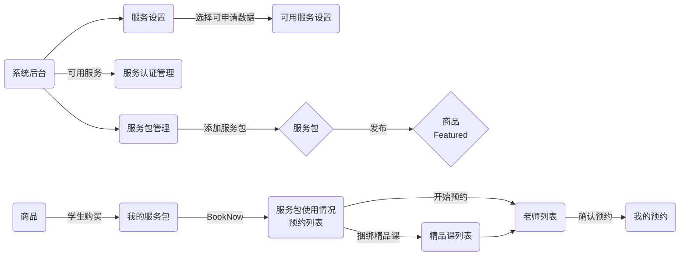
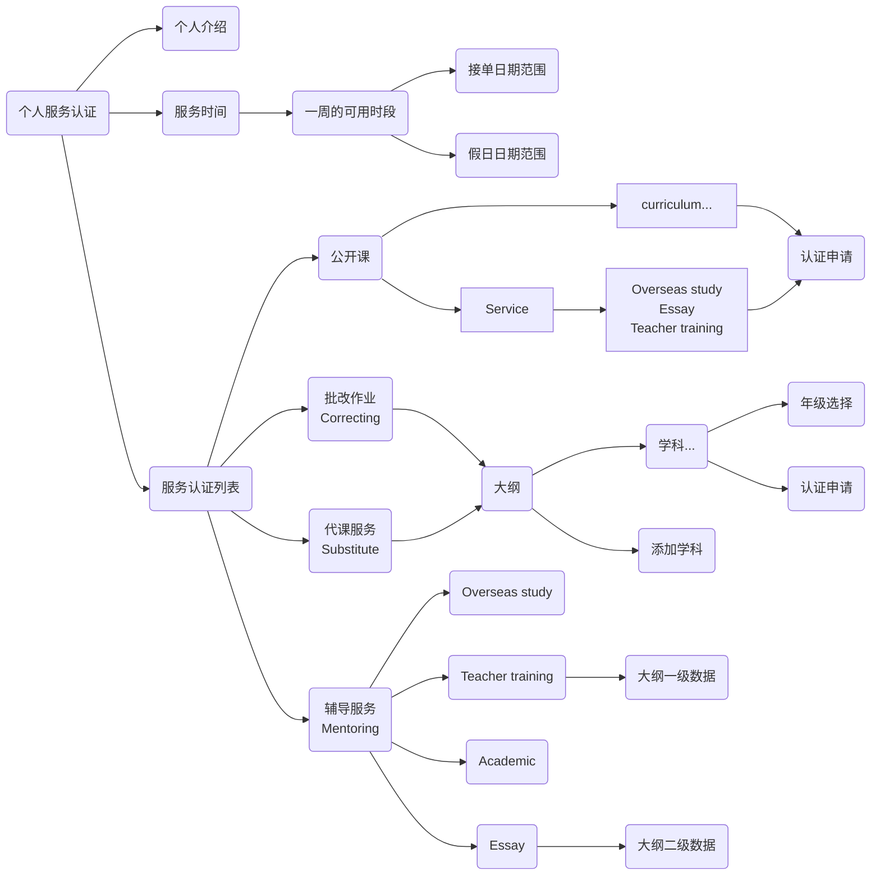

## Service

### 服务整体关系



### 服务认证申请



## 服务设置

```js
// 获取
await App.service("conf").get(`Service:${type}:${mentoringType}`).catch(e => {
  if (e.code === 404) return await App.service("conf").create({_id: `Service:${type}:${mentoringType}`, val: {}})
})
// 更新
await App.service("conf").patch(`Service:${type}:${mentoringType}`, {
  val: {
    desc: '', // 申请描述
    countryCode: [], // 国家代码
    curriculum: [{
      code: '', // 大纲代码
      subject: [], // 学科
    }],
    ...
  }
});
```

## 服务认证

### Enum

```js
ServiceType: ['workshop', 'content', 'teaching', 'mentoring', 'correcting', 'substituteAcademic', 'substituteService'],
MentoringType: ['essay', 'academic', 'overseasStudy', 'teacherTraining', 'steam'], // professionalDevelopment, subject
ServicePackUserType: ['order', 'booking', 'cancel', 'timeout', 'expired', 'refund', 'teachingAccident', 'gift']
```

### service-auth model

```js
uid: {type: String, required: true},
type: {type: String, required: true, enum: Agl.ServiceType}, // 服务类型
mentoringType: {type: String, enum: Agl.MentoringType}, // 辅导类型
enable: {type: Boolean, default: true}, // 是否启用
countryCode: {type: String, trim: true}, // 国家代码
curriculum: {type: String, trim: true}, // 大纲代码 or 自定义的大纲_id
subject: {type: String, trim: true}, // 学科_id
gradeGroup: {type: [String], trim: true}, // 年级组
grades: {type: [String], trim: true}, // 实际年级
unit: { // 认证课件
  _id: {type: String, trim: true}, // unit._id
  name: {type: String, trim: true}, // 课件名称
},
topic: [{ // 用于 essay, teacherTraining等大纲层级 认证项
  _id: {type: String, trim: true}, // subjects.topic..._id
  label: {type: [String], trim: true}, // subjects.topic...name
}],
desc: {type: String, trim: true}, // 描述
status: {type: Number, default: 0}, // 0: 未申请, 1:申请中, 2: 通过, -1: 拒绝
attachments: [{ // 附件
  filename: {type: String, trim: true}, // 文件名
  mime: {type: String, trim: true}, // 文件 MIME
  hash: {type: String, trim: true}, // 文件SHA1, files._id
}],
reason: {type: String, trim: true}, // 原因
```

### 服务认证接口（仅限当前用户）

```js
// 系统后台 服务认证类型数量统计
const [{
  _id: {type, mentoringType, status}, count: 1
}, ...] = await App.service("service-auth").get("countType");

// 服务认证列表（系统后台）
await App.service("service-auth").find({query: {$sys: 1, ...}});

// 服务认证列表（用户查看自己的）
await App.service("service-auth").find({query: {}});
// 已认证列表
await App.service("service-auth").find({ query: { status: 2 } });
// 提交申请
await App.service("service-auth").patch(doc._id, { status: 1 });
// 审批申请
await App.service("service-auth").patch(doc._id, {
  status: 2 / -1,
  reason: "",
});
```

### 服务认证接口（任何人）

```js
// 查询某个老师的已认证列表
await App.service('service-auth').get('listByUid', {
    query: { uid: 'user._id' },
});
```

## 用户服务配置

### service-conf model

```js
rating: {type: Number}, // 好评
count: {
  rate: {type: Number}, // 好评，比率 ＝ 1-(count.accident/count.rating)
  rating: {type: Number}, // 总的评价次数
  accident: {type: Number}, // 教学事故次数
},
introduction: {type: String, trim: true}, // 自我介绍
audio: {type: String, trim: true}, // 音频文件 hash files._id
audioTime: {type: Number}, // 音频时长（秒）
hours: {type: [[Date, Date], ...], required: true}, // 一周服务可用时间段, [[start, end], [Date, Date], ...]
holiday: {type: [[Date, Date], ...], required: true}, // 假日日期, 格式: [[start, end], [Date, Date], ...]
enable: {type: Schema.Types.Mixed}, // 服务启用状态, {[`${type}:${mentoringType}`]: true, ...}
fans: {type: Number, default: 0}, // 收藏的数量
```

### 用户服务配置接口

```js
// 获取用户的服务配置
const doc = await App.service("service-conf").get(pub.user._id).catch(async (e) => {
  if(e.code === 404) return await App.service("service-conf").create({_id: pub.user._id, hours: []})
})
// 设置一周服务可用时间, 格式
await App.service("service-conf").patch(pub.user._id, {hours: [[start, end], ['2024-01-18T05:00:00.000Z', '2024-01-18T12:00:00.000Z'], ...]})
// 设置假日日期, 当前用户的一天的开始时间
await App.service("service-conf").patch(pub.user._id, {holiday:  [[start, end], ['2024-01-18T05:00:00.000Z', '2024-01-18T12:00:00.000Z'], ...]})

```

### 启用/禁用服务

```js
// 启用服务
await App.service("service-conf").patch(pub.user._id, {[`enable.${type}:${mentoringType}`]: true]})
// 禁用服务
await App.service("service-conf").patch(pub.user._id, {[`enable.${type}:${mentoringType}`]: false]})
```

### 查找可预约的老师列表

```js
// 可预约的老师列表 通过服务包查找
const {
  total, limit, skip,
  data: [{
    rating,
    introduction,
    audio,
    audioTime,
    hours,
    holiday,
    enable,
    owner: {_id, name, avatar, email},
    auths: [{ // 已认证的服务项目
      type, mentoringType, countryCode, curriculum, subject, gradeGroup
    }, ...]
  }, ...]
} = await App.service('service-conf').get('teachersByPack', {query: {
  search: 'xxx', // users.name 老师名称
  packUserId: 'servive-pack-user._id',
  subject?: [],
  hours?: [start, end], // 按指定时间段查询老师
  gradeGroup?: ['', ...], // 按年级段过滤老师，不传则以服务包限制为准
  $sort: { // 排序, 值为 1 或 -1
    fans?, // 按粉丝
    'count.rate'? // 按好评比率
  }
}})
```

## 服务包

### service-pack model

```js
name: {type: String, trim: true}, // 服务包名称
cover: {type: String, trim: true}, // files._id
coverName: {type: String, trim: true}, // 图片名称
points: {type: [String], trim: true}, // selling points
type: {type: String, required: true, enum: Agl.ServiceType}, // 服务类型
mentoringType: {type: String, enum: Agl.MentoringType}, // 辅导类型
countryCode: {type: String, trim: true}, // 国家代码
curriculum: {type: String, trim: true}, // curriculum.code
subject: {type: [String], trim: true}, // subjects._id
gradeGroup: {type: [String], trim: true}, // 年级组
price: {type: Number, trim: true}, // 单次价格 *100，cc，美分
discount: [{
  count: {type: Number}, // 数量
  discount: {type: Number}, // 折扣 %
  gifts: {type: Number, default: 0}, // 免费赠送的次数
  orderCount: {type: Number, default: 0}, //购买次数
}],
discountConfig: { // 折扣配置
  enable: {type: Boolean, default: false}, // 是否启用折扣
  end: {type: Date} // 折扣截止时间
},
freq: {type: Number, enum: [7, 14, 30, 120]}, // 每张的可用多少天
duration: {type: Number}, // session duration min
break: {type: Number}, // session break min
status: {type: Boolean, default: false}, // 发布状态
count: { // 统计
  sold: {type: Number}, // 已售
  valid: {type: Number}, // 有效数量
},
attachments: [{ // 图片/视频，附件，推广素材, 插入到课堂的时候，显示在素材中
  filename: {type: String, trim: true}, // 文件名
  mime: {type: String, trim: true}, // 文件 MIME
  hash: {type: String, trim: true}, // 文件SHA1, files._id
}],
income: {type: Number, default: 0}, //收入总计,单位分
```

### 服务包接口

```js
// 发布服务
await App.service('service-pack').patch(doc._id, { status: true });
// 下架服务
await App.service('service-pack').patch(doc._id, { sta.tus: false });
// 服务包列表（后台）
await App.service('service-pack').find({ query: {} });

// 服务包列表（featured）
await App.service('service-pack').find({ query: { status: true } });
```

### 服务包推荐

```js
// 老师取 "teacherTraining"的数据, 学生取非"teacherTraining"的数据
await App.service('service-pack').get('index');
```

### 统计认证老师数量

```js
const {
  countryCode: { 'AU': [{...}], ...},
  curriculum: { 'au': [{...}], ...},
  subject: { '64d99bcc0476f7faf45ef0d8': [{...}], ...},
  gradeGroup: { 'Intermediate': [{...}], ...},
  topic: {'topic._id': [{...}], ...}
} = await App.service("service-auth").get("groups", { query: { type, mentoringType?, curriculum?, countryCode?, subject?, gradeGroup?, 'topic._id'? } });

// const {
//   curriculum: { 'au': {-1: 0, 0: 1, 1: 1, 2: 1}, ...},
//   gradeGroup: { 'Intermediate': {-1: 0, 0: 1, 1: 1, 2: 1}, ...},
//   subject: { '64d99bcc0476f7faf45ef0d8': {-1: 0, 0: 1, 1: 1, 2: 1}, ...},
//   countryCode: { 'AU': {-1: 0, 0: 1, 1: 1, 2: 1}, ...},
// } = await App.service("service-auth").get("stats", { query: { type, mentoringType? } });
```

### 老师发布公开课捆绑服务包

```js
await App.service("serssion").create({
  ...,
  premium: true/false, // 是否为精品公开课
  promotion: true/false, // 是否为推广课
  servicePack: {
    _id: '', // service-pack._id 服务包的id
    times, // live直播课的数量
    price, // 美分，服务包价格 = service-pack.discount 折扣 * live直播课的数量
  },
});
```

## 用户购买的服务包

### service-pack-user model

```js
uid: {type: String}, // users._id
price: {type: Number, default: 0}, // 订单金额
payCount: {type: Number, default: 0}, // 购买可退次数，不可修改
gift: {type: Boolean, default: false}, // 是否赠品, 只要服务包付了钱的都不是赠品
giftCount: {type: Number, default: 0}, // 赠送次数
total: {type: Number, default: 0}, // 总次数
used: {type: Number, default: 0}, // 已经使用
expired: [{type: Date, default: 0}], // 过期列表
expireSoon: {type: Date}, // 即将过期的时间
order: {type: String, required: true}, // 关联 order._id
session: {
  _id: {type: String}, // 关联session._id
  name: {type: String}, // session.name
  start: {type: String}, // session.start
  end: {type: String}, // session.end
},
snapshot: {type: Schema.Types.Mixed, required: true}, // service-pack 快照
status: {type: Boolean, default: true},
logs: [{ // 使用记录
  times: {type: Number, required: true}, // 增减次数
  type: {type: String, enum: Agl.ServicePackUserType}, // 变化类型
  remaining: {type: Number}, // 剩余次数
  expireSoon: {type: Date}, // 新的有效期
  start: {type: Date}, // booking start
  name: {type: String}, // session.name
  servicer: {
    uid: {type: String}, // users._id
    avatar: {type: String}, // users.avatar
    name: {type: [String]}, // users.name
  },
  updatedAt: {type: Date}
}],
```

### 用户已购买的服务包接口

```js
// 服务包列表（purchased）
await this.service('service-pack-user').find({ query: {} });

/**
 * 按用户查询
 * fieldType: {type: String, enum: ['email', 'mobile', 'classcipeId']}
 */
await App.service('service-pack-user').find({
    userField: '',
    userFieldType: 'email/mobile/classcipeId',
});
```

### 支付完成创建用户的服务包

```js
// 后端接口内部调用
await this.service("service-pack-user").buyByOrder({
  packId, // service-pack._id
  order, // order._id
  session?, // session._id 捆绑购买的session
  total: 10, // 购买的次数
  price, // 服务包支付的实际价格
  gift, // 是否赠送的服务包
});
```

### 用户申请退款后调用

```js
// 后端接口内部调用, 弃用
// await this.service("service-pack-user").refund(servicePackUser._id);
```

## 用户预约数据

### service-booking model

```js
packUser: {type: String, required: true}, // service-pack-user._id 用户购买的服务包
booker: {type: String, required: true}, // user._id 预订人
servicer: {type: String, required: true}, // user._id 服务人
type: {type: String, required: true, enum: Agl.ServiceType}, // 服务类型
mentoringType: {type: String, enum: Agl.MentoringType}, // 辅导类型
oldSession: { // 历史课程
  _id: {type: String}, // session._id
  name: {type: String}, // session.name
  image: {type: String, trim: true},
},
session: {
  // 服务人新排的课程
  _id: {type: String}, // session._id
  name: {type: String}, // session.name
  image: {type: String, trim: true},
  status: {type: String},
},
start: {type: Date},
end: {type: Date},
duration: {type: Date}, // 服务包对应的时长 service-pack-user.snapshot.duration
times: {type: Number, default: 1}, // 本次预约消耗次数 = (end-start)/duration
message: {type: String}, // 留言
attachments: [{ // 留言附件
  filename: {type: String, trim: true}, // 文件名
  mime: {type: String, trim: true}, // 文件 MIME
  hash: {type: String, trim: true}, // 文件SHA1, files._id
}],
cancel: {type: String, sparse: true, enum: ['servicer', 'booker', 'timeout']}, // 取消身份
canceledAt: {type: Date}, // 取消时间
reminder: {type: Number, default: 0}, // 未排课提醒,0: 待提醒，1: 开课12小时内已提醒
reminderBooked: {type: Number, default: 0}, // 开课前12小时提醒,0: 待提醒，1: 已提醒
accident: {
  id: {type: String}, //teaching-accident._id
  status: {type: String, enum: ['pending', 'approved', 'rejected']}, // 教学事故状态
  tags: {type: [String]}, // 标签
}
```

### 预约接口

```js
// 预约列表（预订人看）
await App.service("service-booking").find({query: {tab: 'booker', session: null}})
// 预约列表（服务者看）
await App.service("service-booking").find({query: {tab: 'servicer', session: null}})

// 查看老师的可用时间，与不可用时间
const {
  _id: '', // users._id
  introduction: '', // 介绍
  rating: 4.5, // 评分
  hours: [[start, end], ...], // 一周可以预约的时间段
  holiday: [[start, end], ...], // 假日日期范围
  booking: [[start, end], ...], // 已经被预约的时间段
  session: [[start, end], ...], // 已经排课的时间段
} = await App.service("service-conf").get('user._id', {query: {booking: 1, session: 1}})

// 查看自己的不可用时间
const {
  booking: [[start, end], ...], // 已经被预约的时间段
  session: [[start, end], ...], // 已经排课的时间段
} = await App.service("service-booking").get('myHours')

// 创建预约，扣除服务包次数 service-pack-user.used += service-booking.times
const doc = await App.service("service-booking").create({
  packUser,
  servicer,
  oldSession?: { _id, name, image },
  start, end,
  duration,
  times,
  message,
  attachments: [{
    filename,
    mime,
    hash
  }]
});
```

#### 老师对预约进行排课

```js
// 走创建课程流程, 带上预订的 service-booking._id
await App.service("session").create({
  ...,
  booking, // service-booking._id 学生预订的id
});
```

#### 老师取消课程

```js
// - 从 session 中点击取消，删除 session 本身
await App.service('session').remove(sessionId);
```

#### 老师/学生 取消预约逻辑

```js
await App.service('service-booking').patch('cancel', {
    _id: serviceBooking._id,
});
```

## 用户评价数据

### service-rating model

```js
session: {type: String}, // session._id
booking: {type: String}, // service-booking._id
servicer: {type: String, required: true}, // 老师
booker: {type: String, required: true}, // 学生
feel: {type: Boolean, required: true}, // 是否满意
tags: {type: [String], trim: true}, // 标签
message: {type: String, required: true}, // 留言
```

### 评价接口

```js
// 创建评价
await App.service("service-rating").create({
  session: "session._id",
  booking: "service-booking._id",
  servicer: "servicer._id",
  feel: true/false,
  tags: [...],
  message: '...',
});

// 更新评价
await App.service("service-rating").patch({
  tags: [...],
  message: '...',
});

// 老师的标签统计数据
await App.service("service-rating").get("tagsCount", {
  query: { servicer: users._id },
});
// 老师的所有评价数据
await App.service("service-rating").find({
  query: { servicer: users._id },
});
// 通过预订id获取评价数据
await App.service("service-rating").find({
  query: { booking: "service-booking._id" },
});
// 通过session获取评价数据
await App.service("service-rating").find({
  query: { session: "session._id" },
});
```

## 服务者粉丝

### service-fans model

```js
_id: {type: ObjectID}, // 用户 user._id
servicer: {type: [String], required: true}, // 服务者
```

### 粉丝接口

```js
// 我关注的老师数据
await App.service('service-fans').get(pub.user._id);
// 关注老师
await App.service('service-fans').patch(pub.user._id, {
    $addToSet: { servicer: 'user._id' },
});
// 取消关注
await App.service('service-fans').patch(pub.user._id, {
    $pull: { servicer: 'user._id' },
});
```

## Example

```js
// service-pack create > publish > buy
var doc = await App.service('service-pack').create({
    name: Date.now().toString(32),
    points: ['test points', 'test points2'],
    type: 'mentoring',
    mentoringType: 'academic',
    curriculum: 'au',
    subject: ['64d99bcc0476f7faf45ef0d8'],
    gradeGroup: ['Intermediate'],
    price: 1000,
    discount: [{ count: 10, discount: 90 }],
    freq: 7,
    duration: 30,
    break: 10,
});
await App.service('service-pack').patch(doc._id, { status: true });
// buy in api
var packUser = await App.service('service-pack-user').get('buyByOrder', {
    query: {
        packId: '65b47af5a70318050560dc25',
        order: '65b45c361e0529e3d990cc19',
        total: 10,
    },
});

// teacher auth, create > apply
var confDoc = await App.service('service-conf')
    .get(pub.user._id)
    .catch(async (e) => {
        if (e.code === 404)
            return await App.service('service-conf').create({
                _id: pub.user._id,
                hours: [],
            });
    });
confDoc = await App.service('service-conf').patch(confDoc._id, {
    introduction: 'test introduction',
});
var doc = await App.service('service-auth').create({
    type: 'mentoring',
    mentoringType: 'academic',
    curriculum: 'au',
    subject: '64d99bcc0476f7faf45ef0d8',
    gradeGroup: ['Intermediate'],
    grades: ['Grade 1', 'Grade 2'],
});
// 提交申请
await App.service('service-auth').patch(doc._id, { status: 1 });
// 通过申请
await App.service('service-auth').patch(doc._id, { status: 2 });

// 老师列表通过服务包查找
await App.service('service-conf').get('teachersByPack', {
    query: { packUserId: packUser._id, subject: ['64d99bcc0476f7faf45ef0d8'] },
});
// 创建预约
var nt = Date.now();
await App.service('service-booking').create({
    packUser: '65b9c284b5d0b55bf51037de',
    servicer: '634b275c15c7439ecd28d610',
    start: new Date(nt + 3600000).toISOString(),
    end: new Date(nt + 3600000 * 2).toISOString(),
    duration: 30,
    times: 2,
    message: 'test message',
});
```
