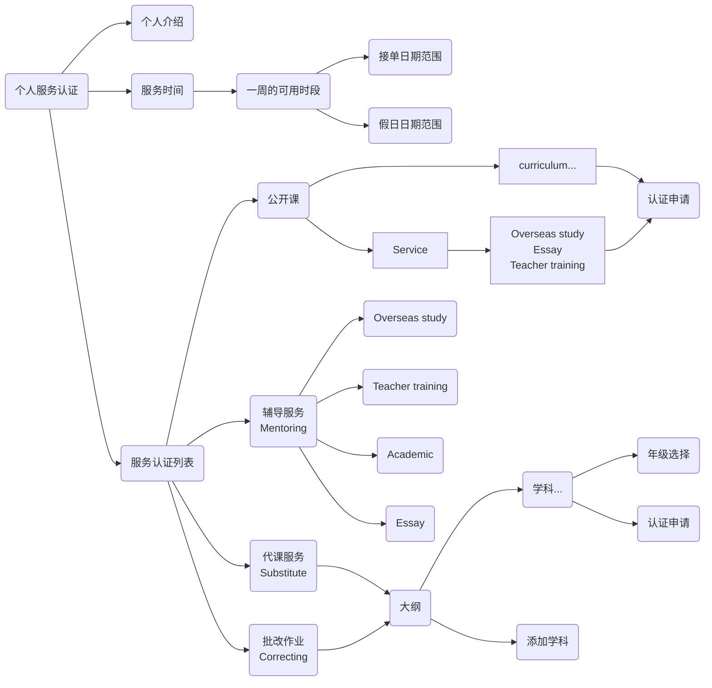

## Service



## 服务认证列表

### Enum

```js
ServiceType: ['workshop', 'teaching', 'mentoring', 'substitute', 'correcting'],
MentoringType: ['essay', 'academic', 'overseasStudy', 'teacherTraining'], // professionalDevelopment, subject
```

### service-auth model

```js
uid: {type: String, required: true},
type: {type: String, required: true, enum: Agl.ServiceType}, // 服务类型
mentoringType: {type: String, enum: Agl.MentoringType}, // 辅导类型
countryCode: {type: String, trim: true}, // 国家代码
curriculum: {type: String, trim: true},
subject: {type: String, trim: true},
gradeGroup: {type: [String], trim: true}, // 年级组
grades: {type: [String], trim: true}, // 实际年级
status: {type: Number, default: 0}, // 0: 未申请, 1:申请中, 2: 通过, -1: 拒绝
attachments: [{ // 附件
  filename: {type: String, trim: true}, // 文件名
  mime: {type: String, trim: true}, // 文件 MIME
  hash: {type: String, trim: true}, // 文件SHA1, files._id
}],
reason: {type: String, trim: true}, // 原因
```

### 服务启用状态接口

```js
// 获取用户的服务配置启用状态
await App.service("conf-user").get("UserServiceEnable")
// 启用服务
await App.service("conf-user").get("UserServiceEnable", {[`${type}${mentoringType}`]: true]})
// 禁用服务
await App.service("conf-user").get("UserServiceEnable", {[`${type}${mentoringType}`]: false]})
```

### 服务认证接口

```js
// 服务认证列表
await App.service("service-auth").find({});
// 已认证列表
await App.service("service-auth").find({ query: { status: 2 } });
// 提交申请
await App.service("service-auth").patch(doc._id, { status: 1 });
// 审批申请
await App.service("service-auth").patch(doc._id, {
  status: 2 / -1,
  reason: "",
});
```
