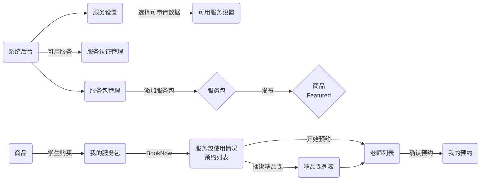
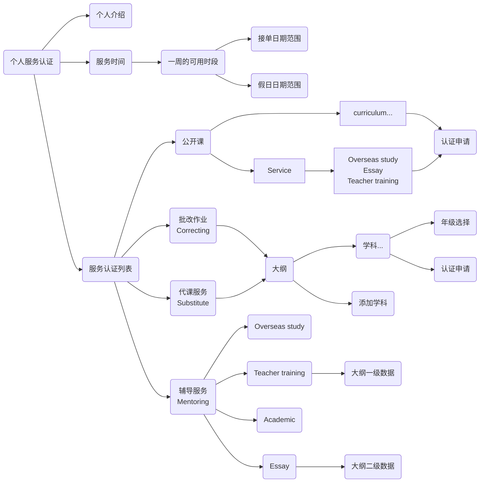
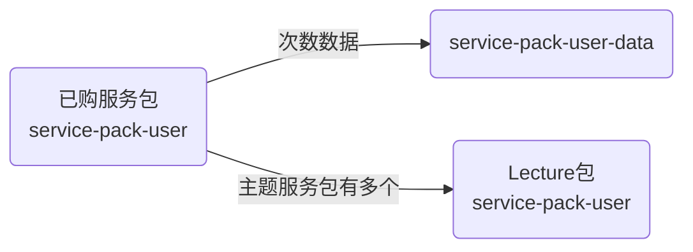
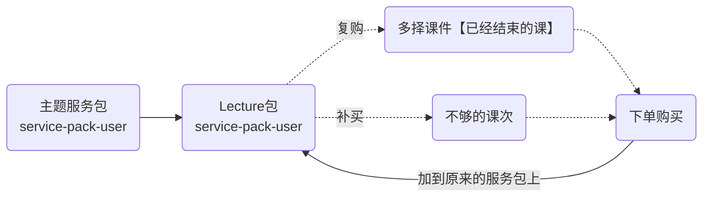
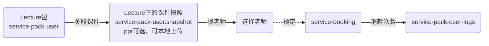

## Service

### 服务整体关系



### 服务认证申请



### 用户服务包



> Lecture 包补买



> Lecture 包预约



## 服务设置

### 服务设置接口

```js
// 批量获取
const [...] = await App.service('conf').get(`Service:${type}:.*`)

// 获取
await App.service("conf").get(`Service:${type}:${mentoringType}`).catch(e => {
  if (e.code === 404) return await App.service("conf").create({_id: `Service:${type}:${mentoringType}`, val: {}})
})
// 更新
await App.service("conf").patch(`Service:${type}:${mentoringType}`, {
  val: {
    desc: '', // 申请描述
    countryCode: [], // 国家代码
    curriculum: [{
      code: '', // 大纲代码
      subject: [], // 学科
    }],
    topic: [{
      _id: '',
      label: ['level 1', 'level 2', ...]
    }, ...],
    attachmentType: ['', ...], // 前端固定，附件类型, 用于 service-auth.attachments.type
    hourRate: [{ // 小时工资
      price: '1500',
      value: ['xxx', ...], // 二级数据（学科/topic）
      default: true, // 是否默认
      qualification: '', // 资质
      curriculum?: '', // 大纲
      topic?: ''
    }]
  }
});
// 精品课认证设置更新
await App.service("conf").patch(`Service:${type}`, {
  val: {
    '服务类型': {
      desc: '', // 申请描述
    }
  }
}
```

## 服务认证

### Enum

```js
ServiceRoles: ['mentoring', 'substitute', 'correcting', 'consultant', 'onCampus', 'contentContributor'],
ServiceType: ['workshop', 'content', 'teaching', 'mentoring', 'correcting', 'substituteAcademic', 'substituteService'],
MentoringType: [
  'essay',
  'academic',
  'overseasStudy',
  'teacherTraining',
  'teacherTrainingSubject',
  'steam',
  'academicPlanning',
  'personalStatement',
  'interest',
],
ConsultantType: ['carer', 'interview', 'interviewTeacher'], // 顾问类型
ServicePackUserType: ['order', 'booking', 'cancel', 'timeout', 'expired', 'refund', 'teachingAccident', 'gift', 'point', 'cash'],
ServicePackVideoType: ['AcademicValue', 'Features', 'QA'],
ServiceSalesTarget: ['personal', 'school'],

```

### service-auth model

```js
uid: {type: String, required: true},
type: {type: String, required: true, enum: Agl.ServiceType}, // 服务类型
mentoringType: {type: String, enum: Agl.MentoringType}, // 辅导类型
enable: {type: Boolean, default: true}, // 是否启用
serviceRoles: {type: [String], enum: Agl.ServiceRoles, default: Agl.ServiceRoles}, // 可以服务的项目 #4586
countryCode: {type: [String], trim: true}, // 国家代码
curriculum: {type: String, trim: true}, // 大纲代码 or 自定义的大纲_id
subject: {type: String, trim: true}, // 学科_id
gradeGroup: {type: [String], trim: true}, // 年级组
grades: {type: [String], trim: true}, // 实际年级
tags: {type: [String], trim: true}, // 标签
unit: { // 认证课件
  _id: {type: String, trim: true}, // unit._id
  name: {type: String, trim: true}, // 课件名称
  price: {type: Number}, // 课件价格, 单位 分 = 互动题数量*20
},
ability: {type: String, trim: true}, // 学习能力 https://github.com/zran-nz/bug/issues/5030
styles: {type: [String], trim: true}, // 认知风格
otherStyles: {type: [String], trim: true}, // 其他风格
unitSnapshot: {type: Schema.Types.Mixed}, // 认证unit快照 https://github.com/zran-nz/bug/issues/4861
linkSnapshot: {type: Schema.Types.Mixed}, // unitl link 的课件快照列表
topic: [{ // 用于 essay, teacherTraining等大纲层级 认证项
  _id: {type: String, trim: true}, // subjects.topic..._id
  label: {type: [String], trim: true}, // subjects.topic...name
}],
desc: {type: String, trim: true}, // 描述
status: {type: Number, default: 0}, // 0: 未申请, 1:申请中, 2: 通过, -1: 拒绝
approval: { // 审批信息
  submitted: {type: Date}, // 提交时间
  approved: {type: Date}, // 审核时间
  approver: {type: String}, // 审核人uid
},
attachments: [{ // 附件
  filename: {type: String, trim: true}, // 文件名
  mime: {type: String, trim: true}, // 文件 MIME
  hash: {type: String, trim: true}, // 文件SHA1, files._id
  date: {type: Date}, // 上传时间
  type: {type: String, trim: true}, // 认证类型, conf.val.attachmentType
  size: {type: Number}, // 文件大小
}],
versionId: {type: String, trim: true}, // 版本 #4846
reason: {type: String, trim: true}, // 原因
inviter: {type: String, trim: true}, //分享人
qualification: {type: String, trim: true}, // 审核时候选的资质 #4864
feedback: { // 留言反馈
  message: {type: String}, // 用户留言内容
  date: {type: Date}, // 留言时间
  read: {type: Boolean, default: false}, // read status
  reply: {type: String}, // 后台回复内容
  replyDate: {type: Date},
  replyRead: {type: Boolean, default: false}, // read status
},
follower: {type: String}, // 跟进人 user._id
followedAt: {type: Date}, // 开始跟进时间
releasedAt: {type: Date}, // 上次释放时间
schoolOfFollower: {type: String}, // school-plan._id 学校管理员所属学校
importUsers: {type: [String]}, // 老师预约排课购买的自动排课被取消后，需要加入，可以重复
interviewInvited: {type: Boolean, default: false}, // 面试邀请是否发送
interviewPack: {type: String}, // 面试服务包id
interviewApply: {type: Boolean, default: false}, // 面试已预约
takeaway: {type: String}, // takeaway
takeawayCreatedAt: {type: Date},
```

### 服务认证接口（仅限当前用户）

```js
// 系统后台 服务认证类型数量统计
const [{
  _id: {type, mentoringType, status}, count: 1
}, ...] = await App.service("service-auth").get("countType");

// 服务认证列表（系统后台）
await App.service("service-auth").find({query: {$sys: 1, ...}});

// 服务认证列表（用户查看自己的）
await App.service("service-auth").find({query: {}});
// 已认证列表
await App.service("service-auth").find({ query: { status: 2 } });
// 生成课件快照，在选择课件之后，申请之前请求
await App.service("service-auth").get('unitSnapshot', {query: {_id: 'service-auth._id', unit: 'unit._id'}})
// 提交申请
await App.service("service-auth").patch(doc._id, { status: 1 });
// 审批申请
await App.service("service-auth").patch(doc._id, {
  status: 2 / -1,
  reason: "",
});
```

### import classcipe cloud

> 导入认证精品课列表

```js
// 课件数据列表
await App.service('service-auth').get('cloudList', { query: {} });
```

### 统计被多少服务包关联

```js
await App.service('service-auth').get('countPackUse', { query: { _id } });
```

### 认证留言

```js
// 创建留言
await App.service('service-auth').patch('message', {_id, message})
// 后台回复
await App.service('service-auth').patch('reply', {_id, reply})
// 标记为已读
await App.service('service-auth').patch(_id, {'feedback.read': true})
await App.service('service-auth').patch(_id, {'feedback.replyRead': true})
// 已读未读过滤条件
await App.service('service-auth').find({query: {
  ...,
  'feedback.read': true/false // 未读
}})
```

### 精品课认证数据查询

```js
// 查询参数参考 service-auth model
await App.service('service-auth').get('unit', query: {
  countryCode?, // 国家代码
  curriculum?, // 大纲代码 or 自定义的大纲_id
  subject?, // 学科_id
  gradeGroup?, // 年级组
  ...
})

```

### 服务认证接口（任何人）

```js
// 查询某个老师的已认证列表
await App.service('service-auth').get('listByUid', {
    query: { uid: 'user._id' },
});
```

### 服务认证日期范围查询

```js
await App.service("service-auth").find({
  query: { dateRange: [start, end, zone?] },
});

```

### 服务认证协同审批

```js
// claim
await App.service('service-auth').patch('service-auth._id', { follower: 'uid', followedAt: new Date() });

// unclaim stop
await App.service('service-auth').patch('service-auth._id', { $unset: { follower: '', followedAt: '' }, releasedAt: new Date() });

// 获取follower列表 按项目数排序 字段count为项目数
await App.service('service-auth').get('groupByFollower');

// by me
await App.service('service-auth').find({ query: { follower: user._id } });
// by others
await App.service('service-auth').find({ query: { follower: { $ne: user._id, $exists: true } } });
// unclaimed
await App.service('service-auth').find({ query: { follower: { $exists: false } } });
// by me + by others
await App.service('service-auth').find({ query: { follower: { $exists: true } } });
// by me + unclaimed
await App.service('service-auth').find({
    query: {
        $or: [{ follower: user._id }, { follower: { $exists: false } }],
    },
});
// by others + unclaimed
await App.service('service-auth').find({
    query: {
        $or: [{ follower: { $ne: user._id, $exists: true } }, { follower: { $exists: false } }],
    },
});
```

### 服务认证协同审批

```js
// 发送面试邀请
await App.service('service-auth').patch('service-auth._id', { interviewInvited: true, interviewPack: 'service-pack._id' });

// 面试手动return
await App.service('service-auth').get('interviewReturn', { query: { id: 'service-auth._id' } });
```

## 用户服务配置

### service-conf model

```js
  rating: {type: Number}, // 好评
  introduction: {type: String, trim: true}, // 自我介绍
  audio: {type: String, trim: true}, // 音频文件 hash files._id
  audioTime: {type: Number}, // 音频时长（秒）
  hours: {type: [[Date]]}, // 一周服务可用时间段 [[start, end], ...]
  // validDate: {type: [[Date]]}, // 有效日期, 当前用户的一天的开始时间, 格式: [[start, end], ...]
  holiday: {type: [[Date]]}, // 假日日期,  格式: [[start, end], ...]
  enable: {type: Schema.Types.Mixed}, // 服务启用状态, {[`${type}${mentoringType}`]: true, ...}
  serviceRoles: {type: [String], enum: Agl.ServiceRoles, default: Agl.ServiceRoles}, // 可以服务的项目 #4586
  fans: {type: Number, default: 0}, // 收藏的数量
  // 以下字段用于索引，数据在更新的时候自动生成
  hoursIndex: {type: [[String]]}, // 自动生成，用于时间段匹配查询
  hoursMax: {type: Number}, // 取最大时间段的分钟数，用于查询老师
  /*
  按服务包的认证项 认证通过时间来排序 #4455
  认证项: 认证通过时间
  */
  sort: {type: Schema.Types.Mixed},
  // 滞后显示：若老师terminate/cancel了超过1/3的被预约辅导课
  lag: {type: Boolean, default: false}, // (cancel+terminate)/booking > 1/3
  count: {
    rate: {type: Number}, // 好评，比率 ＝ 1-(count.accident/count.rating)
    rating: {type: Number}, // 总的评价次数
    accident: {type: Number}, // 教学事故次数
    booking: {type: Number, default: 0}, // 每收到预约 +1
    cancel: {type: Number, default: 0}, // 取消一次 +1
    terminate: {type: Number, default: 0}, //
  },

  country: {type: String, trim: true},
  city: {type: String, trim: true},
  address: {type: String, trim: true},
  place_id: {type: String, trim: true},
  location: {
    type: {
      type: String,
      enum: ['Point'],
      default: 'Point',
    },
    coordinates: {
      type: [Number],
    },
  },
  serviceRadius: {type: Number}, // in meters
  attachmentsAddress: {
    filename: {type: String, trim: true}, // 文件名
    mime: {type: String, trim: true}, // 文件 MIME
    hash: {type: String, trim: true}, // 文件SHA1, files._id
  },
  attachmentsVetting: {
    filename: {type: String, trim: true}, // 文件名
    mime: {type: String, trim: true}, // 文件 MIME
    hash: {type: String, trim: true}, // 文件SHA1, files._id
  },
  vettingDate: {type: Date},
  status: {type: Number, default: 0}, // 0: 未申请/Apply verification, 1:申请中/Under processing, 2: 通过/Verified, -1: 拒绝/Under processing
  vettingReminder: {type: Boolean, default: false}, // 审批过期时间少于30天提醒
  feedback: {
    // 留言反馈
    message: {type: String}, // 用户留言内容
    date: {type: Date}, // 留言时间
    read: {type: Boolean, default: false}, // read status
    reply: {type: String}, // 后台回复内容
    replyDate: {type: Date},
    replyRead: {type: Boolean, default: false}, // read status
  },
  reason: {type: String, trim: true},
```

### 用户服务配置接口

```js
// 获取用户的服务配置
const doc = await App.service("service-conf").get(pub.user._id).catch(async (e) => {
  if(e.code === 404) return await App.service("service-conf").create({_id: pub.user._id, hours: []})
})
// 设置一周服务可用时间, 格式
await App.service("service-conf").patch(pub.user._id, {hours: [[start, end], ['2024-01-18T05:00:00.000Z', '2024-01-18T12:00:00.000Z'], ...]})
// 设置假日日期, 当前用户的一天的开始时间
await App.service("service-conf").patch(pub.user._id, {holiday:  [[start, end], ['2024-01-18T05:00:00.000Z', '2024-01-18T12:00:00.000Z'], ...]})

```

### 启用/禁用服务

```js
// 启用服务
await App.service("service-conf").patch(pub.user._id, {[`enable.${type}:${mentoringType}`]: true]})
// 禁用服务
await App.service("service-conf").patch(pub.user._id, {[`enable.${type}:${mentoringType}`]: false]})
```

### 查找可预约的老师列表

```js
// 可预约的老师列表 通过服务包查找
const {
  total, limit, skip,
  data: [{
    rating,
    introduction,
    audio,
    audioTime,
    hours,
    holiday,
    enable,
    owner: {_id, name, avatar, email},
    auths: [{ // 已认证的服务项目
      type, mentoringType, countryCode, curriculum, subject, gradeGroup
    }, ...]
  }, ...]
} = await App.service('service-conf').get('teachersByPack', {query: {
  search: 'xxx', // users.name 老师名称
  packUserId: 'servive-pack-user._id',
  subject?: [],
  hours?: [start, end], // 按指定时间段查询老师
  gradeGroup?: ['', ...], // 按年级段过滤老师，不传则以服务包限制为准
  $sort: { // 排序, 值为 1 或 -1
    fans?, // 按粉丝
    'count.rate'? // 按好评比率
  }
}})
```

### 批量查询多个老师最近几天，每日可预约的次数

```js
// 批量查询多个老师最近几天的冲突时间段
const {
  booking: [{
    servicer, start, end
  }],
  session: [{
    uid, start, end
  }]
} = await App.service('service-conf').get('recentDaysHours', query: {uid: ['xxx', ...], days: 14})

// 批量计算多个老师的最近几日可预约次数
confStore.getRecentDays(data: 找老师接口列表的数据, days: 天数, blockTime: 预订多少分钟的课)
data: [{_id, hoursIndex, ...}, ...]

// 这里是例子，实际需要通过找老师接口获取老师列表
const rs = await App.service('service-conf').find({query: {$sort: {_id: -1}}})
// 批量计算可用次数
const list = await confStore.getRecentDays(rs.data, 10, 60)
console.log(list)
list: {[uid]: {[day]: count, ...}, ...}
```

### 线下助教 个体用户线下服务认证

```js
service-conf._id=uid
// 地址必须是从google接口搜索出来的,且必须要带该地址的place_id
// google地址获取接口:/fio/maps/address/${country}?q=${query} 参考web-PubSelect-find的city获取
await App.service('service-conf').patch('_id', {
    address: 'desc',
    place_id: 'place_id',
});
```

## 服务包

### service-pack model

```js
name: {type: String, trim: true}, // 服务包名称
cover: {type: String, trim: true}, // files._id
coverName: {type: String, trim: true}, // 图片名称
points: {type: [String], trim: true}, // selling points
type: {type: String, required: true, enum: Agl.ServiceType}, // 服务类型
serviceRoles: {type: String, enum: Agl.ServiceRoles}, // 服务角色
mentoringType: {type: String, enum: Agl.MentoringType}, // 辅导类型
countryCode: {type: [String], trim: true}, // 国家代码
curriculum: {type: String, trim: true}, // curriculum.code
subject: {type: [String], trim: true}, // subjects._id
topic: {type: [String], trim: true}, // 用于 essay, teacherTraining等大纲层级 认证项, subjects.topic..._id || topic._id
gradeGroup: {type: [String], trim: true}, // 年级组
qualification: {type: String, trim: true}, // 服务包需要的资质
// 主题服务包 支持关联多个课件 https://github.com/zran-nz/bug/issues/4861
contentOrientatedEnable: {type: Boolean, default: false}, // type === 'mentoring' 专用
contentOrientatedConfig: {
  price: {type: Number}, // 主题服务包的价格
  schoolPrice: {type: Number, trim: true}, // 给机构的价格 单次价格 *100，cc，美分
},
contentOrientated: [
  {
    premium: {type: String, trim: true}, // contentOrientated === true 才有，取认证过的精品课 service-auth._id
    subject: {type: String, trim: true}, // 学科_id https://github.com/zran-nz/bug/issues/5344
    times: {type: Number}, // 最少授课次数，必须大于0
    price: {type: Number, trim: true}, // 单次价格 *100，cc，美分
    schoolPrice: {type: Number, trim: true}, // 给机构的价格 单次价格 *100，cc，美分
    servicePack: {type: String}, // 捆绑的服务包, service-pack._id 服务包id
    message: {type: String}, // 认证课不正常的时候提示
  },
],
consultant: {
  // 顾问配置
  type: {type: String, enum: Agl.ConsultantType}, // 顾问类型
  carerService: {type: String},
  servicePack: {type: String}, // 捆绑的服务包, service-pack._id 服务包id
},
interviewPack: {
  _id: {type: String}, // 面试捆绑的服务包, service-pack._id 服务包id
  times: {type: Number}, // 次数
},
carerPack: {
  _id: {type: String}, // 管家捆绑的服务包, service-pack._id 服务包id
  times: {type: Number}, // 次数
},
price: {type: Number, trim: true}, // 单次价格 *100，cc，美分
discount: [
  {
    count: {type: Number}, // 数量
    discount: {type: Number}, // 折扣 %
    gifts: {type: Number, default: 0}, // 免费赠送的次数
  },
],
discountConfig: {
  // 折扣配置
  enable: {type: Boolean, default: false}, // 是否启用折扣
  end: {type: Date}, // 折扣截止时间
  discount: {type: Number}, // 主题服务包 统一折扣 %
},
freq: {type: Number, enum: [7, 14, 30, 120]}, // 每张的可用多少天
duration: {type: Number}, // session duration 单位：分钟
break: {type: Number}, // session break 单位：分钟
status: {type: Boolean, default: false}, // 发布状态
lastPublished: {type: Date}, // 上次发布时间
count: {
  // 统计
  sold: {type: Number}, // 已售
  valid: {type: Number}, // 有效数量
  ticket: {type: Number}, // 有效代金券数量
},
attachments: [
  {
    // 图片/视频，附件，推广素材, 插入到课堂的时候，显示在素材中
    filename: {type: String, trim: true}, // 文件名
    mime: {type: String, trim: true}, // 文件 MIME
    hash: {type: String, trim: true}, // 文件SHA1, files._id
    videoType: {type: String, enum: Agl.ServicePackVideoType}, // 视频的类型
  },
],
income: {type: Number, default: 0}, //收入总计,单位分
statistic: [
  {
    count: {type: Number}, // 数量 服务包次数
    orderCount: {type: Number, default: 0}, // 订单购买次数
    income: {type: Number, default: 0}, //收入总计,单位分
    isSchool: {type: Boolean, default: false}, // 学校/个人购买
    type: {type: String, enum: ['lecture', 'mentor', 'all']}, // 购买类型
    city: {type: String}, // 线下 城市
  },
],
salesTarget: {type: [String], enum: Agl.ServiceSalesTarget}, // 销售目标
backgroundCheck: {type: Boolean, default: false}, // academic 是否启用背景审查
requirements: {type: String, default: false}, // academic 是否启用背景审查描述
requirementsItems: {type: [String]}, // academic requirements 二级数据
interview: {type: Boolean, default: false}, // 是否启用面试
splitSale: {type: Boolean, default: false}, // 是否可以分拆卖
filled: {type: Boolean, default: false}, // All forms have been filled
reason: {type: String}, // 下架原因
keywords: {type: [String]}, // 关键词搜索用，[subject, topic, ...]

isOnCampus: {type: Boolean, default: false}, // 线上/线下
country: {type: String, trim: true},
onCampusPrice: [
  {
    hash: {type: String, trim: true},
    city: {type: String, trim: true},
    price: {type: Number, trim: true}, // 单次价格 *100，cc，美分
    discount: [
      {
        count: {type: Number}, // 数量
        discount: {type: Number}, // 折扣 %
        gifts: {type: Number, default: 0}, // 免费赠送的次数
      },
    ],
  },
],
```

### 服务包接口

```js
// 发布服务
await App.service('service-pack').patch(doc._id, { status: true });
// 下架服务
await App.service('service-pack').patch(doc._id, { sta.tus: false });
// 服务包列表（后台）
await App.service('service-pack').find({ query: {} });

// 服务包列表（featured）
await App.service('service-pack').find({ query: { status: true } });

// 服务包列表 拼接service-pack-school-price数据 判断是否显示buy按钮
await App.service('service-pack').find({ query: { $school: 'school-plan._id' } });
```

### 老师自己可用的服务包列表

```js
const {
    data: [
        {
            // 参考 service-pack model
            _id,
            name,
            cover,
            type,
            mentoringType,
            countryCode,
            curriculum,
            subject,
            topic,
            gradeGroup,
            qualification,
            serviceRoles,
        },
    ],
} = await App.service('service-pack').get('TeacherSideViewData');
```

### 服务包统计

```js
const {
  mentoringType: {
    'mentoringType': 3, ....
  }
  curriculum: {
    'curriculum': 2, ...
  },
  subject: {
    'subject._id': 4, ...
  }
} = await App.service('service-pack').get('groups')
```

### 服务包视频

```js
// 单个添加
await App.service('service-pack').patch(doc._id, {
    $addToSet: { attachments: { filename, mime, hash, videoType } },
});

// 单个删除
await App.service('service-pack').patch(doc._id, {
    $pull: { attachments: { _id: doc.attachments[x]._id } },
});
```

### 服务包推荐

```js
// 老师取 "teacherTraining"的数据, 学生取非"teacherTraining"的数据
await App.service('service-pack').get('index');
// 学校下
await App.service('service-pack').get('index', { query: { salesTarget: 'school' } });
```

### 统计认证老师数量

```js
const {
  countryCode: { 'AU': [{...}], ...},
  curriculum: { 'au': [{...}], ...},
  subject: { '64d99bcc0476f7faf45ef0d8': [{...}], ...},
  gradeGroup: { 'Intermediate': [{...}], ...},
  topic: {'topic._id': [{...}], ...}
  serviceRoles: {'mentoring|substitute|...': [{...}], ...}
} = await App.service("service-auth").get("groups", { query: { type, mentoringType?, curriculum?, countryCode?, subject?, gradeGroup?, 'topic._id'? } });

// const {
//   curriculum: { 'au': {-1: 0, 0: 1, 1: 1, 2: 1}, ...},
//   gradeGroup: { 'Intermediate': {-1: 0, 0: 1, 1: 1, 2: 1}, ...},
//   subject: { '64d99bcc0476f7faf45ef0d8': {-1: 0, 0: 1, 1: 1, 2: 1}, ...},
//   countryCode: { 'AU': {-1: 0, 0: 1, 1: 1, 2: 1}, ...},
// } = await App.service("service-auth").get("stats", { query: { type, mentoringType? } });
```

### 认证的课件按 topic.\_id 统计数量

```js
const {
  $topic._id: $count,
  '66506185267ada5104400226': 2,
  ...
} = await App.service("service-auth").get("groupTopic", { query: {type, mentoringType, curriculum, subject}});
```

### 老师发布公开课捆绑服务包

```js
await App.service("serssion").create({
  ...,
  premium: true/false, // 是否为精品公开课
  promotion: true/false, // 是否为推广课
  servicePack: {
    _id: '', // service-pack._id 服务包的id
    times, // live直播课的数量
    price, // 美分，服务包价格 = service-pack.discount 折扣 * live直播课的数量
  },
});
```

## 用户购买的服务包

### service-pack-user model

```js
uid: {type: String}, // users._id
total: {type: Number, default: 0}, // 总次数 会变化，代课服务下为分钟数
used: {type: Number, default: 0}, // 已经使用，代课服务下为分钟数
expireSoon: {type: Date}, // 即将过期的时间
session: {
  _id: {type: String}, // 关联session._id
  name: {type: String}, // session.name
  start: {type: String}, // session.start
  end: {type: String}, // session.end
},
snapshot: {type: Schema.Types.Mixed, required: true}, // service-pack 快照，主题服务包下的Lecture包用 service-auth 快照
status: {type: Boolean, default: true},
order: {type: String, required: true}, // 关联 order._id
price: {type: Number, default: 0}, // 订单金额
point: {type: Number}, // 订单支付积分
isPoint: {type: Boolean, default: false}, // 现金购买/积分购买
payMethod: {type: String}, // 默认为空, 现金支付过就会更新为 cash， https://github.com/zran-nz/bug/issues/5020
// 主题服务包用 https://github.com/zran-nz/bug/issues/5196
pid: {type: String}, // 主题服务包的主包, 本身用于Lecture包，一个主题服务包包含多个Lecture包
premium: {type: String}, // Lecture包 对应的 service-auth 认证的精品课 service-auth._id
taskIndex: {type: [String]}, // Lecture包下, 课件去重后的索引 https://github.com/zran-nz/bug/issues/5200
tasks: {type: [String]}, // Lecture包下, 需要预约的课件id，用于自动计算出预约的关联的课件，增加：首次购买/补买/取消预约，扣除：预约，[id1, id2, ...]
// 线下包
country: {type: String}, // 国家
city: {type: String}, // 城市
place_id: {type: String, trim: true}, // google地点id
location: {
  type: {
    type: String,
    enum: ['Point'],
  },
  coordinates: {
    type: [Number],
  },
},
```

### service-pack-user-data model

```js
packUser: {type: String, required: true}, // 关联购买的服务包 service-pack-user._id
expired: {type: Date}, // 过期列表
status: {type: Number, default: 0}, // 状态 0: 可用，-1: 过期, 1: 被使用
gift: {type: Boolean, default: false}, // 是否赠品
order: {type: String, trim: true}, // 关联 order
serviceTicket: {type: String, trim: true}, // 关联 service-pack-ticket._id
payMethod: {type: String, trim: true}, // 支付方式
```

### service-pack-user-logs model

```js
packUser: {type: String, required: true}, // 关联购买的服务包 service-pack-user._id
times: {type: Number, required: true}, // 增减次数, 分钟数(代课服务)
type: {type: String, enum: Agl.ServicePackUserType}, // 变化类型
remaining: {type: Number}, // 剩余次数
expireSoon: {type: Date}, // 新的有效期
start: {type: Date}, // booking start
name: {type: String}, // session.name
servicer: {
  uid: {type: String}, // users._id
  avatar: {type: String}, // users.avatar
  name: {type: [String]}, // users.name
},
packUserData: [{
  _id: {type: String, required: true}, // 关联购买的服务包次数 service-pack-user-data._id
  payMethod: {type: String, trim: true}, // 支付方式
  order: {type: String, trim: true}, // order
  expired: {type: Date}, // 过期
}]
```

### 用户已购买的服务包接口

```js
// 服务包列表（purchased）
await this.service('service-pack-user').find({ query: {} });

// 服务包列表（purchased） 学校购买
await this.service('service-pack-user').find({ query: { uid: 'school-plan._id', $isSchool: true } });

/**
 * 按用户查询
 * fieldType: {type: String, enum: ['email', 'mobile', 'classcipeId']}
 */
await App.service('service-pack-user').find({
    userField: '',
    userFieldType: 'email/mobile/classcipeId',
});
```

### 支付完成创建用户的服务包

> 后端接口内部调用

```js
// 首次创建购买的服务包
await this.service("service-pack-user").buyByOrder({
  packId, // service-pack._id
  order, // order._id
  session?, // session._id 捆绑购买的session
  total: 10, // 购买的分钟数，代课服务需要传
  price, // 服务包支付的实际价格
  gift, // 是否赠送的服务包
});

// 对已经购买的服务包 消耗次数
await this.service("service-pack-user-data").used({
  packUser, // service-pack-user._id
  type, // 日志类型
  times, // 次数
  order?, // 关联 order 消耗
  servicer?, oldSession?, start?
});
// 对已经购买的服务包 增加次数
await this.service("service-pack-user-data").add({
  packUser, // service-pack-user._id
  packUserData?,
  packUserTasks?, // Lecture包复购的课件id数组, 预定取消/复购/补买调用
  type, // 日志类型
  times, // 次数
  gift?, // 是否赠送的服务包
  isNew?, // 首次创建服务包的时候增加次数
  order?, // 关联 order
  servicer?, oldSession?, start?
});
```

### 主题服务包购买后的处理逻辑

```js
// 创建主题服务包及Lecture包
const {..., childs} = await this.service("service-pack-user").buyByOrder(...)
// 批量对Lecture包增加服务次数数据
for(const o of childs) {
  await this.service("service-pack-user-data").add({...})
}
```

### 主题服务包下的 Lecture 包列表

```js
await App.service('service-pack-user').find({ query: { pid: 'service-pack-user._id' } });
```

### 代课服务包

```js
// 增加分钟数
await this.service("service-pack-user-data").addSubstitute({...})
// 消耗分钟数
await this.service("service-pack-user-data").usedSubstitute({...})
```

### 服务包使用记录

```js
// 根据服务包id, 查询使用记录
await App.service('service-pack-user-logs').find({ query: { packUser: packUser._id } });
```

### 检查 service-pack-user 是否为 free

```js
await App.service('service-pack-user').get('checkFree', { query: { ids: ['service-pack-user._id'] } });
```

## 用户预约数据

### service-booking model

```js
packUser: {type: String, required: true}, // service-pack-user._id 用户购买的服务包
packUserData: {type: [String]}, // 关联的次数id列表 service-pack-user-data._id
packUserTasks: {type: [String]}, // 关联的课件id列表
booker: {type: String, required: true}, // user._id 预订人
servicer: {type: String, required: true}, // user._id 服务人
type: {type: String, required: true, enum: Agl.ServiceType}, // 服务类型
mentoringType: {type: String, enum: Agl.MentoringType}, // 辅导类型
oldSession: { // 历史课程
  _id: {type: String}, // session._id
  name: {type: String}, // session.name
  image: {type: String, trim: true},
},
session: {
  // 服务人新排的课程
  _id: {type: String}, // session._id
  name: {type: String}, // session.name
  image: {type: String, trim: true},
  status: {type: String},
},
carer: {
  subject: {type: String}, // 管家服务包预订的时候选择
  hasView: {type: Boolean, default: false}, // 管家服务包排课的时候是否查看过
  used: {type: Boolean, default: false}, // 是否已经用过管家服务
},
start: {type: Date},
end: {type: Date},
duration: {type: Date}, // 服务包对应的时长 service-pack-user.snapshot.duration
times: {type: Number, default: 1}, // 本次预约消耗次数 = (end-start)/duration
// 预约的留言变化：https://github.com/zran-nz/bug/issues/5123
message: {type: String}, // 留言
slides: {
  packUserTask: {type: String}, // 主题lecture包取课件快照service-pack-user.taskSnapshot[x].pages 下的数据
  pages: {type: [Schema.Types.Mixed]}, // 学校所选的ppt对象，公开课捆绑服务包取课堂快照 用oldSession._id 查询session
},
// 留言附件，老师import的时候需要插入到课堂
attachments: [{
  filename: {type: String, trim: true}, // 文件名
  mime: {type: String, trim: true}, // 文件 MIME
  hash: {type: String, trim: true}, // 文件SHA1, files._id
}],
cancel: {type: String, sparse: true, enum: ['servicer', 'booker', 'timeout']}, // 取消身份
canceledAt: {type: Date}, // 取消时间
reminder: {type: Number, default: 0}, // 未排课提醒,0: 待提醒，1: 开课12小时内已提醒
reminderBooked: {type: Number, default: 0}, // 开课前12小时提醒,0: 待提醒，1: 已提醒
accident: {
  id: {type: String}, //teaching-accident._id
  status: {type: String, enum: ['pending', 'approved', 'rejected']}, // 教学事故状态
  tags: {type: [String]}, // 标签
},
servicePackApply: {type: String}, // 主题服务包报名id
serviceAuthId: {type: String}, // service-auth._id from import classcipe cloud, 精品认证课购买后一次性排课

```

### 预约接口

```js
// 预约列表（预订人看）
await App.service("service-booking").find({query: {tab: 'booker', session: null}})
// 预约列表（服务者看）
await App.service("service-booking").find({query: {tab: 'servicer', session: null}})

// 查看老师的可用时间，与不可用时间
const {
  _id: '', // users._id
  introduction: '', // 介绍
  rating: 4.5, // 评分
  hours: [[start, end], ...], // 一周可以预约的时间段
  holiday: [[start, end], ...], // 假日日期范围
  booking: [[start, end], ...], // 已经被预约的时间段
  session: [[start, end], ...], // 已经排课的时间段
} = await App.service("service-conf").get('user._id', {query: {booking: 1, session: 1}})

// 查看自己的不可用时间
const {
  booking: [[start, end], ...], // 已经被预约的时间段
  session: [[start, end], ...], // 已经排课的时间段
} = await App.service("service-booking").get('myHours')

// 创建预约，扣除服务包次数 service-pack-user.used += service-booking.times
const doc = await App.service("service-booking").create({
  packUser,
  servicer,
  oldSession?: { _id, name, image },
  start, end,
  duration,
  times,
  message,
  attachments: [{
    filename,
    mime,
    hash
  }]
});
```

### 获取booking中的lecture对应的task快照
```js
await App.service('service-booking').get('lectureTaskSnapshot', {query: {_id: 'booking._id', packUser: 'booking.packUser'}})
```

### 管家服务import

```js
// 通过管家服务的预订ID 获取关联已经结束的课堂预订数据
const bookingList = await App.service('service-booking').get('byCarer', {query: {_id: bookingId}});
// 点击查看takeaway的时候标记为已经看过
await App.service('service-booking').patch(_id, { 'carer.hasView': true });
// 管家服务import
await App.service('service-booking').get('importCarer', {query: {_id: bookingId, bookings: ['关联的预订_id数组', ...] }});
```

### 认证精品课快照购买支付成功后 自动排课

```js
// 内部接口调用
await this.app.service('service-booking').importByBooking({ serviceAuthId, bookingId }, params);
```

#### 老师对预约进行排课

```js
// 走创建课程流程, 带上预订的 service-booking._id
await App.service("session").create({
  ...,
  booking, // service-booking._id 学生预订的id
});
```

#### 老师取消课程

```js
// - 从 session 中点击取消，删除 session 本身
await App.service('session').remove(sessionId);
```

#### 老师/学生 取消预约逻辑

```js
await App.service('service-booking').patch('cancel', {
    _id: serviceBooking._id,
});
```

#### 认证精品课快照 自动排课

```js
await App.service('service-booking').get('importByBooking', { query: { serviceAuthId, bookingId } });
```

## 用户评价数据

### service-rating model

```js
session: {type: String}, // session._id
booking: {type: String}, // service-booking._id
servicer: {type: String, required: true}, // 老师
booker: {type: String, required: true}, // 学生
feel: {type: Boolean, required: true}, // 是否满意
tags: {type: [String], trim: true}, // 标签
message: {type: String, required: true}, // 留言
```

### 评价接口

```js
// 创建评价
await App.service("service-rating").create({
  session: "session._id",
  booking: "service-booking._id",
  servicer: "servicer._id",
  feel: true/false,
  tags: [...],
  message: '...',
});

// 更新评价
await App.service("service-rating").patch({
  tags: [...],
  message: '...',
});

// 老师的标签统计数据
await App.service("service-rating").get("tagsCount", {
  query: { servicer: users._id },
});
// 老师的所有评价数据
await App.service("service-rating").find({
  query: { servicer: users._id },
});
// 通过预订id获取评价数据
await App.service("service-rating").find({
  query: { booking: "service-booking._id" },
});
// 通过session获取评价数据
await App.service("service-rating").find({
  query: { session: "session._id" },
});
```

## 服务者粉丝

### service-fans model

```js
_id: {type: ObjectID}, // 用户 user._id
servicer: {type: [String], required: true}, // 服务者
```

### 粉丝接口

```js
// 我关注的老师数据
await App.service('service-fans').get(pub.user._id);
// 关注老师
await App.service('service-fans').patch(pub.user._id, {
    $addToSet: { servicer: 'user._id' },
});
// 取消关注
await App.service('service-fans').patch(pub.user._id, {
    $pull: { servicer: 'user._id' },
});
```

## Example

```js
// service-pack create > publish > buy
var doc = await App.service('service-pack').create({
    name: Date.now().toString(32),
    points: ['test points', 'test points2'],
    type: 'mentoring',
    mentoringType: 'academic',
    curriculum: 'au',
    subject: ['64d99bcc0476f7faf45ef0d8'],
    gradeGroup: ['Intermediate'],
    price: 1000,
    discount: [{ count: 10, discount: 90 }],
    freq: 7,
    duration: 30,
    break: 10,
});
await App.service('service-pack').patch(doc._id, { status: true });
// buy in api
var packUser = await App.service('service-pack-user').get('buyByOrder', {
    query: {
        packId: '65b47af5a70318050560dc25',
        order: '65b45c361e0529e3d990cc19',
        total: 10,
    },
});

// teacher auth, create > apply
var confDoc = await App.service('service-conf')
    .get(pub.user._id)
    .catch(async (e) => {
        if (e.code === 404)
            return await App.service('service-conf').create({
                _id: pub.user._id,
                hours: [],
            });
    });
confDoc = await App.service('service-conf').patch(confDoc._id, {
    introduction: 'test introduction',
});
var doc = await App.service('service-auth').create({
    type: 'mentoring',
    mentoringType: 'academic',
    curriculum: 'au',
    subject: '64d99bcc0476f7faf45ef0d8',
    gradeGroup: ['Intermediate'],
    grades: ['Grade 1', 'Grade 2'],
});
// 提交申请
await App.service('service-auth').patch(doc._id, { status: 1 });
// 通过申请
await App.service('service-auth').patch(doc._id, { status: 2 });

// 老师列表通过服务包查找
await App.service('service-conf').get('teachersByPack', {
    query: { packUserId: packUser._id, subject: ['64d99bcc0476f7faf45ef0d8'] },
});
// 创建预约
var nt = Date.now();
await App.service('service-booking').create({
    packUser: '65b9c284b5d0b55bf51037de',
    servicer: '634b275c15c7439ecd28d610',
    start: new Date(nt + 3600000).toISOString(),
    end: new Date(nt + 3600000 * 2).toISOString(),
    duration: 30,
    times: 2,
    message: 'test message',
});
```

### 主题服务报名

### service-pack-apply model

```js
  uid: {type: String, required: true},
  servicePack: {type: String, required: true}, // service-pack._id
  sharedSchool: {type: String}, // school-plan._id 从学校分享购买的,分享的学校id
  name: [{type: String, trim: true}], // [ firstname, lastname ]
  nickname: {type: String, sparse: true, trim: true},
  gender: {type: String, trim: true}, // gender
  mobile: {type: String, trim: true}, // E.164 format, maximum of 15 digits, +1001XXX5550100, +440201234567 => +44201234567
  email: {type: String, lowercase: true, trim: true},
  emailType: {type: String, enum: ['student', 'parent']},
  mentoringType: {type: String, enum: Agl.MentoringType}, // 辅导类型
  serviceTicket: {type: [String], default: []}, // service-pack-ticket._id 分配的ticket
  order: {type: [String]}, // 关联 order._id
  withinSchool: {type: Boolean, default: false}, // 校内/校外
  needOrder: {type: Boolean, default: false}, // 只有从学校报名,且该学校priceEnable=false时,无需下单;其余情况都需下单
  attachments: [
    // 附件Classcipe1
    {
      filename: {type: String, trim: true},
      mime: {type: String, trim: true},
      hash: {type: String, trim: true},
      date: {type: Date}, // 上传时间
      type: {type: String, trim: true}, // 认证类型, conf.val.attachmentType
      size: {type: Number}, // 文件大小
    },
  ],
  academicStatus: {type: Number, default: 0}, // 学术审核结果 0:pending, 1:approved, -1:rejected
  needAcademic: {type: Boolean, default: false}, // 是否需要学术审核
  interviewStatus: {type: Number, default: 0}, // 面试审核结果 0:pending, 1:approved, -1:rejected
  needInterview: {type: Boolean, default: false}, // 是否需要面试审核
  interviewInvited: {type: Boolean, default: false}, // 面试邀请是否发送
  reason: {type: String, trim: true}, //拒绝理由
  status: {type: Number, default: 0}, // 0:申请中/pending, 1: 通过/approved, -1: 拒绝/rejected, 2: 未申请/withdraw
  interviewPack: {type: String}, // 面试服务包id
  interviewOrder: {type: String}, // 购买的面试服务包订单id
  interviewApply: {type: Boolean, default: false}, // 面试已预约
  takeaway: {type: String}, // takeaway
  takeawayCreatedAt: {type: Date},
  archive: {type: Boolean, default: false},
  contentOrientated: [
    {
      premium: {type: String}, // contentOrientated === true 才有，取认证过的精品课
      times: {type: Number}, // 最少授课次数，必须大于0
      price: {type: Number, trim: true}, // 单次价格 *100，cc，美分
      schoolPrice: {type: Number, trim: true}, // 给机构的价格 单次价格 *100，cc，美分
      servicePack: {type: String}, // 捆绑的服务包, service-pack._id 服务包id
    },
  ],
  purchaseExpireAt: {type: Date}, //可购买过期时间 1.申请通过+7天, 2.更新报价+7天
  interviewPurchaseExpireAt: {type: Date}, // 面试可购买过期时间 1.邀请+7天,
  interviewPurchaseExpired: {type: Boolean, default: false}, // 面试购买过期
  follower: {type: String}, // 跟进人 user._id
  followedAt: {type: Date}, // 开始跟进时间
  schoolOfFollower: {type: String}, // school-plan._id 学校管理员所属学校
  feedback: {
    // 留言反馈
    message: {type: String}, // 用户留言内容
    date: {type: Date}, // 留言时间
    read: {type: Boolean, default: false}, // read status
    reply: {type: String}, // 后台回复内容
    replyDate: {type: Date},
    replyRead: {type: Boolean, default: false}, // read status
  },
```

### 报名接口

```js
// 创建
await App.service('service-pack-apply').create({ uid: 'user._id', servicePack: 'service-pack._id', sharedSchool: 'school-plan._id' });

// withdraw
await App.service('service-pack-apply').patch('_id', { status: 0 });

// find
await App.service('service-pack-school-price').find({ query: { uid: 'user._id', servicePack: 'service-pack._id', sharedSchool: 'school-plan._id' } });

// 按mentoringType统计
await App.service('service-pack-apply').get('countType');

// 校内外统计
await App.service('service-pack-apply').get('count', { query: { sharedSchool: 'school-plan._id', status, servicePack, archive } });

// 当前面试服务包下,可预约面试的申请
await App.service('service-pack-apply').find({ query: { status: 0, interviewInvited: true, interviewPack: 'service-pack._id' } });

// 单独更新报价 需同时更新字段purchaseExpireAt
await App.service('service-pack-apply').patch('_id', {
    contentOrientated: [],
    purchaseExpireAt: Date.now() + 7 * 24 * 3600 * 1000,
});

// 重置面试数据
await App.service('service-pack-apply').get('interviewReturn', { query: { id: '_id' } });

// 获取follower列表 按项目数排序 字段count为项目数
await App.service('service-pack-apply').get('groupByFollower');
```

### 机构售卖分享设置

### service-pack-school-price model

```js
  school: {type: String}, // school-plan._id
  servicePack: {type: String, required: true}, // service-pack._id
  priceEnable: {type: Boolean, default: false}, // 价格设置
  contentOrientated: [
    {
      premium: {type: String}, // contentOrientated === true 才有，取认证过的精品课
      times: {type: Number}, // 最少授课次数，必须大于0
      price: {type: Number, trim: true}, // 单次价格 *100，cc，美分
      schoolPrice: {type: Number, trim: true}, // 给机构的价格 单次价格 *100，cc，美分
      servicePack: {type: String}, // 捆绑的服务包, service-pack._id 服务包id
    },
  ],
  deadline: {type: Date}, // 截止时间
  withinSchool: {type: Boolean, default: false}, // 校内/校外
  students: {type: [String]}, // 分享的学生
  teachers: {type: [String]}, // 分享的老师
  role: {type: String, default: 'student', enum: ['student', 'teacher']},
```

### 分享接口

```js
// 创建
await App.service('service-pack-school-price').create({ school: 'school-plan._id', servicePack: 'service-pack._id' });

// 更新
await App.service('service-pack-school-price').patch('_id', { priceEnable: false });

// find
await App.service('service-pack-school-price').find({ query: { school: 'school-plan._id', servicePack: 'service-pack._id' } });

// 统计
await App.service('service-pack-school-price').get('count', { query: { school: 'service-pack._id' } });
```

### 机构购买代金券信息

### service-pack-ticket model

```js
  uid: {type: String},
  school: {type: String, required: true}, // school-plan._id
  servicePremium: {type: String, required: true}, // service-pack._id
  order: {type: String, trim: true}, // 关联 order
  serviceData: {
    type: [
      {
        servicePack: {type: String}, // service-pack._id
        cash: {type: Number, default: 0}, // 现金购买数量 当前剩余
        point: {type: Number, default: 0}, // 积分购买数量 当前剩余
        gift: {type: Number, default: 0}, // 赠送数量 当前剩余
        cashOrigin: {type: Number, default: 0}, // 现金购买数量
        pointOrigin: {type: Number, default: 0}, // 积分购买数量
        giftOrigin: {type: Number, default: 0}, // 赠送数量
      },
    ],
  },
  refund: {type: Boolean, default: false}, // 已退款
```

### 代金券接口

```js
// 分配
await App.service('service-pack-ticket').get('claim', { query: { id: 'service-pack-ticket._id', uid: 'uid' } });
// 取消分配
await App.service('service-pack-ticket').get('disclaim', { query: { ids: ['service-pack-ticket._id'] } });
```

### service-auth-message model

```js
{
  uid: {type: String, required: true},
  rid: {type: String, required: true}, // 关联的 service-auth._id, service-conf._id, school-plan._id
  message: {type: String},
  read: {type: Boolean, default: false}, // read status
  isAdmin: {type: Boolean, default: false},
  type: {type: String, default: 'service-auth', enum: ['service-auth', 'service-conf', 'school-plan']},
  attachments: {
    // 图片/视频证据
    filename: {type: String, trim: true}, // 文件名
    mime: {type: String, trim: true}, // 文件 MIME
    hash: {type: String, trim: true}, // 文件SHA1, files._id
  },
}
```

### 留言接口

```js
// 创建
await App.service('service-auth-message').create({ rid: 'service-auth._id', message });

// 列表
await App.service('service-auth-message').find({ query: { rid: 'service-auth._id', $sort: { createdAt: -1 } } });
```
