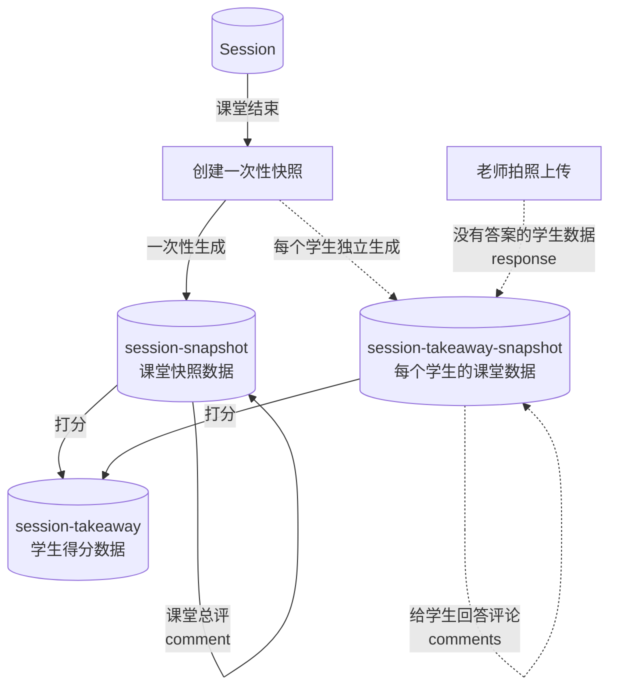

### takeaway 流程图



### session-snapshot model

- 课堂的快照数据

```js
_id: {type: ObjectID, required: true}, // session._id
sid: {type: String, required: true}, // session.sid
students: {type: Schema.Types.Mixed}, // 报名/选择的学生 snapshot
members: {type: Schema.Types.Mixed}, //  实际进入课堂的学生 snapshot
teachers: {type: Schema.Types.Mixed}, //  实际进入课堂的老师 snapshot
pages: {type: Schema.Types.Mixed}, // pages snapshot
questions: {type: Schema.Types.Mixed}, // questions snapshot
materials: {type: Schema.Types.Mixed}, // materials snapshot
comment: {type: String, trim: true}, // total comment
```

### session-takeaway-snapshot model

- 课堂下每个学生的 takeaway 快照数据

```js
session: {type: String, required: true}, // session._id
uid: {type: String, required: true}, // users._id for student user
response: {type: [Schema.Types.Mixed]}, // rooms student answer, response snapshot
comments: {type: [Schema.Types.Mixed]}, // rooms feedback, comments snapshot
hash: {type: String, required: true}, // hash = Acan.SHA1([...分值,评论等].join(''))
```

### session-takeaway model

```js
uid: {type: String, required: true}, // users._id
session: {type: String, required: true}, // session._id
page: {type: String}, // page._id
question: {type: String}, // questions._id
score: {type: Number}, // total score
point: {type: Number}, // 学生实际得总分
points: {type: Schema.Types.Mixed}, // 实际得分哈希表
outlines: {
  outline: {type: Schema.Types.Mixed}, // ppt outlines
  assess: {type: Schema.Types.Mixed}, // ppt assess
  pd: {type: Schema.Types.Mixed}, // pd
  goal: {type: Schema.Types.Mixed}, // ppt assess
  skills: {type: Schema.Types.Mixed}, // skills
},
```

### 大纲数据嵌套结构

```js
const outline = {
  name: {type: String, trim: true},
  grade: {type: [String]},
  tags: {type: [String], trim: true},
  code: {type: String, trim: true},
  mark: {type: String, trim: true},
  score: {type: Number}, // 设置的分值
  point: {type: Number}, // 学生实际得分
  child: [outline, ...],
}
```

### 创建一次性课堂快照

```js
await App.service("session-snapshot").get("snapshot", {
  query: { _id: "session._id" },
});
```

### 老师拍照上传

```js
await App.service("session-takeaway-snapshot").patch(_id, {$addToSet: {response: {...}}});
```

### 给学生回答评论

```js
await App.service("session-takeaway-snapshot").patch(_id, {$addToSet: {comments: {...}}});
```

### 课堂总评

```js
await App.service("session-snapshot").patch(_id, { comment: "..." });
```

### 老师在takeaway页面点击发送将最新takeaway发送时,Inform parents to view takeaway

```js
await App.service('session-takeaway-snapshot').get('informParents', { query: { _id: 'session-takeaway-snapshot._id' } });

```
