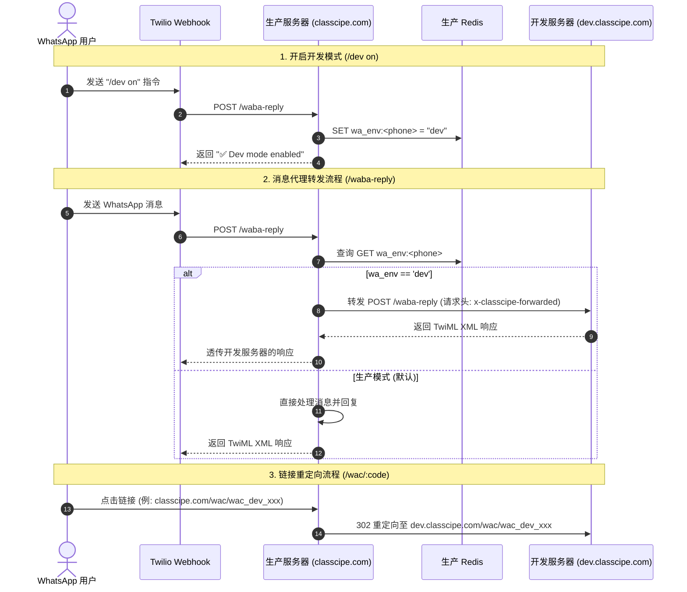
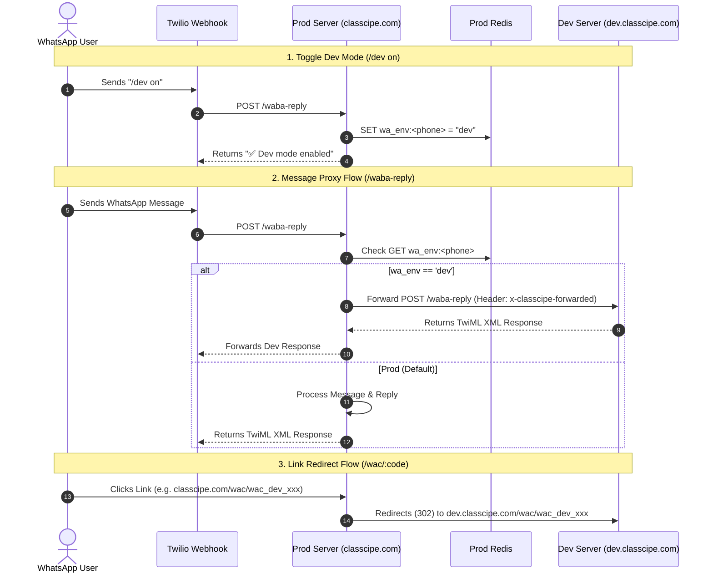

# WhatsApp (WABA) 开发环境集成与架构指南

本文档解释了如何在**生产环境 (Production)** 和 **开发环境 (Development)** 之间处理 WhatsApp (WABA / Twilio Webhook) 请求，以便开发者在不修改 Twilio 全局 Webhook URL 的情况下，在本地或开发服务器上测试 WhatsApp 业务流程。

---

## 1. 整体架构概览

Twilio 的 Webhook 统一配置指向生产环境 `classcipe.com`。当收到 WhatsApp 消息或指令（例如 `/dev on`）时，**生产服务器会直接处理并将其配置写入生产环境的 Redis** (`wa_env:<phone>`) 中。

当后续的 WhatsApp 消息到达时，生产服务器会查询生产 Redis：
* 若设置的值为 `dev`，生产服务器会将请求转发（Proxy）至 `dev.classcipe.com`。
* 若为默认/生产模式（`prod`），则由生产服务器直接处理。

### 架构与数据流示意图

---

## 2. 如何开启 WhatsApp 开发模式

可以直接通过 WhatsApp 向官方账号发送指令来切换开发环境：

| 指令 (Command) | 动作 | 说明 |
| :--- | :--- | :--- |
| `/dev on` | 开启开发模式 | 在生产 Redis 中设置 `wa_env:<phone>` 为 `dev`。之后该手机号发送的所有 `/waba-reply` 消息都会转发给 `dev.classcipe.com`。 |
| `/dev off` | 关闭开发模式 | 删除生产 Redis 中的 `wa_env:<phone>` 键。恢复为由生产服务器直接处理。 |
| `/dev status` | 查询当前状态 | 回复当前生效的环境状态（`DEV` 或 `PROD`）。 |

---

## 3. 核心连接机制说明

### A. Webhook 转发机制 (`/waba-reply`)
* **参考代码**: [waba.ts](file:///Users/Classcipe/workspace-i/learn-api/src/middleware/waba.ts#L289-L331), [waba.class.ts](file:///Users/Classcipe/workspace-i/learn-api/src/services/waba/waba.class.ts#L16-L26)
* 由于 Twilio Webhook 固定请求生产环境，`/dev on` 指令会直接写入 **生产环境 Redis** (`wa_env:<phone>`)。
* 当消息到达生产环境的 `/waba-reply` 时，`getWhatsAppEnvironment(redis, phone)` 会检查生产 Redis 中的 `wa_env:<phone>`。
* 如果值为 `'dev'`，生产服务器会发起 HTTP POST 请求，将 Body 参数转发至 `https://dev.classcipe.com/waba-reply`，并附加请求头 `x-classcipe-forwarded: true`。
* `x-classcipe-forwarded` 请求头用于防止转发死循环。

### B. 动态 Code 前缀与跳转 (`/wac/:code`)
* **参考代码**: [waba.ts](file:///Users/Classcipe/workspace-i/learn-api/src/middleware/waba.ts#L498-L503), [waba.class.ts](file:///Users/Classcipe/workspace-i/learn-api/src/services/waba/waba.class.ts#L10-L14)
* 通过 `generateWabaCode(env)` 生成临时登录/路由短 code 时：
  * 开发环境生成的 code 带前缀 **`wac_dev_`**（例如：`wac_dev_l8x9z...`）。
  * 生产环境生成的 code 带前缀 **`wac_`**（例如：`wac_l8x9z...`）。
* 当用户点击 `https://classcipe.com/wac/wac_dev_xxx` 时，生产服务器识别到 `wac_dev_` 前缀，会立即发起 `302` 重定向，将用户浏览器跳转至 `https://dev.classcipe.com/wac/wac_dev_xxx`。

---

# WhatsApp (WABA) Development Integration & Architecture

This document explains how WhatsApp (WABA / Twilio Webhook) requests are handled between **Production** and **Development** environments, enabling developers to test WhatsApp flows locally or on dev instances without changing global webhook URLs on Twilio.

---

## 1. Overall Architecture

Twilio webhooks are configured to hit `classcipe.com` (Production). When a message or command (like `/dev on`) arrives, **Production handles it and stores the setting in Production Redis** (`wa_env:<phone>`).

When subsequent WhatsApp messages arrive, Production checks its Redis instance:
* If set to `dev`, Production proxies the request to `dev.classcipe.com`.
* If default/prod, Production handles it directly.

### Architecture & Data Flow Diagram

---

## 2. How to Enable WhatsApp Dev Mode

You can toggle dev mode directly from WhatsApp by sending command messages to the official WhatsApp number:

| Command | Action | Description |
| :--- | :--- | :--- |
| `/dev on` | Enable Dev Mode | Sets Redis key `wa_env:<phone>` to `dev`. All future `/waba-reply` webhooks for your phone will proxy to `dev.classcipe.com`. |
| `/dev off` | Disable Dev Mode | Deletes Redis key `wa_env:<phone>`. Returns routing back to Production server. |
| `/dev status` | Check Status | Replies with current active environment (`DEV` or `PROD`). |

---

## 3. Core Connecting Mechanics

### A. Webhook Forwarding (`/waba-reply`)
* **Reference**: [waba.ts](file:///Users/Classcipe/workspace-i/learn-api/src/middleware/waba.ts#L289-L331), [waba.class.ts](file:///Users/Classcipe/workspace-i/learn-api/src/services/waba/waba.class.ts#L16-L26)
* Because Twilio webhooks strictly hit Prod, commands like `/dev on` write directly to **Production Redis** (`wa_env:<phone>`).
* When a message arrives at Prod (`/waba-reply`), `getWhatsAppEnvironment(redis, phone)` checks Prod Redis for `wa_env:<phone>`.
* If the value is `'dev'`, Prod sends an HTTP POST request forwarding the body payload to `https://dev.classcipe.com/waba-reply` with the header `x-classcipe-forwarded: true`.
* The `x-classcipe-forwarded` header prevents infinite forwarding loops.

### B. Dynamic Link Prefixing & Redirect (`/wac/:code`)
* **Reference**: [waba.ts](file:///Users/Classcipe/workspace-i/learn-api/src/middleware/waba.ts#L498-L503), [waba.class.ts](file:///Users/Classcipe/workspace-i/learn-api/src/services/waba/waba.class.ts#L10-L14)
* When generating short authentication/routing codes via `generateWabaCode(env)`:
  * Dev codes are prefixed with **`wac_dev_`** (e.g. `wac_dev_l8x9z...`).
  * Prod codes are prefixed with **`wac_`** (e.g. `wac_l8x9z...`).
* When a user opens `https://classcipe.com/wac/wac_dev_xxx`, the Prod server detects the `wac_dev_` prefix and immediately redirects (`302`) the browser to `https://dev.classcipe.com/wac/wac_dev_xxx`.
