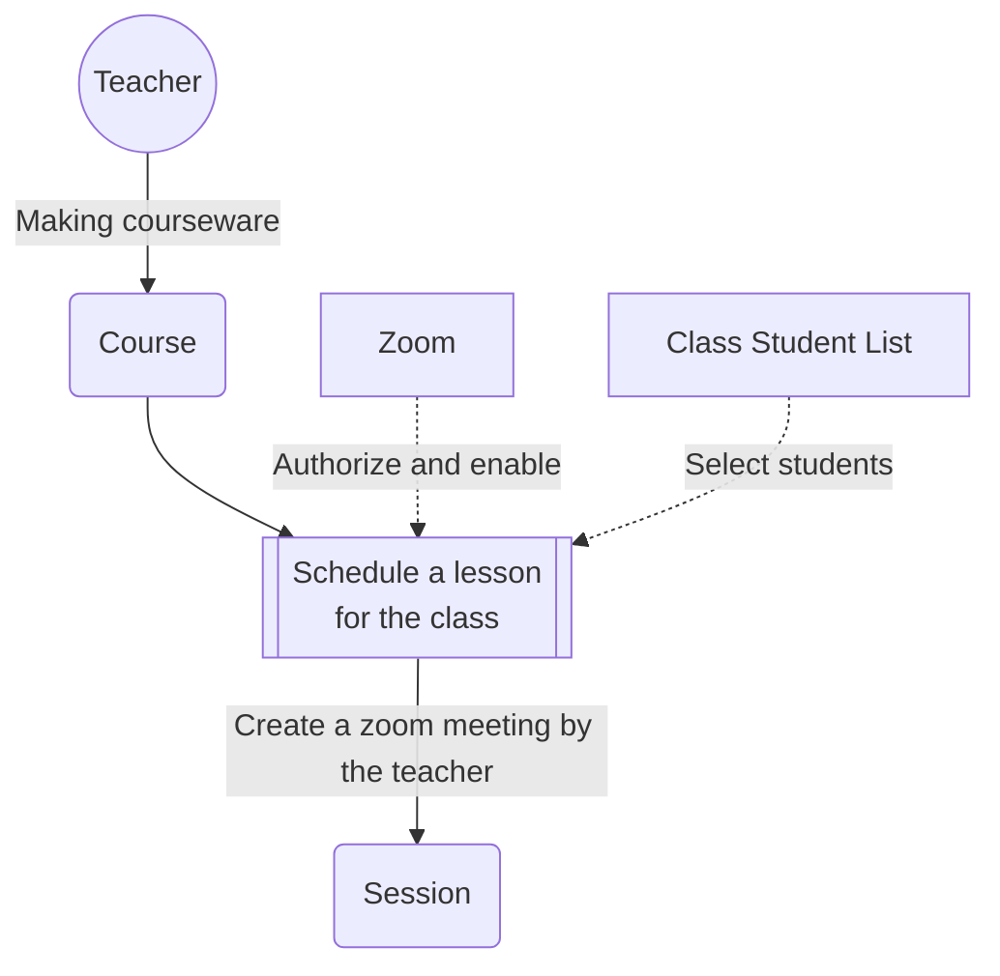
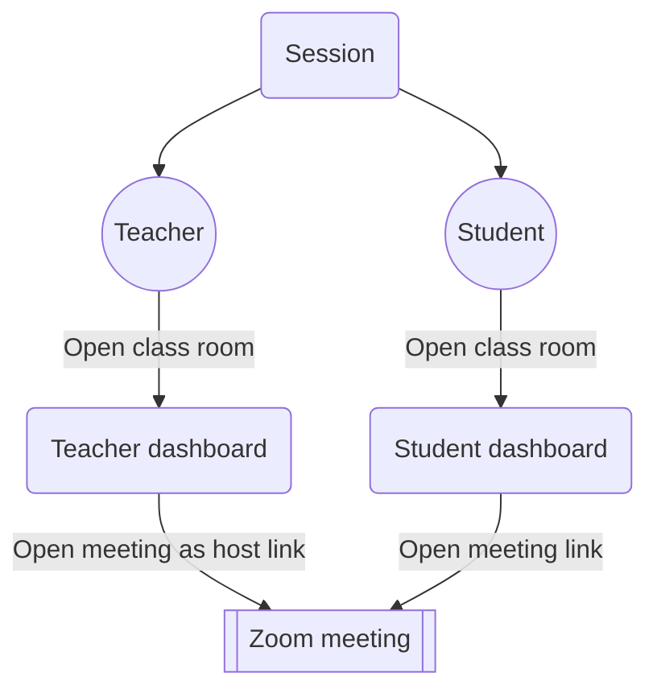

# Zoom


## 技术堆栈
- 详细描述应用程序所使用的所有技术、库和 API。
```text
Front-end UI framework: quasar
Backend technology stack: nodejs, redis, mongodb, mqtt.
nodejs lib：feathers, express, mongodb-core, mongoose, googleapis, google-images, mqtt, socket.io, nodemailer, pdfkit-table, node-fetch.
API: googleapi, cloudflare r2, aws s3.
```
## 架构图
- 尽可能提供带有附加流程图的架构图。这包括与 Zoom 交互的任何服务，例如数据库、服务器和应用程序运行所需的第三方应用程序。

### 后端架构
  

### zoom相关流程

- Schedule


- join class room
