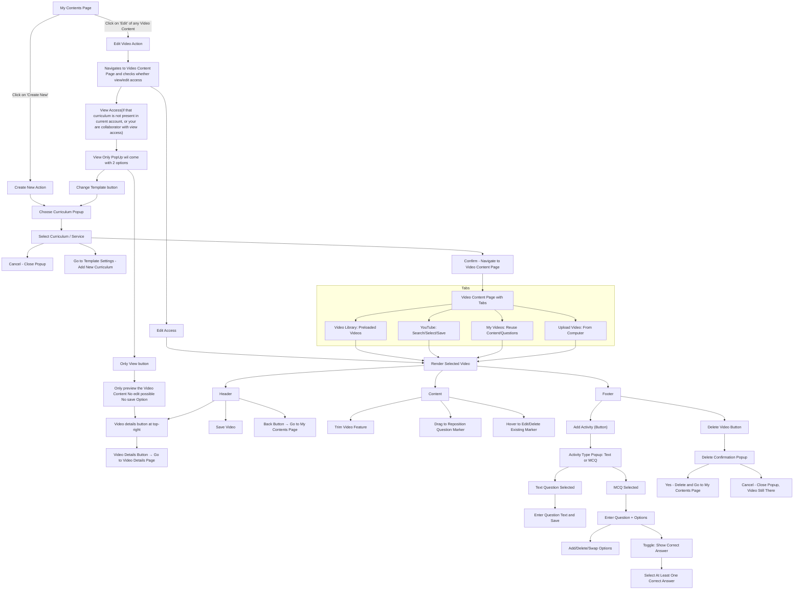
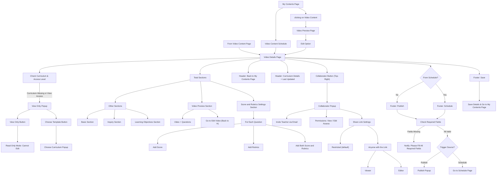
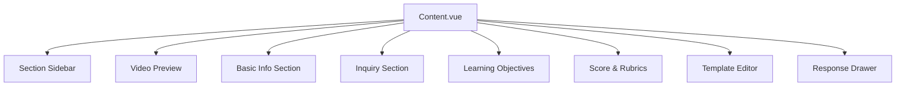
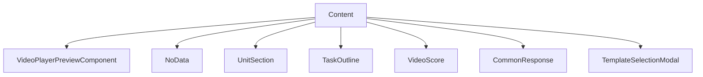
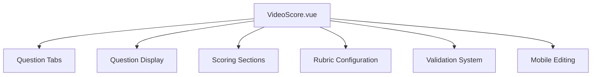
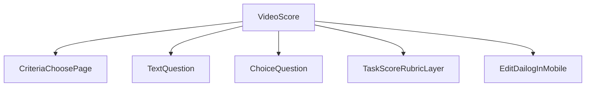
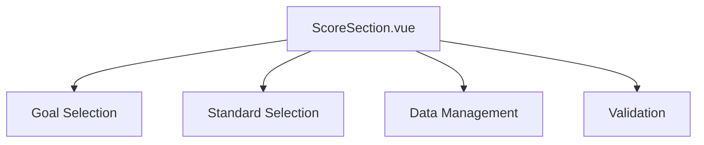
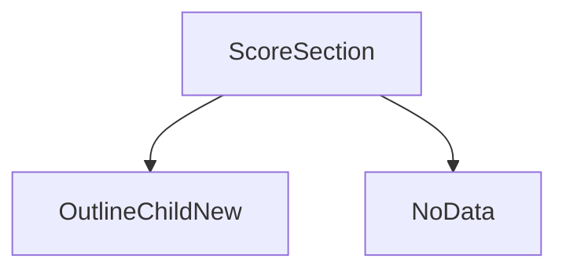
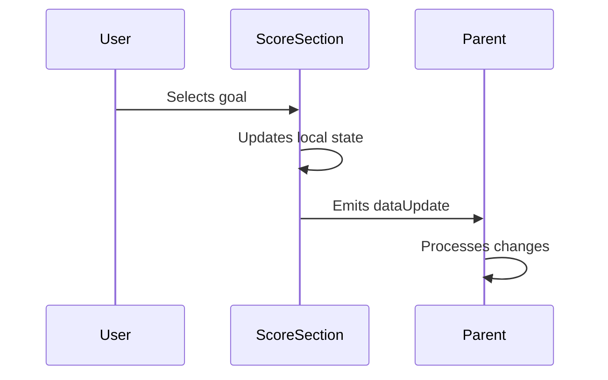

# 1. Introduction

## Interactive Video Task Module

This module enables educators to create interactive video-based tasks with features like trimming, embedded quizzes, and real-time engagement tracking. Built using Vue.js with Quasar, Video.js, videojs-youtube, and FeathersJS, it supports flexible video sources and two modes of learning: **Student-paced** and **Teacher-paced**.

---

### Features

#### Video Source Options

Educators can choose from a variety of video sources:

- **YouTube** – Link public or unlisted YouTube videos.
- **Video Library** – Use curated educational videos provided by Classcipe.
- **My Videos** – Select from previously created video tasks.
- **Upload** – Upload custom video files from the local system.

---

#### Video Trimming

Educators can trim the video to focus on specific segments that are relevant to the learning objective.

---

#### Quiz Integration

- Add interactive quizzes at specific timestamps.
- Supports two question types - MCQS and Text Questions.
- Responses are stored and evaluated for analytics and grading.

---

### Learning Modes

#### Student-paced Mode

- **Control**: Student controls video playback.
- **Flexibility**: Students can pause, rewind, and move at their own pace.
- **Autonomy**: Ideal for self-directed learning environments.

#### Teacher-paced Mode

- **Control**: Teacher controls playback and progression.
- **Synchronization**: All students watch and interact with the video simultaneously.
- **Classroom-friendly**: Perfect for live teaching sessions and guided discussions.

---

# 2. Project Structure

## Folder Structure

### Teacher Video Content Creation (Repository- web)

```
src/
├── components/
│   └── VideoPlayer/
│       └── VideoPlayer.vue         # Common reusable video player component

├── pages/
│   ├── InteractiveVideo/
│   │   ├── components/
│   │   │   ├── ActivityModal/
│   │   │   │   ├── ChooseOptions.vue
│   │   │   │   ├── MainModal.vue
│   │   │   │   ├── MultipleChoiceActivity.vue
│   │   │   │   └── TextOnlyActivity.vue
│   │   │   ├── DeleteModal.vue
│   │   │   ├── InteractiveHeader.vue
│   │   │   ├── MyVideos.vue
│   │   │   ├── TemplateSelectionModal.vue
│   │   │   ├── UploadVideos.vue
│   │   │   ├── VideoFooter.vue
│   │   │   ├── VideoPlayerComponent.vue
│   │   │   ├── VideoPlayerPreviewComponent.vue
│   │   │   └── YoutubeComponent.vue
│   │   ├── PreviewPage.vue
│   │   └── VideoContainer.vue
│
│   └── com/
│       └── video/
│           ├── Main.vue           # video Details Page
│           ├── CheckDialog.vue
│           ├── ScoreSection.vue
│           └── VideoScore.vue

├── stores/                        # Pinia stores
│   └── InteractiveVideo.js

├── router/                        # Route calls
│   └── InteractiveVideo.js

```

---

# 3. FlowChart

### Video Content:

---



---

### Video Details:

---



# 4. Component Documentation

## Component: `<VideoPlayer.vue>`

A feature-rich video player component built with Video.js that supports YouTube/MP4 playback, trimming, interactive markers, and quiz integration.

### Features

- **Video Playback**
  - YouTube & MP4 support
  - Custom progress bar
- **Trimming Tools**
  - Visual trim handles
  - Live preview
  - Apply/cancel functionality
- **Interactive Markers**
  - Quiz point indicators
  - Draggable in edit mode
  - Tooltips with details
- **Student Mode**
  - Automatic quiz triggering
  - Case study support
  - Teacher-paced controls

** Dependencies**

- `video.js`: Core video engine
- `videojs-youtube`: YouTube playback
- `Quasar`: UI framework
- `FeathersJS`: Backend API”

### Props

| Prop Name     | Type    | Default | Description                                   |
| ------------- | ------- | ------- | --------------------------------------------- |
| `isEdit`      | Boolean | false   | Whether the player is in edit mode            |
| `isStudent`   | Boolean | false   | Whether the player is in student mode         |
| `videoData`   | Object  | {}      | Video metadata including ID, type, and timing |
| `isSaving`    | Boolean | false   | Flag indicating if video is being saved       |
| `isPreview`   | Boolean | false   | Whether the player is in preview mode         |
| `startTrim`   | Number  | null    | Start time for trimmed video segment          |
| `endTrim`     | Number  | null    | End time for trimmed video segment            |
| `isLandscape` | Boolean | false   | Whether the player is in landscape mode       |

### State Variables

#### Reactive References

- `player`: Video.js player instance
- `currentTooltip`: Currently displayed tooltip element
- `isTooltipVisible`: Whether any tooltip is visible
- `currentMarker`: Currently active marker element
- `trimmedOverlay`: DOM element for trimmed overlay
- `isSeekDragging`: Whether seek bar is being dragged
- `isTrimDragging`: Whether trim controls are being dragged
- `isMarkerDragging`: Whether a marker is being dragged
- `markerClickedTime`: Time when marker was clicked
- `trimRange`: Object with start/end trim percentages
- `showTrimmer`: Whether trim controls are visible
- `dragType`: Type of drag operation ('start' or 'end')
- `initialX`: Initial X position for drag operations
- `isAnyMarkerOverlapping`: Whether any marker overlaps playhead
- `resumedFromMarker`: Whether playback resumed from marker
- `isCaseStudy`: Whether case study is active
- `isPausedAtMarker`: Whether paused at marker
- `isMarkerClicked`: Whether marker was clicked
- `currentQuiz`: Currently active quiz data

#### Computed Properties

- `isPreview`: Whether in preview mode
- `isViewOnly`: Whether in view-only mode
- `videoAddedFrom`: Source of video from store
- `getQuizIdFromAuth`: Current quiz ID from room store
- `isLandscape`: Whether in landscape mode
- `isSaving`: Whether saving is in progress
- `isEdit`: Whether in edit mode
- `isStudent`: Whether in student mode
- `currentQuiz`: Currently active quiz
- `quizModalVisible`: Whether quiz modal is visible
- `questions`: Array of quiz questions
- `videoData`: Video metadata
- `containerStyle`: Dynamic container styling

### Methods

#### Player Control Methods

- `handleModalOpen()`: Pauses player and opens quiz modal
- `handleModalClose()`: Resumes playback after modal close
- `changeShowTrimmer()`: Toggles trim controls visibility
- `updateTimeOnMarker()`: Advances time slightly after marker
- `updateMarkers()`: Updates marker positions based on questions
- `clearSelectedQuiz()`: Resets current quiz state

#### Time Handling Methods

- `handleTimeUpdate()`: Main time update handler for player
- `secondToTimeFormat()`: Converts seconds to MM:SS format
- `updateCustomTimeDisplay()`: Updates time display during trim

#### Marker Methods

- `clearMarker()`: Removes a specific marker
- `addMarker()`: Adds a new marker with tooltip
- `updateQuizTimeInStore()`: Updates quiz time in Vuex store

#### Trim Methods

- `startTrimDragging()`: Initiates trim drag operation
- `onTrimDrag()`: Handles trim drag movement
- `stopTrimDragging()`: Ends trim drag operation
- `applyTrim()`: Applies trim changes to player
- `updateProgressControl()`: Updates progress bar after trim
- `cancelTrim()`: Cancels trim operation

#### Utility Methods

- `hideAllTooltips()`: Hides all visible tooltips
- `handleResize()`: Handles window resize events

### Events

#### Player Events

- `timeupdate`: Main playback time update
- `playing`: When playback starts
- `play`: When playback begins
- `pause`: When playback pauses
- `loadedmetadata`: When video metadata loads

### Lifecycle Hooks

#### `onMounted()`

- Initializes video player with proper tech (YouTube/HTML5)
- Sets up custom controls and progress bar
- Loads questions from API if needed
- Adds event listeners

#### `onBeforeUnmount()`

- Cleans up player instance
- Removes event listeners
- Performs cleanup of DOM elements

#### Watchers

- `isSaving`: Handles save state changes
- `isMarkerClicked`: Handles marker click state
- `quizModalVisible`: Pauses on modal open
- `questions`: Updates markers when questions change
- `rooms.currentCaseStudy`: Handles case study changes
- `startTrim/endTrim`: Updates markers when trim changes
- `isPausedAtMarker`: Handles marker pause state
- `showTrimmer`: Handles trim UI changes
- `videoData`: Updates trim times
- `rooms.studentPaced`: Handles pacing mode changes
- `rooms.currentQuizId`: Updates current quiz

### APIs Used

- FeathersJS `App.service('questions').find()`: Fetches questions for video
  -{ query: { id: videoData.value.videoId } }
- This sends a GET request to fetch all question records where the id matches the videoId from videoData in OnMounted Lifecycle Hook.

### Stores Used

- `roomStore`: Manages room/quiz state
- `interactiveVideoStore`: Manages video and question state

### Components Used

- `VideoFooter`: Player control footer
- `MainModal`: Quiz modal for instructor
- `MainModalStud`: Quiz modal for student
- `EyesUp`: Case study component
- `CaseStudy`: Case study modal

---

## Component: `VideoContainer.vue`

This component is responsible for rendering the main video interaction view. It dynamically handles loading, video selection (library, YouTube, uploaded), and interactive editing depending on the current route and fetched data.

---

### Dependencies

```js
import {ref, computed, watch, onMounted, inject} from 'vue'
import {useRoute, useRouter} from 'vue-router'
import {useQuasar} from 'quasar'
```

---

### Components Used

```js
import YoutubeComponent from './components/YoutubeComponent.vue'
import MyVideoes from './components/MyVideoes.vue'
import UploadVideoes from './components/UploadVideoes.vue'
import VideoPlayerComponent from './components/VideoPlayerComponent.vue'
import InteractiveHeader from './components/InteractiveHeader.vue'
import CheckDailog from '../com/video/CheckDailog.vue'
```

| Component              | Purpose                                                                   |
| ---------------------- | ------------------------------------------------------------------------- |
| `YoutubeComponent`     | Embeds videos from YouTube.                                               |
| `MyVideoes`            | Shows user's own video collection.                                        |
| `UploadVideoes`        | Allows user to upload videos directly.                                    |
| `VideoPlayerComponent` | Plays the selected interactive video.                                     |
| `InteractiveHeader`    | Handles the header (with save/back functions) for interactive video edit. |
| `CheckDailog`          | Popup for validating whether user can edit the video.                     |

---

### API Usage

#### `App.service('unit').get(id)`

- **When**: During `onMounted()`
- **Why**: To fetch unit data and initialize video-related state.
- id is from route.params.id (unitId)

#### `App.service('interactive-videoes').get(videoId)`

- **When**: If unit has a linked video
- **Why**: To load the interactive video’s metadata.
- videoId is taken from above unit data (video [rs.video] - id of the video)

---

### `ref` & `computed` Usage Summary

| Name             | Type       | Purpose                                                                           |
| ---------------- | ---------- | --------------------------------------------------------------------------------- |
| `loading`        | `ref`      | Controls `q-inner-loading` display during async fetches.                          |
| `oneValue`       | `ref`      | Holds current unit info fetched from backend.                                     |
| `selectedTab`    | `ref`      | Tracks currently selected tab (e.g., YouTube, Upload).                            |
| `videoData`      | `computed` | Stores data of the selected video from the store.                                 |
| `videoAddedFrom` | `computed` | Source where the video was added from.                                            |
| `isSaving`       | `ref`      | Indicates whether a save action is in progress (used for `VideoPlayerComponent`). |
| `isCheckDailog`  | `ref`      | Whether to show the check dialog popup or not.                                    |
| `leftDrawerOpen` | `ref`      | Controls the state of the navigation drawer for small screens.                    |
| `miniState`      | `ref`      | Whether the drawer is in mini (collapsed) state.                                  |

---

### Logic Highlights

- **Initial Setup**: On mount, we fetch the unit using the route ID and possibly fetch video data if linked.
- **Tab Handling**: Dynamically loads components based on selected tab (`youtube`, `myvideo`, `upload`, etc.).
- **Readonly Checks**: Depending on the user and unit ownership, the component switches to readonly view.
- **Drawer**: Responsive navigation drawer with auto-toggle based on screen size and click behavior.

---

### Methods

- **`goBack()`**: Returns to the previous or default `/home/contents` page.
- **`handleSave()`**: Toggles the save state for `VideoPlayerComponent`.
- **`setSelectedTab()`**: Updates local tab and reflects change in store.

---

## Component: `PreviewPage.vue`

This component is responsible for **previewing a trimmed interactive video** and rendering **quiz questions** associated with that video. It’s commonly used in review or preview modes.

---

### Dependencies

```js
import {ref, onMounted, computed} from 'vue'
import {useRoute, useRouter} from 'vue-router'
```

- `ref`, `computed`, `onMounted`: Vue 3 Composition API for state and lifecycle.
- `useRoute`, `useRouter`: Vue Router to fetch route params and enable navigation.

---

### Components Used

```js
import VideoScore from '../com/video/VideoScore.vue'
import VideoPlayer from '../../components/VideoPlayer/VideoPlayer.vue'
```

| Component     | Purpose                                                  |
| ------------- | -------------------------------------------------------- |
| `VideoPlayer` | Displays the trimmed video using the passed `videoData`. |
| `VideoScore`  | Renders questions/quizzes overlayed on the video.        |

---

### Props

| Name        | Type    | Default  | Description                                        |
| ----------- | ------- | -------- | -------------------------------------------------- |
| `width`     | String  | `'auto'` | Width of the container                             |
| `height`    | String  | `'auto'` | Height of the container                            |
| `noFlex`    | Boolean | `false`  | Layout helper                                      |
| `noEdit`    | Boolean | `false`  | If true, disables editing                          |
| `isReview`  | Boolean | `false`  | Indicates review mode; changes UI accordingly.     |
| `videoData` | Object  | `null`   | Video metadata to use for playback and quiz fetch. |

---

### API Usage

#### `App.service('questions').find({ query: { id: videoId } })`

- **When**: After getting `videoData`
- { query: {id: videoData.value.videoId} }
- **Why**: To fetch questions/quizzes related to the video.

#### Conditional API Call:

- If `videoData` is not passed via props:
  - sessionRs = `App.service('session').get(id)` → for sessions.
  - unitRs = `App.service('unit').get(id)` → for unit content.
  - id is `route.params.id` for both cases.
  - Then fetch the video using `App.service('interactive-videoes').get(videoId)`.
  - This videoId can be `sessionRs?.task?.video` or `unitRs?.video`

---

### `ref` & `computed` Usage Summary

| Name             | Type       | Purpose                                                           |
| ---------------- | ---------- | ----------------------------------------------------------------- |
| `videoData`      | `ref`      | Stores video details (either from props or fetched).              |
| `taskId`         | `computed` | Gets task/session/unit ID from route.                             |
| `startTrim`      | `ref`      | Start timestamp for trimming the video.                           |
| `endTrim`        | `ref`      | End timestamp for trimming the video.                             |
| `questions`      | `ref`      | Stores quizzes/questions fetched from backend.                    |
| `filteredQuizes` | `computed` | Filters `questions` to only show those within trim time window.   |
| `loading`        | `ref`      | Controls the `q-inner-loading` spinner.                           |
| `activeTab`      | `ref`      | Tracks the currently active question ID.                          |
| `selectedQuiz`   | `ref`      | Currently selected quiz/question data.                            |
| `isPD`           | `ref`      | Indicates if curriculum type is 'pd'.                             |
| `componentStyle` | `computed` | Used to fix the player dimensions (`100%` width, `500px` height). |

---

### Key Logic Flow

#### `onMounted() → initialdata()`

- If `videoData` prop exists:
  - Use it and fetch associated questions.
- Else:
  - Detect if it's a session or unit.
  - Fetch video ID from session/unit.
  - Fetch full video metadata.
  - Fetch associated questions.

#### Trimming Support

- Uses `startTrim` and `endTrim` to define the **time window** of the video preview.
- Only quizzes inside this window (based on `quiz.page`) are rendered.

---

### Navigation

#### `goBack()`

- Uses Vue Router to go back to a given `route.query.back` value, or default to `/home/contents`.

---

### UI Overview

- **Header**: Displays back button and "Questions" label if not in review mode.
- **VideoPlayer**: Trimmed video is shown with controls.
- **VideoScore**: Quiz overlays based on time; respects `isReview` mode.
- **Loader**: Shows loading spinner until all data is fetched.

---

## Component: `InteractiveHeader.vue`

---

### Purpose

`InteractiveHeader.vue` is a **reusable video header** designed to be used in a video preview, edit, or view mode. It manages **navigation**, displays **video metadata**, and supports **save actions** for interactive video tasks.

---

### Props

| Prop           | Type       | Description                                                                   |
| -------------- | ---------- | ----------------------------------------------------------------------------- |
| `oneValue`     | `Object`   | The main video/task object containing metadata like `name`, `updatedAt`, etc. |
| `hasVideoData` | `Boolean`  | Whether video data exists—determines if "Save" button should be shown         |
| `handleSave`   | `Function` | External function to handle temporary/extra save logic before store update    |

---

### Computed Properties

| Name         | Description                                                     |
| ------------ | --------------------------------------------------------------- |
| `one`        | Alias for `props.oneValue` to access video/task metadata easily |
| `isViewOnly` | Checks if the route path includes `/video/view/`                |
| `isPd`       | Determines if the curriculum is `'pd'`, marking it as a service |
| `videoData`  | Fetched via `interactiveVideoStore.getVideoData`                |
| `questions`  | Fetched via `interactiveVideoStore.getQuestions`                |

---

### Components Used

- Quasar UI components:
  - `<q-header>`, `<q-toolbar>`, `<q-btn>`, `<q-avatar>`, `<q-icon>`, `<q-item>`

---

### Stores Accessed

| Store                     | Purpose                                                                                   |
| ------------------------- | ----------------------------------------------------------------------------------------- |
| `curriculumStore()`       | For curriculum labels (`pubList`) and curriculum logic (`isPd`)                           |
| `interactiveVideoStore()` | Handles video metadata and questions state, like `getVideoData`, `updateInteractiveVideo` |

---

### Methods

| Methods               | Description                                                                                    |
| --------------------- | ---------------------------------------------------------------------------------------------- |
| `goBack()`            | Navigates to the previous route using `route.query.back` or defaults to `/home/contents`       |
| `videoDetailsClick()` | Redirects to either the **view** or **edit** interactive video page based on the current route |
| `save()`              | - Executes `handleSave()` before and after the update                                          |

                       - Updates the video using store’s `updateInteractiveVideo()`
                       - Shows a success notification using `$q.notify()` |

| `checkOrientation()`| Sets `isLandscape` to `true` if screen width is less than 576px (mobile view) |

---

### Lifecycle Hooks

| Hook            | Purpose                                                             |
| --------------- | ------------------------------------------------------------------- |
| `onMounted()`   | Initializes the screen orientation and adds a resize event listener |
| `onUnmounted()` | Removes the orientation event listener to avoid memory leaks        |

---

### Responsive Design

- Uses `isLandscape` ref to adapt layout for small screens (like hiding extra details)
- Buttons have adaptive classes like `gt-sm`, `lt-md`, etc.
- Mobile-first: `q-btn` for hamburger menu (`menu` icon) appears only on small screens

---

### Navigation Logic

- Back and navigation buttons rely on `vue-router` and `route.query.back`
- Clicking **"Video Details"** redirects to either view or edit routes dynamically:
  ```vue
  /com/video/view/:id or /com/video/edit/:id
  ```

---

### Save Workflow

1. `handleSave()` is called (possibly to validate or format data)
2. After 500ms, `videoStore.updateInteractiveVideo(videoData)` updates the store
3. Notification is shown: “Updated successfully”

---

## Component: `VideoFooter.vue`

---

### Purpose

`VideoFooter.vue` is a UI footer component for an interactive video editor. It provides key controls to:

- Add a new **activity (quiz/prompt)** at the current timestamp
  -️ Trigger a modal to **delete the video**
- Show notifications for deletion confirmation or errors

---

### Props

| Prop                  | Type    | Default | Description                                                 |
| --------------------- | ------- | ------- | ----------------------------------------------------------- |
| `disabledAddActivity` | Boolean | false   | Controls whether the **"Add Activity"** button is clickable |

---

### `ref` State Variables

| Variable           | Type           | Description                                                                                                |
| ------------------ | -------------- | ---------------------------------------------------------------------------------------------------------- |
| `showNotification` | `Ref(Boolean)` | Controls visibility of the custom `Notification.vue`                                                       |
| `notificationRef`  | `Ref`          | Ref to the custom notification component                                                                   |
| `notifMessage`     | `Ref(String)`  | Message content for the notification                                                                       |
| `notifColor`       | `Ref(String)`  | Color of the notification (e.g., `'red'` for error)                                                        |
| `notifAvatar`      | `Ref(String)`  | Placeholder for avatar/icon in notification                                                                |
| `notifActions`     | `Ref(Array)`   | List of actions for the notification (e.g., close button)                                                  |
| `isDeleteModal`    | `Ref(Boolean)` | Controls visibility of the `DeleteModal` component                                                         |
| `controlBarRef`    | `Ref(null)`    | A general-purpose ref that checks presence of control bar, possibly used for logic branching during delete |

---

### Computed Properties

| Name                 | Description                                                               |
| -------------------- | ------------------------------------------------------------------------- |
| `currentTime`        | Gets the current time (in seconds) from the video player via `videoStore` |
| `formattedTime`      | Converts `currentTime` to `HH:MM:SS` format for display in UI             |
| `getVideoDataForApi` | Pulls the current video metadata from store                               |
| `getQuestionsForApi` | Accesses the list of interactive questions (quizzes/prompts)              |
| `videoAddedFrom`     | Indicates which module or route the video was added from                  |
| `isEdit`             | Checks if the current route is in edit mode (`/edit/`)                    |

---

### Components Used

| Component          | Source                               | Purpose                                    |
| ------------------ | ------------------------------------ | ------------------------------------------ |
| `DeleteModal`      | Local (same folder)                  | Modal to confirm and handle video deletion |
| `Notification.vue` | Custom global notification component |
| `q-btn`, `q-icon`  | Quasar UI                            | Buttons with icons and styling             |

---

### API Calls

#### `App.service('unit').patch(route.params.id, { video: null, cover: null, name: null })`

- **When**: When resetting(on delete video) the unit's associated video, cover image, and name—typically before setting or updating them.
- **Why**: To clear existing video, cover, and name data from the unit before assigning new values or when deleting unit content.
- `route.params.id` is unit Id

---

### Stores Accessed

| Store                     | Purpose                                                                 |
| ------------------------- | ----------------------------------------------------------------------- |
| `interactiveVideoStore()` | Gets video metadata, current time, questions list, and visibility flags |

---

### Methods

| Method                | Description                                                                                         |
| --------------------- | --------------------------------------------------------------------------------------------------- |
| `addActivity()`       | Opens the quiz modal at the current video timestamp using `videoStore.setQuizModalVisibility(true)` |
| `handleDeleteModal()` | Toggles the `DeleteModal` visibility on/off                                                         |
| `deleteVid()`         | - Calls backend API to remove the video from the unit                                               |

                       - Clears store video data if applicable
                       - Shows a success notification and redirects to `/home/contents` |

| `triggerNotification(message, color)` | Custom method to trigger a notification with a message and color. Internally sets message, color, and close action |

---

### Lifecycle Hook

| Hook          | Purpose                                                                                                  |
| ------------- | -------------------------------------------------------------------------------------------------------- |
| `onMounted()` | Dispatches a custom event `footer-mounted` after footer is mounted (used to sync layout with parent/app) |

---

### UI Behavior

#### Add Activity Button

- Label: `"Add Activity at HH:MM:SS"` (current video timestamp)
- Disabled when `props.disabledAddActivity` is `true`
- On click → opens quiz modal via store

#### ️ Delete Video Button

- Opens a confirmation modal (`DeleteModal`)
- On confirm:
  - PATCHes the backend `unit` resource (removes `video`, `cover`, `name`)
  - Updates local store if needed
  - Shows a Quasar toast notification
  - Redirects to `/home/contents`

---

## Component: `VideoPlayerComponent.vue`

This component acts as a **container wrapper for the actual `VideoPlayer`**, dynamically adjusting layout based on screen orientation (portrait or landscape). It pulls video data from the pinia store and passes it to the player.

---

### Components Used

#### `VideoPlayer.vue`

---

### Props

| Prop       | Type      | Default | Description                                  |
| ---------- | --------- | ------- | -------------------------------------------- |
| `isSaving` | `Boolean` | -       | Indicates whether video data is being saved  |
| `readOnly` | `Boolean` | `false` | Whether the player is in read-only view mode |

---

### Computed Properties

| Name        | Description                                                                           |
| ----------- | ------------------------------------------------------------------------------------- |
| `videoData` | Returns current video data from the `interactiveVideoStore` via `getVideoData` getter |

---

### Refs (Reactive State)

| Ref           | Type           | Description                                                           |
| ------------- | -------------- | --------------------------------------------------------------------- |
| `isLandscape` | `Ref(Boolean)` | Reflects current layout orientation (true for landscape/compact mode) |

---

### Methods

| Method               | Purpose                                                                                 |
| -------------------- | --------------------------------------------------------------------------------------- |
| `checkOrientation()` | Dynamically updates `isLandscape` based on current window width (`< 576px` = landscape) |

---

### Store Used

#### `interactiveVideoStore`

- **Getter used**:
  - `getVideoData`: Provides current video metadata and configuration
- No API mutations or actions triggered in this component itself — it is purely _consumptive_

---

### Lifecycle Hooks

| Hook          | Purpose                                                          |
| ------------- | ---------------------------------------------------------------- |
| `onMounted`   | Triggers `checkOrientation` and sets up window `resize` listener |
| `onUnmounted` | Cleans up the event listener to prevent memory leaks             |

---

### UI Behavior

| Feature                          | Explanation                                                             |
| -------------------------------- | ----------------------------------------------------------------------- |
| Responsive Layout                | Adjusts video container height depending on orientation                 |
| Title Display (`videoData.name`) | Displays current video's name in a top banner                           |
| `VideoPlayer` Component Render   | Responsible for rendering the actual player UI and interactive elements |
| Height Dynamic Adjustment        | `calc(100vh - 86px)` for portrait, `calc(100% - 87px)` for landscape    |

---

## Component: `VideoPlayerPreviewComponent.vue`

This component displays a **preview of an interactive video** along with a list of quizzes (multiple choice or text-based) placed at specific timestamps within the video. It is designed for both view-only and editable navigation depending on the `readOnly` prop.

---

### Purpose

- Display a **preview video** using `VideoPlayer`
- Fetch and display **trimmed quizzes** within the video time range
- Allow navigation to **edit/view full video** based on `readOnly` mode
- Show **quiz preview cards** for selected quiz tabs

---

### Components Used

#### `VideoPlayer.vue`

- Embedded inside preview
- Props passed: `isPreview`, `startTrim`, `endTrim`, `videoData`

#### Quasar Components

- `q-btn`, `q-card`, `q-tabs`, `q-tab`, `q-icon`, `q-spinner-ball`, `q-inner-loading`, `q-card-section`

---

### Props

| Prop       | Type    | Default  | Description                                               |
| ---------- | ------- | -------- | --------------------------------------------------------- |
| `width`    | String  | `'auto'` | Width of the video component container                    |
| `height`   | String  | `'auto'` | Height of the video component container                   |
| `readOnly` | Boolean | `false`  | If true, disables editing and navigates to view-only mode |

---

### State (`ref`s)

| Variable       | Type         | Description                                      |
| -------------- | ------------ | ------------------------------------------------ |
| `route`        | Object       | Vue router object for accessing route params     |
| `router`       | Object       | Vue router object to handle navigation           |
| `questions`    | Ref(Array)   | All quiz questions fetched from backend          |
| `startTrim`    | Ref(Number)  | Start time of the video trim                     |
| `endTrim`      | Ref(Number)  | End time of the video trim                       |
| `loading`      | Ref(Boolean) | Shows loading spinner while data is fetched      |
| `activeTab`    | Ref(String)  | ID of the currently selected quiz tab            |
| `selectedQuiz` | Ref(Object)  | The currently active quiz (selected by user/tab) |
| `videoData`    | Ref(Object)  | Video metadata fetched via API                   |

---

### Computed Properties

| Name             | Description                                                          |
| ---------------- | -------------------------------------------------------------------- |
| `filteredQuizes` | Quizzes that fall within the trimmed start and end time of the video |
| `componentStyle` | Computed dynamic width and height based on screen size and props     |

---

### Methods

| Method                        | Purpose                                                    |
| ----------------------------- | ---------------------------------------------------------- |
| `selectQuiz(quiz)`            | Sets `selectedQuiz` to the clicked quiz tab                |
| `goToVideo()`                 | Navigates to edit/view video page based on `readOnly` mode |
| `secondToTimeFormat(seconds)` | Converts seconds to `MM:SS` format for display             |

---

### API Calls

#### GET /unit/:id -`App.service('unit').get(route.params.id)`

- Fetches unit metadata by unit Id (from route)

#### GET /interactive-videoes/:videoId -`App.service('interactive-videoes').get(videoId)`

- Fetches video metadata including trimming information
- videoId is taken from above unit data by unitData?.video

#### GET /questions?query={id: videoId} - `App.service('questions').find({query: {id: videoData.value.videoId}})`

- Fetches all quiz questions associated with the video
- videoData is taken from above api

---

### UI Behavior

| Feature          | Description                                                                    |
| ---------------- | ------------------------------------------------------------------------------ |
| Video Preview    | Renders a trimmed preview using `VideoPlayer`                                  |
| Quiz Tabs        | Shows tab for each filtered quiz within the trim range                         |
| Question Display | Renders selected quiz with icon, timestamp, question, and options              |
| Button Behavior  | Displays `"Go to edit video"` or `"Go to view video"` based on `readOnly` prop |
| Loading Spinner  | Full-screen spinner shown until all data (video + questions) is loaded         |

---

### Lifecycle Hook

| Hook        | Purpose                                                                                                                    |
| ----------- | -------------------------------------------------------------------------------------------------------------------------- |
| `onMounted` | Triggers API calls to fetch unit → video metadata → questions in sequence. Initializes quiz tab selection after filtering. |

---

## Component: `YoutubeComponent.vue`

---

### Reactive State (Refs)

| Ref                      | Type                  | Description                                                 |
| ------------------------ | --------------------- | ----------------------------------------------------------- |
| `keyword`                | `Ref<String>`         | Search query entered by the user                            |
| `list`                   | `Ref<Object>`         | Response list from the YouTube API                          |
| `selectedVideo`          | `Ref<Object>`         | Currently selected video object                             |
| `active`                 | `Ref<Number>`         | Index of the currently selected video for display           |
| `player`                 | `Ref<Object>`         | Instance of the YouTube IFrame API player                   |
| `videoAvailable`         | `Ref<Boolean>`        | If an error occurred during video load                      |
| `loading`                | `Ref<Boolean>`        | Whether a search is in progress                             |
| `searchEl`               | `Ref<HTMLElement>`    | Reference to the input element                              |
| `googleImageSearch`      | `Ref<HTMLElement>`    | Reference wrapper for the entire search component           |
| `start`, `duration`      | `Ref<String>`         | Start time and total duration of selected video             |
| `lastSeconds`            | `Ref<Number>`         | Last played seconds timestamp                               |
| `prompt`                 | `Ref<Boolean>`        | (Unused currently) Flag for prompting user                  |
| `resize`, `scrollHeight` | `Ref<Boolean/Number>` | (Unused currently) For scroll height or responsive behavior |

---

### Computed

> **None explicitly declared**

---

### Methods

| Method                        | Description                                                                                                     |
| ----------------------------- | --------------------------------------------------------------------------------------------------------------- |
| `searchFn()`                  | Calls backend YouTube proxy API and populates `list.items` with valid video entries                             |
| `onPosterClick(index, video)` | Handles thumbnail click: sets selected video, initializes YouTube Player iframe                                 |
| `onPlayerReady(event)`        | Mutes video on ready                                                                                            |
| `onPlayerStateChange()`       | Updates `start` and `duration` values using the current player state                                            |
| `onPlayerError(event)`        | If player encounters error, marks `videoAvailable` as true (disabling save button)                              |
| `secondsToHMS(seconds)`       | Utility to convert seconds to `hh:mm:ss` format                                                                 |
| `addFn()`                     | Saves selected video to the store by calling `addInteractiveVideo` with required metadata and notifies the user |

---

### API Calls

| API                                         | Method | Description                                                     |
| ------------------------------------------- | ------ | --------------------------------------------------------------- |
| `/fio/google/youtube?order=relevance&q=...` | GET    | Searches YouTube videos using server-side proxy for `q` keyword |

---

### Lifecycle Hooks

| Hook          | Description                                                |
| ------------- | ---------------------------------------------------------- |
| `onMounted()` | Focuses the search input box when the component is mounted |

---

### Stores

| Store                   | Usage                                                                                                                      |
| ----------------------- | -------------------------------------------------------------------------------------------------------------------------- |
| `interactiveVideoStore` | Used to add selected video and keep track of video source using `setVideoAddedFrom('youtube')` and `addInteractiveVideo()` |

---

### UI Behavior

- Input field takes in search keyword.
- Enter key or search icon triggers a YouTube video search.
- Videos are displayed as cards with:
  - Thumbnail
  - Title with tooltip
  - Description (up to 2 lines)
  - Published time
- On clicking a thumbnail:
  - Thumbnail is replaced with embedded YouTube Player.
  - Video duration and current start time are computed.
- "Save" button is visible when a video is selected and is enabled only if the video is playable (no player error).
- A toast notification appears on successful video save.

---

### Components Used

| Component                                                                                            | Source                                 | Purpose                                                    |
| ---------------------------------------------------------------------------------------------------- | -------------------------------------- | ---------------------------------------------------------- |
| `q-toolbar`, `q-input`, `q-icon`, `q-page`, `q-scroll-area`, `q-card`, `q-img`, `q-tooltip`, `q-btn` | [Quasar Framework](https://quasar.dev) | For UI layout, inputs, buttons, scrollable area, and icons |

---

### Styling Classes

| Class                                 | Purpose                                                                    |
| ------------------------------------- | -------------------------------------------------------------------------- |
| `yt-body-with-search`                 | Main container class for styling (external CSS assumed)                    |
| `rounded-borders`, `shadow-1`         | Applies rounded corners and subtle shadow to cards                         |
| `ellipsis-1-line`, `ellipsis-2-lines` | Limits text overflow to one or two lines                                   |
| `active-video`                        | Custom class (likely styled externally) to indicate active video selection |
| `vid-thumbnail`                       | Sets dimensions and layout of video thumbnails                             |

---

## Component: `MyVideoes.vue`

### Overview

`MyVideoes.vue` is a component that displays a list of user's interactive videos in a virtual scrollable layout. It allows filtering through `GeneralFilters`, and users can select a video to copy it into the current workspace.

---

### Computed Properties

#### `pagination`

- **Type:** `Object`
- **Description:** Returns the current pagination range of the visible video list.
- **Returns:** `{ start: Number, end: Number }`

#### `groupedVideoList`

- **Type:** `Array<Array>`
- **Description:** Groups `videoList` into chunks of 4 videos for display in a row-wise card layout.

---

### Reactive State / Refs

- `virtualListIndex`: Tracks the virtual scroll index.
- `videoListRes`: Stores the response object from the API.
- `videoList`: Stores the list of fetched video objects.
- `videoLoading`: Boolean flag to show loading state.
- `query`: Stores dynamic query parameters for video fetch API.
- `filters`: Bound to `GeneralFilters`, stores filter options.
- `notifMessage`, `notifColor`, `notifAvatar`, `notifActions`: Controls notification message state.

---

### Methods

#### `fetchVideoes()`

- **Purpose:** Fetches videos from the backend using the current `query`.
- **Returns:** Number of fetched videos.
- **Side Effects:** Updates `videoList`, `videoListRes`, and toggles `videoLoading`.

#### `resetFn()`

- **Purpose:** Resets the state and reloads the video list.
- **Side Effects:** Clears video list and fetches anew.

#### `scrollFn({index, to})`

- **Purpose:** Triggered on virtual scroll. If bottom is reached, fetches the next set of videos.

#### `onFilterUpdate()`

- **Purpose:** Called when filters are updated from `GeneralFilters`, resets video list.

#### `selectVideo(videoData)`

- **Purpose:** Adds the selected video to `interactiveVideoStore` and shows a success notification.
- **Side Effects:** Modifies the store, updates video ID with current route ID, and strips internal `_id`.

#### `triggerNotification(message, color)`

- **Purpose:** Sets notification properties to display a message.

---

### API Calls

#### `App.service('interactive-videoes').find()`

- **Description:** Fetches videos based on filters and pagination.
- **Parameters:** `{ query: { $limit, $skip, name, isDeleted: false } }`
- **Response:** `{ data: [videos], limit, skip }`

---

### Emits

- **`@update:modelValue`**: Emitted by `GeneralFilters` when filter values change.

---

### Components Used

- `GeneralFilters`: Input component for search and filter functionality.
- `Notification`: Custom notification UI.
- `q-virtual-scroll`, `q-img`, `q-card`, `q-tooltip`, `q-spinner-ball`, `q-page`: Quasar UI components.
- `NoData`: Custom fallback UI for empty results.

---

### Store

- `interactiveVideoStore`:
  - `setVideoAddedFrom(source)`: Sets the source of the video.
  - `addInteractiveVideo(data)`: Adds a selected video to the store.

---

### UI Behavior

- Displays spinner while loading.
- Shows `NoData` if no videos are returned.
- Implements infinite scroll with virtual scrolling.
- Tooltips for video names longer than 50 characters.
- Clicking on a video card triggers `selectVideo`.

---

### Lifecycle Hooks

#### `onMounted()`

- Not used explicitly in this file, but initial fetch is triggered via the component lifecycle indirectly by rendering logic.

---

## Component: `UploadVideoes.vue`

### Purpose

A simple drag-and-drop or click-to-upload UI component that allows users to upload a video file, process its metadata (e.g., title, thumbnail, duration), and store it as an interactive video for a specific `tid` (topic ID).

---

### Components Used

- `<q-icon>` (from Quasar)

---

### State (Reactivity with `ref`)

| Variable           | Type             | Description                                                         |
| ------------------ | ---------------- | ------------------------------------------------------------------- | ---------------------- |
| `errorMessage`     | `String`         | Stores any upload-related error message                             |
| `videoDuration`    | `Number/null`    | Stores the duration of the video (not used in logic directly)       |
| `fileInput`        | `Ref`            | Not used but declared (possibly intended for `<input type="file">`) |
| `videoElement`     | `Ref`            | Not used but declared                                               |
| `isUploading`      | `Boolean`        | Indicates upload status (used for toggling icon display)            |
| `uploadController` | `AbortController | null`                                                               | Used to cancel uploads |

---

### Methods

#### `handleFileChange`

- **What it does**: Triggers the `uploadVideo` method when the container is clicked.
- **Why**: Allows file selection using the native file picker.

---

#### `handleDrop(event)`

- **What it does**: Handles file dropped via drag-and-drop UI, calls `Fn.fileUpLoadUi()` and uploads video.
- **UI Feedback**: Sets appropriate `errorMessage` if any error occurs.
- **API Calls**: Uploads video and generates interactive video metadata.

---

#### `uploadVideo()`

- **What it does**: Opens file picker restricted to videos via `Fn.fileUpLoadUiX('video/*')`, then calls `uploadVideoDetails`.
- **Handles**: User-triggered file uploads (click-to-select).
- **Errors**: Handles both generic and abort errors.

---

#### `uploadVideoDetails(rs)`

- **Input**: `rs` — response object after uploading video via `Fn.fileUpLoadUi`
- **What it does**:
  - Converts thumbnail from base64 to `File`
  - Uploads thumbnail via `Fn.fileUpLoadUi`
  - Constructs interactive video object using `route.params.id`
  - Calls `videoStore.addInteractiveVideo()` to save video
  - Notifies success
- **API Calls**:
  - `Fn.fileUpLoadUi(file)`
  - `Fn.hashToUrl(thImg._id)`
  - `videoStore.addInteractiveVideo()`

---

#### `base64ToFile(base64String, fileName)`

- **What it does**: Converts a base64 string into a JavaScript `File` object.
- **Why**: Required to re-upload thumbnail image extracted from uploaded video.

---

#### `cancelUpload()`

- **What it does**: Cancels current upload using `uploadController.abort()`.
- **UI Feedback**: Updates `errorMessage`.

---

#### `driveClicked()`

- **Note**: Currently not active in UI.
- **What it does**: Fetches slide data using `App.service('slide').get('sync')`.

---

### Emits

None directly emitted from this component.

---

### Store Used

#### `interactiveVideoStore`

- Methods Used:
  - `setVideoAddedFrom('upload')` — marks that the source of video addition is this component.
  - `addInteractiveVideo({...})` — adds video metadata to the global interactive video store.

---

### API Calls

- `Fn.fileUpLoadUi(file)` → Uploads a single file (used for both video and thumbnail).
- `Fn.hashToUrl(_id)` → Converts hash ID of uploaded thumbnail to a usable image URL.
- `Fn.fileUpLoadUiX('video/*')` → Opens a file picker for video files.
- `App.service('slide').get('sync')` (in `driveClicked`) → Retrieves sync info for slide (unused in UI currently).
- **When**: This API call is triggered when the user clicks on the "Drive" option (driveClicked() method). The UI element for this is currently commented out, so this function is not in use right now.

- `{ query: { id: o.sid } }`: This sends a request to the slide service to retrieve the resource with ID o.sid. This ID refers to a video stored in a connected cloud drive (Google Drive).

- **Why**: To sync and fetch content from a third-party source, possibly a Google Drive file. This could be used to import or link slides/videos from external storage into the interactive video editor.

---

### UI Behavior

#### Click to Upload

- Clicking the upload container opens a file picker.

#### Drag and Drop

- Users can drag a video file over the container and drop it to upload.

#### Icon Display

- Upload icon is shown only when `isUploading` is `false`.

#### Notifications

- Uses Quasar's `$q.notify()` to display a success message on successful upload.

---

## Component: `TemplateSelectionModal.vue`

### Overview

`TemplateSelectionModal` is a modal component built with Quasar and Vue 3 that allows users to choose either an academic curriculum template or a service type template when setting up a unit. It supports dynamic data fetching, loading states, default selections, and redirects to template settings.

---

### Props

#### `currentUnitData` (Object, default: `null`)

- Optional prop representing the unit currently being edited.
- Used to pre-select the relevant template or service based on curriculum.

---

### Computed Properties

#### `hasServiceCurr`

- Checks if there is at least one curriculum entry with `value === 'pd'`.
- Used to decide if the "Service" option should be available.

#### `hasNormalCurr`

- Checks if there's at least one curriculum **not equal to** `'pd'`.
- Used to enable or disable the "Academic" option.

---

### Reactive State

#### `chooseCurrType` (ref)

- `'academic'` or `'service'`. Indicates the current tab/radio selection.

#### `loading` (ref)

- Indicates if the modal is currently fetching data.

#### `mode` (ref)

- Static ref set to `'task'`, used for template labeling display.

#### `defaultTplId` (ref)

- Holds the default task template ID fetched from the server.

---

### Methods

#### `getCurriculumLabel(template)`

Returns the curriculum label (name) based on the template’s `curriculum` code by searching `_curriculumList`.

---

#### `getUnitPlanTemplateUserList()`

- Fetches and processes user-defined unit templates.
- Filters based on curriculum match.
- Fetches full template details using `getOneById`.
- Updates the global `acList` with new entries.

---

#### `getServices()`

- Populates `serviceList` with available PD (service-type) templates using the `subjects` store.

---

#### `setSelectedOption()`

- Determines the initial selection of template (`selectedOption`):
  - Based on default template for school/personal context.
  - Falls back to first template in the list if needed.
  - Uses `currentUnitData` to override selection, if provided.

---

#### `onOKClick()`

- Triggers the modal confirm event (`onDialogOK`) with the selected template.
- For service type, sets `curriculum = 'pd'` and applies `pdTaskTemplate`.

---

### Watchers

#### Watch on `_unitPlanTemplateUserList` & `_curriculumList`

- If `acList` is empty, triggers template fetch (`getUnitPlanTemplateUserList`).

#### Watch on `chooseCurrType`

- Updates `selectedOption` based on current curriculum type selection.

---

### Lifecycle Hook

#### `onMounted`

- Fetches curriculum list and service list.
- Waits for template data to load.
- Initializes selection logic.
- Sets default `chooseCurrType` based on `currentUnitData`.

---

### API Calls

Uses FeathersJS services:

- `App.service('conf-user').get('TaskTplDefault')`

  - Retrieves user's default template preferences.

- `App.service('unit-tpl-user').find()`

  - `{ query : {school, $limit}}` - school can be school id, personal user id or sys (system).
  - Fetches user-defined templates for units.

- `App.service('unit-tpl').get('task')`
  - Gets the default task template (for service curriculum).

---

### Emits

Emits via `useDialogPluginComponent`:

- `@hide` (handled internally)
- `onDialogCancel` → triggers when cancel button is clicked.
- `onDialogOK({data})` → sends selected template object back to parent on confirm.

---

### Stores Used

#### `pubStore`

- User's school context for determining default templates.

#### `curriculumStore`

- Provides list of available curriculums.

#### `subjectsStore`

- Fetches subject options for service templates.

---

### Composables Used

- `useDialogPluginComponent` – Quasar plugin for dialog management.
- `useUnitPlanTemplate` – Logic related to fetching and managing task templates.
- `useUnitPlanTemplateUser` – Logic related to user-defined templates.
- `useSchool` – Determines if the user has edit permissions.

---

### Components & UI Behavior

#### `q-dialog`

- Contains the full modal UI.

#### Radio Buttons (`q-option-group`)

- Toggles between `'academic'` and `'service'`.

#### `q-select`

- Shows available templates (`acList`) or service types (`serviceList`) depending on selection.

#### `q-chip`

- Shows indicators like "Default" or curriculum mode.

#### `q-spinner`

- Spinner shown when loading templates or curriculums.

#### Action Buttons

- **Cancel**: triggers `onDialogCancel`
- **Confirm**: triggers `onOKClick`
- **Go to Template Settings**: navigates to template settings route if `isUserEditing` is true.

---

### Routing

- Clicking on `Go to Template Settings`
  ```
  /account/academic-setting/subject/templateSetting
  ```
  - Also passes current route in `query.back` to allow returning.

---

## Component: `DeleteModal.vue`

### Overview

`DeleteModal` is a confirmation modal component. It prompts users to confirm or cancel the deletion of a video. The modal ensures that the delete operation is intentional, as the action is irreversible.

---

### Props

#### `handleDeleteModal` (Function, required)

- Called when the user clicks **"Cancel"**.
- Typically used to **hide/close the modal**.

#### `deleteVid` (Function, required)

- Called when the user confirms **"Yes, Delete it"**.
- Expected to **trigger the deletion logic**, such as an API call or a local update.

---

### Methods

There are **no explicitly defined methods**, but the component depends on two props as callbacks:

#### `props.handleDeleteModal()`

- Hides the modal when "Cancel" is clicked.

#### `props.deleteVid()`

- Executes the deletion logic when the user confirms.

---

### API Calls

- This component itself **does not make API calls**.
- However, the `<VideoFooter.vue>` calls the `deleteVid`, which involve:
  - A call to a video deletion API.
  - Local state management (e.g., removing the video from a list).
  - Notification updates or route redirection.

---

### UI Behavior

#### Visual Structure

- A **modal-like overlay** with a:
  - **Title**: “Delete Video”
  - **Subtitle**: “Are you sure you want to delete this video? This action cannot be undone.”
  - **Buttons**:
    - **Yes, Delete it**: Red, rounded. Triggers `deleteVid`.
    - **Cancel**: White, rounded, outlined. Triggers `handleDeleteModal`.

#### `q-btn` (from Quasar)

- Uses Quasar buttons for consistent design and responsiveness.

---

## Component: `MainModal.vue`

### Overview

`MainModal` is the main controller component that displays the quiz modal interface in an interactive video flow. It conditionally renders one of three child components — `ChooseOptions`, `TextOnlyActivity`, or `MultipleChoiceActivity` — based on the quiz question type selected from the Pinia store.

---

### Props

#### `selectedQuiz` (Object)

- Contains the current quiz data to be shown or edited.
- Passed down to child components.

#### `isPreview` (Boolean)

- Controls whether the quiz interface is in preview mode or edit mode.
- Affects how the child components behave/display.

#### `isLandscape` (Boolean)

- Determines layout styling.
- Passed to child components and applied to modal container class.

#### `readOnly` (Boolean) – _default: `false`_

- Disables user interaction when set to true.
- Passed to child components to render them in a non-editable state.

---

### Computed Properties

#### `questionType`

- **Source:** Pulled from the `interactiveVideoStore`.
- **Values:**
  - `undefined`: No question selected → renders `ChooseOptions`
  - `"text"`: Text-based quiz → renders `TextOnlyActivity`
  - `"choice"`: Multiple choice quiz → renders `MultipleChoiceActivity`

---

### Methods

#### `handleClearSelectedQuiz()`

- Emits `clearSelectedQuizFromChild` to parent.
- Used by child components to notify parent when the quiz is cleared (e.g., after saving or canceling).

---

### Emits

#### `clearSelectedQuizFromChild`

- Triggered when the child activity component finishes its interaction (like clearing selected quiz data).
- Parent component can use this to reset state or close modals.

---

### UI Behavior

#### Conditional Rendering

- **`ChooseOptions`** is shown when `questionType` is undefined.
- **`TextOnlyActivity`** is shown when `questionType` is `'text'`.
- **`MultipleChoiceActivity`** is shown when `questionType` is `'choice'`.

#### Modal Layout

- Uses a full-page `.bg` wrapper.
- Class applied to the modal (`quiz-modal` or `new-qmodal`) depends on the `isLandscape` prop.

---

### Stores Used

### `interactiveVideoStore`

- **`getQuestionType`**: Determines which quiz component to display.
- Acts as a central store for quiz modal state and selected question type.

---

### Components Used

| Component                | Purpose                                               |
| ------------------------ | ----------------------------------------------------- |
| `ChooseOptions`          | Lets the user choose between "text" and "choice" quiz |
| `TextOnlyActivity`       | Quiz editor/viewer for text-based questions           |
| `MultipleChoiceActivity` | Quiz editor/viewer for multiple choice questions      |

---

## Component: `ChooseOptions.vue`

### Overview

`ChooseOptions` is a modal component that allows users to select the type of quiz question they want to add to an interactive video — either a **text question** or a **multiple choice** question. It integrates with a store to persist the selection and control modal visibility.

---

### Props

#### `isLandscape` (Boolean)

- Optional prop.
- Affects the **styling** of the action buttons (`Cancel`, `Confirm`) based on the screen orientation.
- When `true`, adds a top margin; when `false`, applies a scale transformation.

---

### Reactive State

#### `questionType` (`ref`)

- A reactive string value bound to the selected radio button.
- Initializes from the value returned by `videoStore.getQuestionType` or defaults to `"text"`.
- Values:
  - `"text"` – for simple text-based questions.
  - `"choice"` – for multiple-choice questions.

---

### Methods

#### `confirmClicked()`

- Called when the **Confirm** button is clicked.
- Sets the selected `questionType` in the store via `videoStore.setQuestionType`.

#### `cancelClicked()`

- Called when the **Cancel** button is clicked.
- Hides the question type selection modal by calling `videoStore.setQuizModalVisibility(false)`.

---

### Stores Used

#### `interactiveVideoStore` (Pinia store)

- **`getQuestionType`**: Retrieves the current question type selection.
- **`setQuestionType(value)`**: Updates the selected question type in the store.
- **`setQuizModalVisibility(false)`**: Hides the quiz modal when canceling.

---

### UI Behavior

#### Layout

- Shows a **radio group** with two options:
  - Text question
  - Multiple choice question

#### Buttons

- Two buttons:
  - **Cancel**: Reverts and closes the modal.
  - **Confirm**: Saves the selection to the store.
- Button styling dynamically adjusts based on `isLandscape`.

---

## Component: `MultipleChoiceActivity.vue`

### Overview

`MultipleChoiceActivity.vue` is a component that handles the creation, editing, and previewing of multiple choice quiz questions. It supports dynamic option editing, marking correct answers, drag-and-drop reordering, and saving or deleting the quiz via the `interactiveVideoStore`.

---

### Props

| Prop           | Type    | Description                                                          |
| -------------- | ------- | -------------------------------------------------------------------- |
| `selectedQuiz` | Object  | The quiz data object, used for editing or previewing a question.     |
| `isPreview`    | Boolean | If true, the component renders in a read-only preview mode.          |
| `isLandscape`  | Boolean | Indicates orientation, affects layout and button scaling.            |
| `readOnly`     | Boolean | If true, disables editing and saving features (defaults to `false`). |

---

### Computed Properties

| Name          | Description                                           |
| ------------- | ----------------------------------------------------- |
| `currentTime` | Current video timestamp from `interactiveVideoStore`. |
| `videoData`   | Full video metadata from the store.                   |
| `questions`   | All quiz questions associated with the video.         |

---

### State / Refs

| Name             | Type    | Description                                                         |
| ---------------- | ------- | ------------------------------------------------------------------- |
| `textQuiz`       | `ref`   | The question text input value.                                      |
| `choices`        | `ref[]` | Array of answer choices (each with `val` and `on` for correctness). |
| `isAnswerToggle` | `ref`   | Toggles whether correct answers should be shown/marked.             |
| `loadingSub`     | `ref`   | Temporary loading flag for UI feedback during changes.              |

---

### Methods

| Method                                | Description                                                                  |
| ------------------------------------- | ---------------------------------------------------------------------------- |
| `addChoice()`                         | Adds a new empty choice to the list.                                         |
| `initializeChoices()`                 | Ensures a minimum of 2 choices exist.                                        |
| `isButtonDisabled(textQuiz, choices)` | Validates if "Save" should be enabled based on text input and correctness.   |
| `closeClicked()`                      | Clears internal state and emits quiz close event.                            |
| `choicesTextReplace(choices)`         | Returns a sanitized copy of the `choices` array.                             |
| `saveQuiz()`                          | Adds or updates the quiz via `interactiveVideoStore`.                        |
| `deleteQuiz()`                        | Deletes the current quiz question via the store.                             |
| `removeChoice(index)`                 | Removes a choice at a given index.                                           |
| `removeFn(o, i)`                      | Same as `removeChoice`, with loading flag.                                   |
| `changeFn(o, key, index)`             | Handles change in option values. Avoids duplicates, resets others if needed. |
| `moveOpt()`                           | Triggers re-render after drag-and-drop reordering.                           |

---

### Stores Used

#### `interactiveVideoStore`

| Store Getter/Action             | Purpose                                |
| ------------------------------- | -------------------------------------- |
| `getCurrentTime`                | Fetches the current time in the video. |
| `getVideoData`                  | Retrieves metadata including video ID. |
| `getQuestions`                  | Retrieves all existing quiz questions. |
| `setQuizModalVisibility(false)` | Hides the quiz modal.                  |
| `setQuestionType(undefined)`    | Resets quiz type selector.             |
| `addQuestion(newQuiz)`          | Saves a new quiz to the store.         |
| `updateQuestion(...)`           | Updates an existing quiz in the store. |
| `removeQuestion(id)`            | Deletes a quiz by ID from the store.   |

---

### Emits

| Event                 | When Triggered                                                       |
| --------------------- | -------------------------------------------------------------------- |
| `clear-selected-quiz` | After close, save, or delete actions. Used by parent to reset state. |

---

### Components Used

| Component                  | Purpose                                                            |
| -------------------------- | ------------------------------------------------------------------ |
| `draggable` (vuedraggable) | Enables drag-and-drop reordering of answer options.                |
| `VirtualKeyboard`          | Custom input field with slot support for action buttons and icons. |
| `q-icon`                   | Quasar component used for visual cues and icons.                   |
| `q-btn`                    | Quasar button, used to delete answer options.                      |

---

### UI Behavior

#### Preview Mode (`isPreview = true`)

- Renders a simplified version of the quiz: header, question text, and static choices.

#### Edit Mode (`isPreview = false`)

- Editable input for question text.
- Toggle to show/hide correct answer selection.
- Each option is:
  - Draggable
  - Deletable (minimum 2 required)
  - Markable as correct (via checkbox icon if `isAnswerToggle` is enabled)
- Supports dynamic resizing and landscape responsiveness.

---

### Validation Rules

- Minimum of 2 non-empty options required.
- If `isAnswerToggle` is on, at least one correct answer must be selected.
- Duplicate values are not allowed (auto-removes on detection).
- The question text must be non-empty.

---

## Component: `TextOnlyActivity.vue`

A component for creating or editing a simple **text-based quiz** within an interactive video system. It supports both **edit** and **preview** modes and integrates with a central video store for managing questions.

---

### Props

| Prop           | Type    | Default | Description                                                               |
| -------------- | ------- | ------- | ------------------------------------------------------------------------- |
| `selectedQuiz` | Object  | -       | The current quiz object being edited or previewed.                        |
| `isPreview`    | Boolean | false   | Determines if the component is shown in preview mode (read-only display). |
| `isLandscape`  | Boolean | false   | Indicates screen orientation to adapt button styling.                     |
| `readOnly`     | Boolean | false   | If true, disables all input and actions like saving/deleting.             |

---

### Computed Properties

| Name               | Description                                                                           |
| ------------------ | ------------------------------------------------------------------------------------- |
| `currentTime`      | Gets the current playback time from the video store.                                  |
| `videoData`        | Retrieves metadata of the currently loaded video.                                     |
| `questions`        | Gets the list of all quiz questions from the video store.                             |
| `isButtonDisabled` | Returns `true` if the question input is empty, disabling the Save button accordingly. |

---

### State (Refs)

| Name       | Type  | Description                                 |
| ---------- | ----- | ------------------------------------------- |
| `textQuiz` | `ref` | Holds the text input for the quiz question. |

---

### Emits

| Event                 | Description                                   |
| --------------------- | --------------------------------------------- |
| `clear-selected-quiz` | Emitted when the modal/quiz editor is closed. |

---

### Methods

| Method           | Purpose                                                                                 |
| ---------------- | --------------------------------------------------------------------------------------- |
| `closeClicked()` | Closes the quiz modal, resets local state, and emits `clear-selected-quiz`.             |
| `saveQuiz()`     | Adds a new quiz or updates an existing one in the video store based on `selectedQuiz`.  |
| `deleteQuiz()`   | Removes the selected quiz from the video store. Only called if the quiz has an `_id`.   |
| `generateId()`   | Utility function to generate unique IDs, though not used directly in the current logic. |

---

### API Calls (via Store)

All backend interactions are done through the `interactiveVideoStore`:

| Method                                | Purpose                                         |
| ------------------------------------- | ----------------------------------------------- |
| `videoStore.updateQuestion()`         | Updates an existing quiz object.                |
| `videoStore.addQuestion()`            | Adds a new quiz object.                         |
| `videoStore.removeQuestion()`         | Deletes a quiz object by ID.                    |
| `videoStore.setQuizModalVisibility()` | Controls the visibility of the quiz modal.      |
| `videoStore.setQuestionType()`        | Resets the current question type being created. |

---

### 🧩 Components Used

| Component | Source           | Purpose                          |
| --------- | ---------------- | -------------------------------- |
| `q-icon`  | Quasar Framework | Displays the icon in the header. |

---

### Store

**`interactiveVideoStore`** is the central state manager for interactive video quizzes. It provides:

- Current video playback time
- Video metadata
- List of all added quiz questions
- Methods to **add/update/delete** quiz entries

---

### UI Behavior

- If `isPreview` is `true`, it shows a **read-only** preview of the text quiz.
- If `isPreview` is `false`, it shows an **editable input** for the quiz question.
- The **Save** button is **disabled** if the question text is empty or if `readOnly` is `true`.
- The **Delete** button is **shown** only if the quiz has an `_id`.

---

## Store: `interactiveVideoStore`

This Pinia store manages the state and logic related to **interactive videos** and **quizzes** for a video-based learning platform. It handles quiz modal visibility, question management, video metadata, and more.

---

### State

| Property               | Type    | Default      | Description                                                                  |
| ---------------------- | ------- | ------------ | ---------------------------------------------------------------------------- |
| `showQuizModal`        | Boolean | `false`      | Controls the visibility of the quiz modal.                                   |
| `questionType`         | String  | `undefined`  | Current type of quiz being created (e.g., text, multiple-choice).            |
| `questions`            | Array   | `[]`         | List of questions added to the current video.                                |
| `createVideoData`      | Object  | `{}`         | Metadata of the interactive video being edited/created.                      |
| `currentTime`          | Number  | `0`          | The current playback time of the video (used for question placement).        |
| `formattedCurrentTime` | String  | `'00:00:00'` | String representation of `currentTime`. Not used in current actions.         |
| `selectedTab`          | String  | `'library'`  | UI state to manage which tab is currently selected in the interface.         |
| `videoAddedFrom`       | Any     | `undefined`  | Source identifier for where the video was added from (e.g., page/component). |

---

### Getters (Computed)

| Getter Name              | Description                                               |
| ------------------------ | --------------------------------------------------------- |
| `getQuizModalVisibility` | Returns current state of the quiz modal visibility.       |
| `getQuestionType`        | Returns the current question type.                        |
| `getCurrentTime`         | Returns the current video playback time.                  |
| `getVideoData`           | Returns the current interactive video metadata.           |
| `getSelectedTab`         | Returns the current selected tab (UI state).              |
| `getVideoAddedFrom`      | Returns the source from where the video was added.        |
| `getQuestions`           | Returns the array of questions associated with the video. |

---

### Actions (Methods)

#### UI / State Handlers

| Method Name                    | Purpose                                                          |
| ------------------------------ | ---------------------------------------------------------------- |
| `setQuizModalVisibility(bool)` | Opens or closes the quiz modal, then saves to localStorage.      |
| `setQuestionType(type)`        | Sets the active question type and saves state.                   |
| `setCurrentTime(time)`         | Sets the current video playback time and saves state.            |
| `setVideoData(data)`           | Updates the current video metadata and saves state.              |
| `setSelectedTab(tab)`          | Changes the selected tab in the UI and saves state.              |
| `setVideoAddedFrom(value)`     | Records the origin of where the video was added and saves state. |
| `setQuestions(array)`          | Sets the full array of quiz questions.                           |

#### Persistence

| Method Name   | Purpose                                                                         |
| ------------- | ------------------------------------------------------------------------------- |
| `saveState()` | Serializes the store state into localStorage (with optional filtering of keys). |
| `loadState()` | Loads and restores state from localStorage if previously saved.                 |

---

### API Calls (via Feathers `App.service()`)

#### Video Management

| Method                         | Purpose                                                                                  |
| ------------------------------ | ---------------------------------------------------------------------------------------- |
| `addInteractiveVideo(data)`    | Creates a new interactive video. Also patches the corresponding unit with video details. |
| `updateInteractiveVideo(data)` | Updates an existing interactive video with new metadata.                                 |
| `removeInteractiveVideo(data)` | Soft-deletes an interactive video by setting `isDeleted: true` via a PATCH call.         |

#### Question Management

| Method                 | Purpose                                                                                |
| ---------------------- | -------------------------------------------------------------------------------------- |
| `addQuestion(data)`    | Adds a new question to the database (assigns current user ID). Appends to local state. |
| `updateQuestion(data)` | Updates an existing question in the database and syncs changes in local `questions`.   |
| `removeQuestion(id)`   | Deletes a question from the database and removes it from the local state.              |

> **Note**: All question-related actions attach `uid` from `pubStore().user._id` to the payload.

---

### Lifecycle/Usage Notes

- On app load or store injection, you may call `loadState()` to rehydrate state from localStorage.
- `saveState()` is triggered on all major state changes to persist user progress.
- **Error handling** is present for API failures in `try-catch` blocks.

---

### Dependencies

| Module     | Purpose                               |
| ---------- | ------------------------------------- |
| `pubStore` | To access user context (used for UID) |
| `App`      | FeathersJS client for backend APIs    |

---

### UI Behavior Summary

- Shows quiz modal using `showQuizModal`.
- Updates question type dynamically.
- Saves current video position when a question is added.
- Switches between tabs (`library`, `quiz`, etc.) using `selectedTab`.
- Supports full video-question syncing via `addQuestion`, `updateQuestion`, `removeQuestion`.

---

## Router Module: `interactiveVideo.js`

This routing module defines the navigation structure for the **interactive video editing, viewing, and previewing features**. It manages route paths related to creating and managing quizzes and metadata for interactive videos.

---

### Route Base

| Property             | Value                                                        |
| -------------------- | ------------------------------------------------------------ |
| **Base Path**        | `/video/`                                                    |
| **Layout Component** | `ComLayout.vue` (common layout wrapper for all child routes) |

---

### Route Children

#### 1. **Edit Video Route**

```js
{ path: 'edit/:id', component: () => import('pages/InteractiveVideo/VideoContainer.vue') }
```

- **URL Pattern**: `/video/edit/:id`
- **Component**: `VideoContainer.vue`
- **Purpose**: To **edit an interactive video** based on a `unitId` or similar.
- **Props Passed**: `:id` via route params.
- **Typical Usage**:
  - Load video metadata using `id`
  - Fetch and list associated quiz questions
  - Allow modifications like adding/removing quizzes

---

#### 2. **Edit Specific Video by ID**

```js
{ path: 'edit/:id/:videoId', component: () => import('pages/InteractiveVideo/VideoContainer.vue') }
```

- **URL Pattern**: `/video/edit/:id/:videoId`
- **Component**: `VideoContainer.vue`
- **Purpose**: Extended version of the edit route that may support both `unitId` and `videoId` for more granular control.
- **Props Passed**: `:id`, `:videoId` via route params.
- **Typical Usage**:
  - Enables editing when both `unit` and specific `video` need to be resolved
  - Helps in distinguishing videos when `unit` has multiple video entries

---

#### 3. **View Video Route**

```js
{ path: 'view/:id', component: () => import('pages/InteractiveVideo/VideoContainer.vue') }
```

- **URL Pattern**: `/video/view/:id`
- **Component**: `VideoContainer.vue`
- **Purpose**: To **view (readonly)** an interactive video (no editing tools shown).
- **Props Passed**: `:id` via route params.
- **Behavior**:
  - Displays quizzes and video in readonly mode
  - Components like `TextOnlyActivity.vue` and `MultipleChoiceActivity.vue` are rendered in `preview` mode

---

#### 4. **Preview Video Route**

```js
{ path: 'preview/:id', component: () => import('pages/InteractiveVideo/components/VideoPlayerPreviewComponent.vue') }
```

- **URL Pattern**: `/video/preview/:id`
- **Component**: `VideoPlayerPreviewComponent.vue`
- **Purpose**: A **standalone preview** for a video, used before publishing or sharing.
- **Props Passed**: `:id` via route params.
- **Behavior**:
  - Lightweight video viewer UI
  - Renders all added quiz overlays and timelines
  - Doesn't expose editing or modification options

---

### Components Used

| Component                         | Description                                                                                     |
| --------------------------------- | ----------------------------------------------------------------------------------------------- |
| `ComLayout.vue`                   | Layout wrapper used for consistent headers, sidebars, and layout structure                      |
| `VideoContainer.vue`              | Central editor/viewer component for creating or modifying interactive videos                    |
| `VideoPlayerPreviewComponent.vue` | Slim, focused component that plays the interactive video and contains all the questions details |

---

### Props (from Route Params)

| Prop Key  | Type   | Passed to                                               | Purpose                                     |
| --------- | ------ | ------------------------------------------------------- | ------------------------------------------- |
| `id`      | String | `VideoContainer.vue`, `VideoPlayerPreviewComponent.vue` | Primary video or unit ID                    |
| `videoId` | String | `VideoContainer.vue` (optional)                         | Used when targeting a specific video record |

---

### UI Behavior (Controlled by Routing)

- **Edit Mode** (`/edit/:id` or `/edit/:id/:videoId`) enables full controls:

  - Save, delete, update quizzes
  - Add quiz modal popup
  - Tabs like “Quiz”, “Settings”, etc.

- **View Mode** (`/view/:id`) disables modification:

  - All content is readonly
  - Quizzes are displayed but not editable

- **Preview Mode** (`/preview/:id`) for end-user interaction:
  - Just the timeline and video
  - For reviewing final user experience

---

## Component: `main.vue`

This component serves as the primary layout for the Interactive Video Editor, handling the UI structure, state management, API calls, and collaboration setup for editing/viewing interactive videos.

---

### Computed (via `ref`/`reactive`)

| Name               | Type           | Description                                                                      |
| ------------------ | -------------- | -------------------------------------------------------------------------------- |
| `isPD`             | `Ref(Boolean)` | Determines if the curriculum is "pd" (service-based).                            |
| `curriculumString` | `Ref(String)`  | Human-readable string for curriculum display.                                    |
| `sectionStatus`    | `Ref(Object)`  | Controls visibility and active state of collapsible content sections.            |
| `isInit`           | `Ref(Boolean)` | Controls loading status when initializing data.                                  |
| `canProceed`       | `Ref(Boolean)` | Used to check if all required inputs are completed before publishing/scheduling. |
| `triggerCanCheck`  | `Ref(Number)`  | Incremented to trigger child component checks for validation.                    |

---

### State (`ref`)

- `unitData`: Stores data for the selected unit (task).
- `outlineData`: Outline structure for the unit.
- `taskId`: Unit ID from route.
- `videoQuestions`: Interactive questions for the video.
- `videoData`: Metadata for the selected video.
- `showInviteDialog`, `showPublishDialog`, `isCheckDailog`: Toggles for dialogs.
- `action`: Current mode (e.g., `schedule`, `publish`).
- `isLoading`: Global loading state.
- `linkList`, `commonSchoolList`: Used in `InviteDialog`.
- `changeReadOnly`: Function reference to toggle readonly in child.
- `latestOne`: Stores last patched `unit`.

---

### API Calls

| Service Name          | Action          | Purpose                                         |
| --------------------- | --------------- | ----------------------------------------------- |
| `unit`                | `get`           | Get unit by `taskId`.                           |
| `task-outline`        | `find`          | Fetch associated outlines.                      |
| `unit`                | `patch`         | Merge template data into the unit.              |
| `interactive-videoes` | `get`           | Get video metadata by ID.                       |
| `questions`           | `get`           | Get list of video questions.                    |
| `auth`                | `get` (join)    | Setup for collaboration ( websocket room join). |
| `reflection`          | `on('patched')` | Re-init reflections on update.                  |

---

### Methods

| Method                                                                       | Purpose                                                                       |
| ---------------------------------------------------------------------------- | ----------------------------------------------------------------------------- |
| `init()`                                                                     | Core initializer; fetches unit, outlines, and sets up data for collaboration. |
| `handleCanPublish(value)`                                                    | Receives boolean from child to control publish/schedule logic.                |
| `handleToggle(activeKey)`                                                    | Toggles section visibility. Only one section can be active.                   |
| `goBack()`                                                                   | Navigate back or to default content page.                                     |
| `invitePeople()`                                                             | Opens invite modal.                                                           |
| `onInviteDialogHide()`                                                       | Closes invite modal.                                                          |
| `onPublishDialogHide()`                                                      | Closes publish modal.                                                         |
| `changeLoading(value)`                                                       | Updates loading state.                                                        |
| `handleReadOnlyChange(fn)`                                                   | Caches read-only toggle function passed from child.                           |
| `onFinishClick(publish, scheduleForMyStudentsOrAsPublic, publishOrSchedule)` | Handles Save / Publish / Schedule click based on validations.                 |
| `initCollab()`                                                               | Joins collaboration room and sets up websocket listeners.                     |

---

### Emits

- `@toggle-active`
- `@read-only-change`
- `@update-video-questions`
- `@can-publish`

These are handled from the `Content` component.

---

### Components Used

| Name                | Purpose                                             |
| ------------------- | --------------------------------------------------- |
| `InviteDialog.vue`  | Invite collaborators to the unit.                   |
| `Content.vue`       | Main editor form section rendered per `sectionKey`. |
| `CheckDailog.vue`   | Validation checker before scheduling/publishing.    |
| `PublishDialog.vue` | Final confirmation dialog for publishing.           |

---

### Stores

- **`reflectionsStore`**: Manages real-time data related to user reflections on the video content. Initialized per `taskId`.

---

### UI Behavior

- **Toolbar & Header**: Shows title, unit/curriculum info, and an "Invite" button.
- **Content Sections**: Rendered from `sectionStatus` with toggle behavior.
- **Footer**: Contains Save / Schedule / Publish buttons based on route query `action`.
- **Dialogs**: Invite and publish dialogs managed with `ref`.

---

### Lifecycle Hooks

- **`onMounted`**
  - Triggers `init()`.
  - Checks route to decide if check dialog (`CheckDailog`) should show.
  - Initializes collaboration via WebSockets.

---

## Component: `Content.vue`

### Overview

Responsible for rendering and managing different sections of a video unit (basic info, inquiry, learning objectives, scoring). Handles section navigation, content editing, template management, and publish validation.

### Component Structure



### Props

| Prop             | Type     | Required | Description                                        |
| ---------------- | -------- | -------- | -------------------------------------------------- |
| `section`        | Object   | Yes      | Current section configuration                      |
| `sectionKey`     | String   | Yes      | Active section identifier ('video', 'basic', etc.) |
| `unitData`       | Object   | Yes      | Complete unit data object                          |
| `outlineData`    | Object   | Yes      | Learning objectives outline data                   |
| `taskId`         | String   | Yes      | ID of the current task/unit                        |
| `videoQuestions` | Object   | Yes      | Assessment questions data                          |
| `videoData`      | Object   | Yes      | Video metadata                                     |
| `isActive`       | Boolean  | Yes      | Whether section is currently active                |
| `isInit`         | Boolean  | No       | Template initialization status                     |
| `init`           | Function | No       | Template initialization function                   |
| `isPD`           | Boolean  | No       | Professional Development mode flag                 |
| `template`       | Array    | No       | Template configuration array                       |
| `triggerCheck`   | Number   | No       | Validation trigger counter                         |

### State Management

#### Reactive Properties

| Property             | Type    | Description                        |
| -------------------- | ------- | ---------------------------------- |
| `tplBasic`           | Array   | Filtered basic section templates   |
| `tplInquery`         | Array   | Filtered inquiry section templates |
| `localUnitData`      | Object  | Local copy of unit data            |
| `toggleVideo`        | Boolean | Video section toggle state         |
| `toggleBasic`        | Boolean | Basic section toggle state         |
| `toggleInquery`      | Boolean | Inquiry section toggle state       |
| `toggleScore`        | Boolean | Score section toggle state         |
| `learningObjectives` | Boolean | Objectives section state           |
| `checkReady`         | Boolean | Validation ready flag              |
| `editScore`          | Boolean | Score editor dialog state          |
| `activeSection`      | Object  | Currently active subsection        |
| `rightDrawerOpen`    | Boolean | Response drawer visibility         |
| `activeType`         | String  | Active response type               |
| `loading`            | Boolean | API operation loading state        |

#### Computed Properties

| Property    | Returns | Description                               |
| ----------- | ------- | ----------------------------------------- |
| `arrowIcon` | String  | Dynamic arrow icon based on section state |

### Methods

#### Section Management

| Method                  | Parameters     | Description                  |
| ----------------------- | -------------- | ---------------------------- |
| `eclipseSection`        | `sectionKey`   | Toggles section active state |
| `toggleRightDrawer`     | `type`, `item` | Controls response drawer     |
| `beforeRightDrawerHide` | -              | Clears active section        |

#### Navigation

| Method          | Description               |
| --------------- | ------------------------- |
| `goToEditVideo` | Redirects to video editor |

#### Template Handling

| Method              | Description                     |
| ------------------- | ------------------------------- |
| `changeTamplate`    | Opens template selection dialog |
| `onTemplateChoosed` | Handles template selection      |

#### Data Operations

| Method                | Parameters            | Description                  |
| --------------------- | --------------------- | ---------------------------- |
| `getSectionModel`     | `section`             | Gets current section data    |
| `updateSectionModel`  | `section`, `value`    | Updates section data         |
| `shouldRenderSection` | `section`             | Section render condition     |
| `getSectionKey`       | `section`, `unitData` | Generates unique section key |

#### Validation

| Method                        | Description                 |
| ----------------------------- | --------------------------- | ------------------------- |
| `checkCanPublish`             | Validates publish readiness |
| `checkLearningObjectiveValid` | Checks objectives validity  |
| `itemIsFilled`                | `item`                      | Validates required fields |
| `outlineTargetsAllFilled`     | `type`                      | Checks outline completion |
| `targetIsFilled`              | `type`, `target`            | Validates specific target |

#### Score Management

| Method                | Description        |
| --------------------- | ------------------ | ---------------------- |
| `editScoreDialogOpen` | Opens score editor |
| `closeEditDialog`     | `qs`               | Closes score editor    |
| `setSectionStatus`    | `newStatus`        | Updates section status |

#### Permission Control

| Method           | Description             |
| ---------------- | ----------------------- | ---------------------- |
| `cantChaneIt`    | Checks edit permissions |
| `changeReadOnly` | `isRead`                | Toggles read-only mode |

### Events

| Event                    | Parameters | Description            |
| ------------------------ | ---------- | ---------------------- |
| `toggle-active`          | `key`      | Section activation     |
| `read-only-change`       | `function` | Read-only state change |
| `update-video-questions` | `qs`       | Questions update       |
| `can-publish`            | `status`   | Publishability status  |

### Lifecycle Hooks

| Hook        | Description                 |
| ----------- | --------------------------- |
| `onMounted` | Initializes read-only state |

### Watchers

| Watched Property | Description                      |
| ---------------- | -------------------------------- |
| `triggerCheck`   | Triggers publish validation      |
| `unitData`       | Updates local data and templates |

### UI Components

1. **Section Toolbar**

   - Color-coded by section type
   - Collapsible sections

2. **Video Preview**

   - Displays video player or placeholder
   - Edit video CTA when empty

3. **Basic Section**

   - Curriculum info display
   - Template edit button
   - Dynamic form fields

4. **Inquiry Section**

   - Conditional rendering
   - Response action buttons
   - Complex field types

5. **Learning Objectives**

   - TaskOutline component integration
   - Validity checking

6. **Score Section**

   - Rubric display
   - Edit dialog with VideoScore

7. **Response Drawer**
   - Right-side panel
   - CommonResponse component

### Permission Handling

| Role         | Edit Access | Template Access |
| ------------ | ----------- | --------------- |
| Owner        | Full        | Yes             |
| Write Member | Full        | Yes             |
| Read Member  | None        | No              |
| Viewer       | None        | No              |

### Error Handling

- Empty state components for missing data
- Console warnings for template issues
- Validation feedback for required fields

### Components Used



### Key Features

1. **Dynamic Section Rendering**

   - Conditionally displays components based on active section
   - Maintains independent state for each section type

2. **Template Management**

   - Filters templates by section group
   - Handles template switching

3. **Validation System**

   - Comprehensive field validation
   - Publish readiness checking

4. **Permission System**

   - Role-based access control
   - Read-only mode switching

5. **Data Synchronization**
   - Local data mirroring
   - API interaction handling

---

## Component: `VideoScore.vue`

### Overview

Component for managing scoring rubrics and assessment criteria for video-based questions. Handles question navigation, rubric configuration, score calculation, and validation.

### Component Structure



### Props

| Prop               | Type     | Required | Description                         |
| ------------------ | -------- | -------- | ----------------------------------- |
| `videoData`        | Object   | Yes      | Video metadata and configuration    |
| `unitData`         | Object   | Yes      | Unit/task data                      |
| `questions`        | Array    | Yes      | List of assessment questions        |
| `taskId`           | String   | Yes      | ID of the current task              |
| `readOnly`         | Boolean  | No       | Read-only mode flag                 |
| `preview`          | Boolean  | No       | Preview mode flag                   |
| `isPD`             | Boolean  | No       | Professional Development mode flag  |
| `isReview`         | Boolean  | No       | Review mode flag                    |
| `setSectionStatus` | Function | No       | Callback for section status updates |

### State Management

#### Reactive Properties

| Property             | Type    | Description                    |
| -------------------- | ------- | ------------------------------ |
| `questionNO`         | Number  | Current question index         |
| `currentTag`         | Object  | Active scoring category        |
| `editTag`            | Object  | Currently edited tag type      |
| `outlineIdList`      | Array   | Tracked outline IDs            |
| `numbersOfOutline`   | Object  | Count of outlines per type     |
| `openEditTagsDialog` | Boolean | Tag editor visibility          |
| `chooseCriteria`     | Boolean | Criteria dialog visibility     |
| `editScoreDialog`    | Boolean | Mobile score editor visibility |
| `selectedOutline`    | Object  | Currently edited outline       |
| `isScoreIssueList`   | Array   | Score validation issues        |
| `isQuestionSavable`  | Array   | Question save status           |

### Computed Properties

| Property            | Returns | Description                  |
| ------------------- | ------- | ---------------------------- |
| `currentQuestion`   | Object  | Currently displayed question |
| `questionTitle`     | String  | Dynamic question title       |
| `questionIcon`      | String  | Question type icon           |
| `questionIconColor` | String  | Icon color by question type  |
| `hasQuestionError`  | Boolean | Validation error flag        |
| `hasAnyScoreIssue`  | Boolean | Score validation issues flag |
| `readyToSave`       | Boolean | Save readiness status        |

### Methods

#### Navigation & UI

| Method                           | Description               |
| -------------------------------- | ------------------------- |
| `openTag()`                      | Toggles scoring category  |
| `openEditTags()`                 | Opens tag editor          |
| `closeAddTagDialog()`            | Closes tag editor         |
| `editScoreinMonile()`            | Opens mobile score editor |
| `closeEditScoreDialoginMobile()` | Closes mobile editor      |

#### Data Operations

| Method             | Description                 |
| ------------------ | --------------------------- |
| `addOutline()`     | Adds new scoring outline    |
| `deleteTag()`      | Removes scoring tag         |
| `calculateScore()` | Recalculates scores         |
| `setRubric()`      | Configures rubric criteria  |
| `setRubricValue()` | Updates rubric values       |
| `initCriteria()`   | Initializes rubric criteria |

#### Validation

| Method              | Description                 |
| ------------------- | --------------------------- |
| `checkScoreIssue()` | Validates score values      |
| `checkReadOnly()`   | Checks edit permissions     |
| `checkCanPublish()` | Validates publish readiness |

#### Submission

| Method                 | Description       |
| ---------------------- | ----------------- |
| `SubmitChanges()`      | Saves all changes |
| `closeCurrentDialog()` | Closes editor     |

### Events

| Event              | Parameters | Description             |
| ------------------ | ---------- | ----------------------- |
| `closeEditDialog`  | questions  | Emits on dialog close   |
| `update:layer`     | layer      | Layer update event      |
| `score-switch`     | -          | Score toggle event      |
| `calculate-score`  | -          | Score calculation event |
| `delete-tag`       | -          | Tag removal event       |
| `set-rubric-value` | -          | Rubric update event     |

### UI Components

1. **Question Tabs**

   - Navigate between questions
   - Shows validation badges

2. **Question Display**

   - Renders question content
   - Supports text and choice types

3. **Scoring Sections**

   - Organized by category (Standards, Topics, etc.)
   - Collapsible sections

4. **Rubric Configuration**

   - Criteria management
   - Point allocation
   - Validation feedback

5. **Mobile Editing**
   - Adaptive interface for small screens
   - Dedicated edit dialogs

### API Integration

| Function                                                                                                 | Purpose               | When Called     |
| -------------------------------------------------------------------------------------------------------- | --------------------- | --------------- |
| `questions.get('list')` - `App.service('questions').get('list', {query: {id: props.videoData.videoId}})` | Fetch questions       | Component mount |
| `questions.patch()` - `App.service('questions').patch(question._id, question)`                           | Save question updates | On changes      |
| `task-outline.get('byRid')` -`App.service('task-outline').get('byRid', {query: {_id: props.taskId}})`    | Get outline data      | On mount        |

### Permission Handling

| Role   | Edit Access | Notes            |
| ------ | ----------- | ---------------- |
| Owner  | Full        | All operations   |
| Editor | Full        | All operations   |
| Viewer | Read-only   | No modifications |

### Validation Rules

1. **Score Validation**

   - Cannot be zero or empty
   - Must be positive numbers

2. **Rubric Validation**
   - Points must be unique per criterion
   - Cannot exceed total score
   - Must be valid numbers

### Key Features

1. **Dynamic Question Handling**

   - Supports multiple question types
   - Maintains state per question

2. **Hierarchical Scoring**

   - Nested outline structures
   - Score propagation through levels

3. **Rubric Management**

   - Criteria configuration
   - Automatic sorting
   - Validation feedback

4. **Mobile Adaptation**

   - Dedicated edit dialogs
   - Responsive layouts

5. **Validation System**
   - Real-time feedback
   - Prevents invalid submissions

### Components Used



---

## 📄 Component: `ScoreSection.vue`

### Overview

Component for managing learning goal selection and assessment criteria configuration. Handles both goal-based tagging and standard learning objective selection with integration to curriculum standards.

### Component Structure



### Props

| Prop               | Type     | Required | Description                     |
| ------------------ | -------- | -------- | ------------------------------- |
| `type`             | String   | Yes      | Section type ('goal' or others) |
| `editTag`          | Object   | Yes      | Current tag being edited        |
| `outlines`         | Object   | Yes      | Learning objectives data        |
| `question`         | Object   | Yes      | Current question data           |
| `unitData`         | Object   | Yes      | Unit/task configuration         |
| `setSectionStatus` | Function | Yes      | Callback for section navigation |

### State Management

#### Reactive Properties

| Property               | Type    | Description                     |
| ---------------------- | ------- | ------------------------------- |
| `loading`              | Boolean | Loading state                   |
| `goalSections`         | Object  | Available goal sections         |
| `changedData`          | String  | Currently selected goal section |
| `dataLoadFinished`     | Boolean | Data loading completion flag    |
| `connectionTemplateId` | String  | Connection template ID          |

#### Computed Properties

None explicitly defined (uses props directly)

### Methods

#### Data Handling

| Method                   | Description                      | When Called            |
| ------------------------ | -------------------------------- | ---------------------- |
| `sectionChange()`        | Changes active goal section      | User selects section   |
| `toTarget()`             | Navigates to learning objectives | Import button click    |
| `reloadTarget()`         | Refreshes outline data           | Refresh button click   |
| `readLearningGoalData()` | Loads goal selection data        | Component mount        |
| `learningGoalFilter()`   | Filters available goals          | Data initialization    |
| `onDataUpdate()`         | Emits data changes               | Goal selection changes |

#### Helper Functions

| Method         | Description                |
| -------------- | -------------------------- |
| `getChildId()` | Recursively gets child IDs |

### Events

| Event            | Parameters | Description             |
| ---------------- | ---------- | ----------------------- |
| `changeTab`      | tabName    | Request tab change      |
| `reloadOutlines` | -          | Request data refresh    |
| `dataUpdate`     | data       | Emits updated unit data |

### UI Components

1. **Goal Selection Interface**

   - Section tabs for different goal types
   - Checkbox-based selection
   - Real-world connections handling

2. **Standard Selection Interface**

   - Import button for objectives
   - Outline tree display
   - Curriculum code labeling

3. **Loading State**
   - Spinner animation
   - Status message

### API Calls

| Function                                                                  | Purpose        | When Called     |
| ------------------------------------------------------------------------- | -------------- | --------------- |
| `tags.get()` - `App.service('tags').get(tagsId, {query: {isLib: false}})` | Fetch tag data | Goal filtering  |
| `unit.get()` - `App.service('unit').get(taskId)`                          | Load unit data | Component mount |

### Permission Handling

All operations are available to editors/owners based on permissions.

### Validation Rules

- Ensures selected goals exist in current template
- Maintains data consistency between selections and stored values

### Key Features

1. **Dual Mode Operation**

   - Specialized UI for goal selection
   - Standard interface for other types

2. **Dynamic Data Loading**

   - Handles layered goal structures
   - Supports custom connections

3. **Curriculum Integration**

   - Displays curriculum codes
   - Maintains standard references

4. **Data Synchronization**
   - Real-time updates to parent
   - Loading state management

### Component Dependencies



### Component Behavior

#### Initialization Flow

1. Mounts and loads unit data
2. Identifies available goal sections
3. Filters based on template configuration
4. Sets up initial selections

#### User Interaction

1. Selects goals via checkboxes
2. Changes between goal sections
3. Imports standards when needed
4. Refreshes data as required

#### Data Flow



---