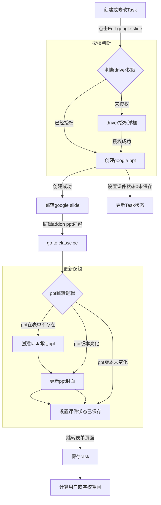
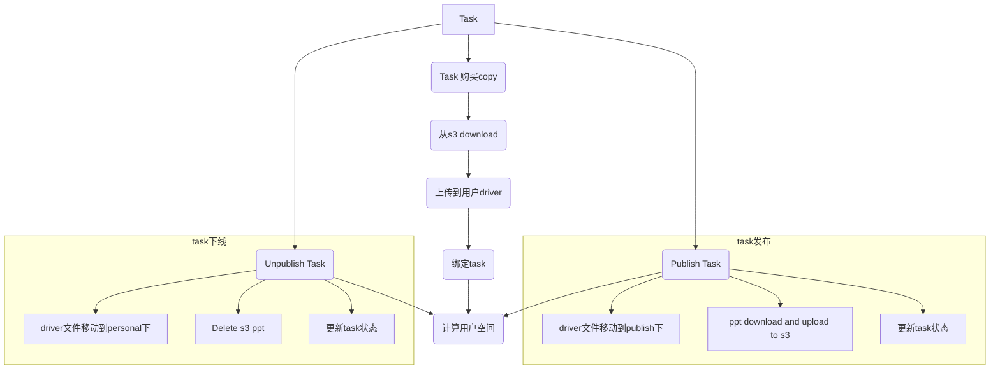
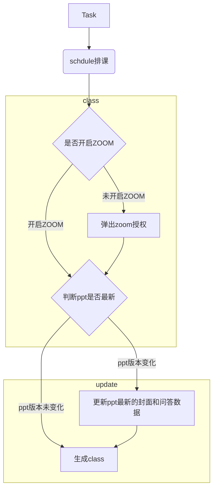
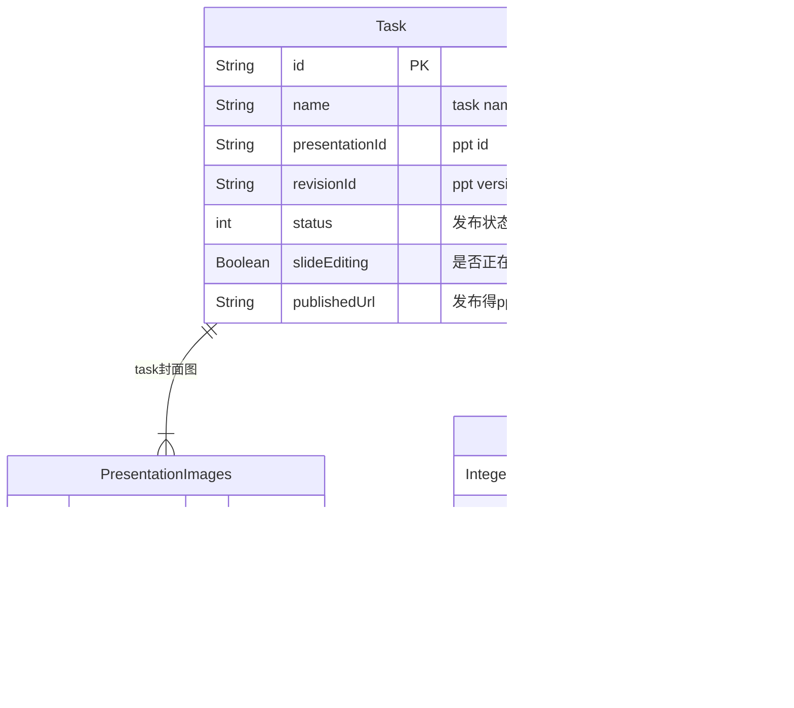

### PPT

> PPT管理(创建、授权、原件下载和上传、发布逻辑)

> Session管理（课件删除逻辑）

> 资源管理（个人和学校空间计算）

### ppt创建更新逻辑

```mermaid
flowchart TB

A[创建或修改Task] --点击Edit google slide--> B{判断driver权限}
  subgraph 授权判断
    B --已经授权--> C[创建google ppt]
    B --未授权--> D[driver授权弹框]
    D --授权成功--> C[创建google ppt]
  end
C--创建成功--> E[跳转google slide]
C--设置课件状态0未保存--> F[更新Task状态]
E--编辑addon ppt内容--> G[go to classcipe]
G --> I{ppt跳转逻辑}
  subgraph 更新逻辑
  I--ppt在表单不存在-->I1[创建task绑定ppt]-->I2[更新ppt封面]-->I3[设置课件状态已保存]
  I--ppt版本变化-->I2[更新ppt封面]-->I3[设置课件状态已保存]
  I--ppt版本未变化-->I3[设置课件状态已保存]
  end
I3--跳转表单页面--> J[保存task]--> L[计算用户或学校空间]


```
### ppt发布逻辑

```mermaid
graph TD
A[Task]
A --> A1(Publish Task)
    subgraph task发布
     direction TB
     A1 --> A11[driver文件移动到publish下]
     A1 --> A12[ppt download and upload to s3]
     A1 --> A13[更新task状态]
    end
A --> A2(Unpublish Task)
  subgraph task下线
    direction TB
    A2 --> A21[driver文件移动到personal下]
    A2 --> A22[Delete s3 ppt]
    A2 --> A23[更新task状态]
  end
A --> A3(Task 购买copy)
A3--> A31(从s3 download)--> A32(上传到用户driver)--> A33(绑定task)
A33-->A4(计算用户空间)
A1-->A4(计算用户空间)
A2-->A4(计算用户空间)
 

```

### session管理

```mermaid
graph TD
A[Task]
A--> B(schdule排课)--> C{是否开启ZOOM}
subgraph class
    direction TB
    C--开启ZOOM--> E{判断ppt是否最新}
    C--未开启ZOOM --> C1[弹出zoom授权]--> E{判断ppt是否最新}
end
subgraph update
    direction TB
    E--ppt版本未变化--> E1[生成class]
    E--ppt版本变化 --> E2[更新ppt最新的封面和问答数据]--> E1[生成class]
end

 

```

```mermaid
erDiagram

Task {
    String id PK
    String name "task name"
    String presentationId "ppt id"
    String revisionId "ppt version"
    int status "发布状态"
    Boolean slideEditing "是否正在编辑ppt"
    String publishedUrl "发布得ppt s3地址"
}
Task ||--|{PresentationImages : "task封面图"
Task ||--|{RSlidePageThumbnails : "课堂高清封面图"

PresentationImages{
 String id PK
 String imageUrl "ppt图片"
 String presentationId "ppt slide id"
 String pageObjectId "ppt page id"
}

RSlidePageThumbnails{
 Integer id PK
 String fileName "ppt图片"
 String presentationId "ppt slide id"
 String pageObjectId "ppt page id"
 String revisionId "ppt version"
 Long fileSize "文件大小"
}


```