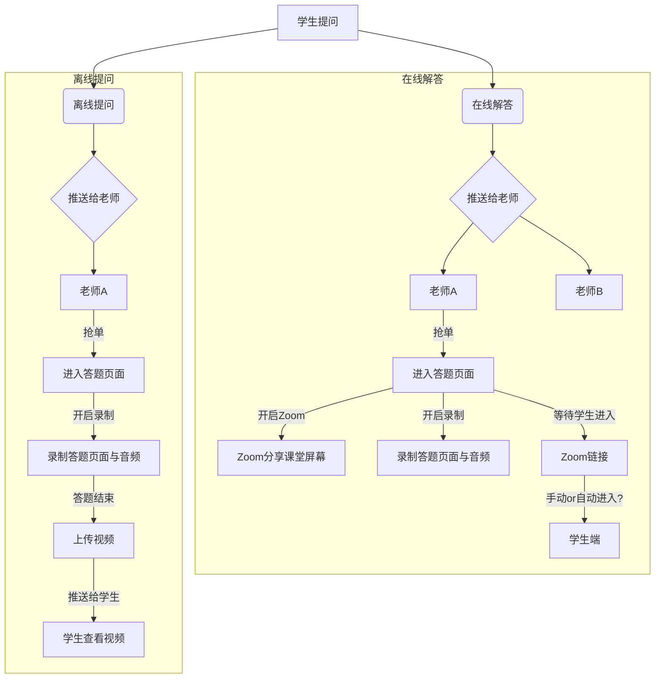

## 学生在线提问

```mermaid
graph TD
A[学生提问] --> B(在线解答)
A --> B2(离线提问)
subgraph 在线解答
B --> P{推送给老师}
P --> T1[老师A]
P --> T2[老师B]
T1 -->|抢单| C[进入答题页面]
C -->|开启Zoom| Z[Zoom分享课堂屏幕]
C -->|开启录制| Z2[录制答题页面与音频]
C -->|等待学生进入| Z3[Zoom链接]
Z3 -->|手动or自动进入?| S1[学生端]
end

subgraph 离线提问
B2 --> P2{推送给老师}
P2 --> T3[老师A]
T3 -->|抢单| C2[进入答题页面]
C2 -->|开启录制| Z20[录制答题页面与音频]
Z20 -->|答题结束| Up[上传视频]
Up -->|推送给学生| S0[学生查看视频] 
end
```