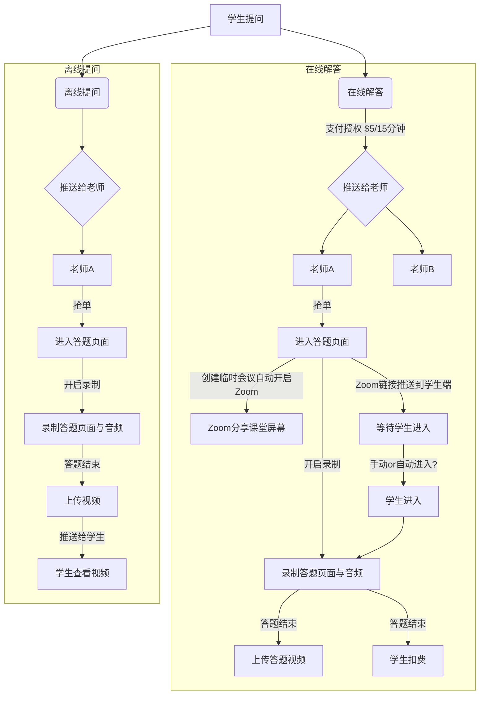

## 学生在线提问

> 老师来剪辑、分享解答视频
- 可以赚取积分（被其它用户查看的时候）
- 赚取的积分可以用于支付查看其它解答视频
- 音频部分需要变音

> 在线解答收费机制
- 按时长收费，15分钟为最小时间单位，每个单位5$
- 余额少于一个单位需要有充值提示
- 解答结束后按照时间单位来扣余额

> 老师赚取积分方法
- UnitPlan, Task, 师训视频 分享赚取
- 赚取的积分可以用于查看其它相关内容

> 积分获取规则
- 被其它老师复制后，增加空间，增加积分n个？
- 自学习课件
  - 前n个人免费查看
  - 被学生查看，增加积分n个？

> 老师资质审核
- 申请内容？
- 

