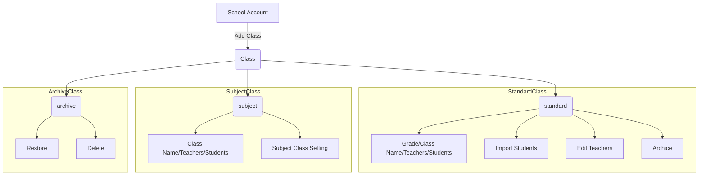
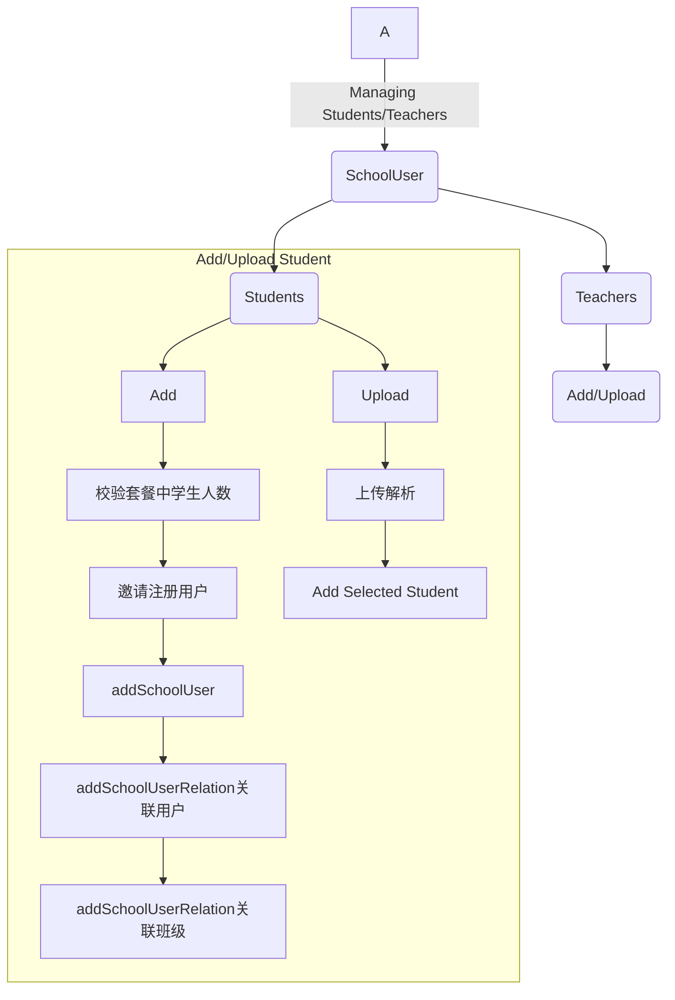
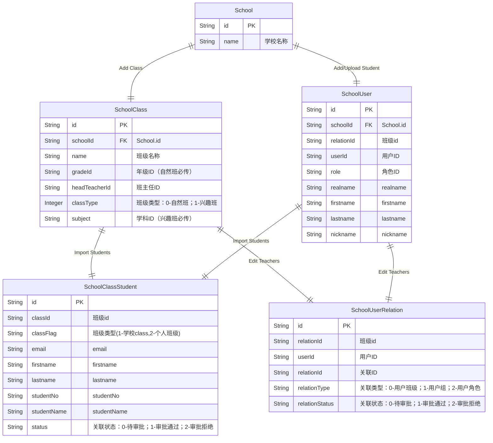

### 班级管理

```mermaid
graph TD
A[School Account] -->|Add Class| B(Class)
B --> B1(standard)
B --> B2(subject)
B --> B3(archive)

  subgraph StandardClass
    direction TB
    B1 --> B1_1[Grade/Class Name/Teachers/Students]
    B1 --> B1_2[Import Students]
    B1 --> A1_3[Edit Teachers]
    B1 --> A1_4[Archice]
  end

  subgraph SubjectClass
    direction TB
    B2 --> B2_1[Class Name/Teachers/Students] 
    B2 --> B2_2[Subject Class Setting] 
  end

  subgraph ArchiveClass
    direction TB
    B3 --> B3_1[Restore] 
    B3 --> B3_2[Delete] 
  end

```

```mermaid
graph TD
A -->|Managing Students/Teachers| C(SchoolUser)
C --> C1(Students)
C --> C2(Teachers) --> D2(Add/Upload)

  subgraph Add/Upload Student
    direction TB
    C1 --> D1_0[Add]
    D1_0 --> D1_1[校验套餐中学生人数]
    D1_1 --> D1_2[邀请注册用户]
    D1_2 --> D1_3[addSchoolUser]
    D1_3 --> D1_4[addSchoolUserRelation关联用户]
    D1_4 --> D1_5[addSchoolUserRelation关联班级]
    C1 --> D2_0[Upload]
    D2_0 --> D2_1[上传解析]
    D2_1 --> D2_2[Add Selected Student]
  end
```

```mermaid
erDiagram
School {
  String id PK
  String name "学校名称"
}


School ||--||SchoolUser : "Add/Upload Student"
SchoolUser{
  String id PK
  String schoolId FK "School.id"
  String relationId "班级id"
  String userId "用户ID"
  String role "角色ID"
  String realname "realname"
  String firstname "firstname"
  String lastname "lastname"
  String nickname "nickname"
}


School ||--||SchoolClass : "Add Class"
SchoolClass{
  String id PK
  String schoolId FK "School.id"
  String name "班级名称"
  String gradeId "年级ID（自然班必传）"
  String headTeacherId "班主任ID"
  Integer classType "班级类型：0-自然班；1-兴趣班"
  String subject "学科ID（兴趣班必传）"
}

SchoolClass ||--||SchoolClassStudent : "Import Students"
SchoolUser ||--||SchoolClassStudent : "Import Students"
SchoolClassStudent{
  String id PK
  String classId "班级id"
  String classFlag "班级类型(1-学校class,2-个人班级)"
  String email "email"
  String firstname "firstname"
  String lastname "lastname"
  String studentNo "studentNo"
  String studentName "studentName"
  String status "关联状态：0-待审批；1-审批通过；2-审批拒绝"
}


SchoolClass ||--||SchoolUserRelation : "Edit Teachers"
SchoolUser ||--||SchoolUserRelation : "Edit Teachers"
SchoolUserRelation{
  String id PK
  String relationId "班级id"
  String userId "用户ID"
  String relationId "关联ID"
  String relationType "关联类型：0-用户班级；1-用户组；2-用户角色"
  String relationStatus "关联状态：0-待审批；1-审批通过；2-审批拒绝"
}

```

