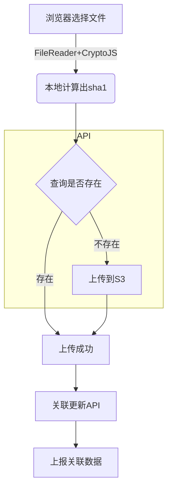
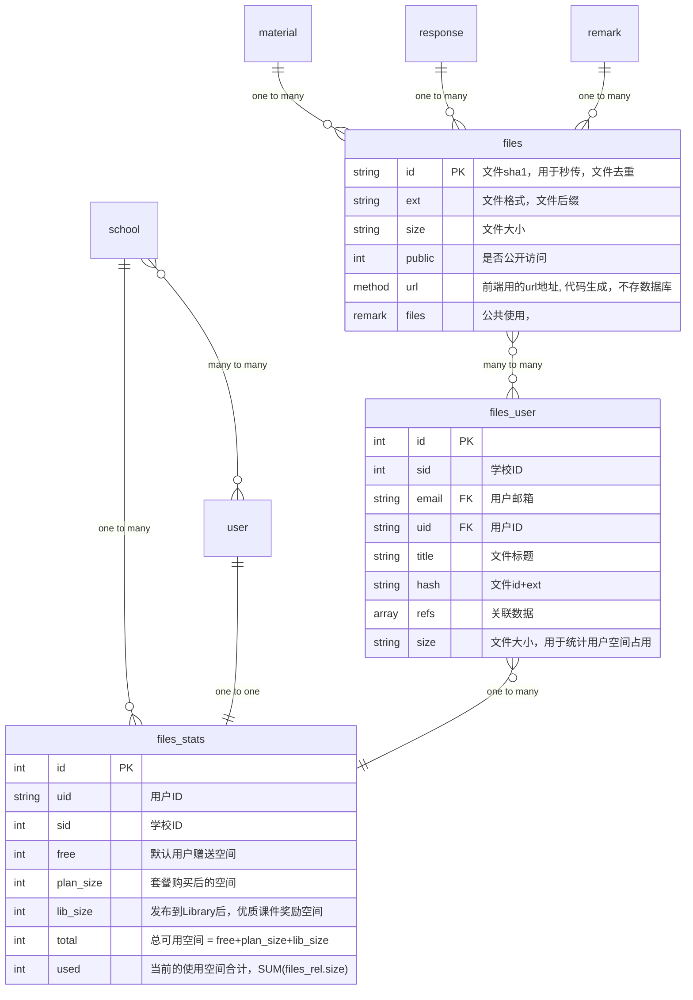

### 文件服务
> 媒体文件URL格式  
{CDNurl}/{sha1}.{ext}

> 媒体文件上传接口  
查询hash对象 GET {API}/files/{sha1}  
上传对象 POST {API}/files?sha1={sha1}&ext={ext}  
form-data  file

> 媒体文件接口  
新增关联数据上报 GET {API}/files_user/{sha1}?add[]={db}:{table}:{id}&add[]=...  
删除关联数据上报 GET {API}/files_user/{sha1}?del[]={db}:{table}:{id}&del[]=...  
用户空间信息 GET {API}/files_user?uid={user_id}&sid={school_id}  

