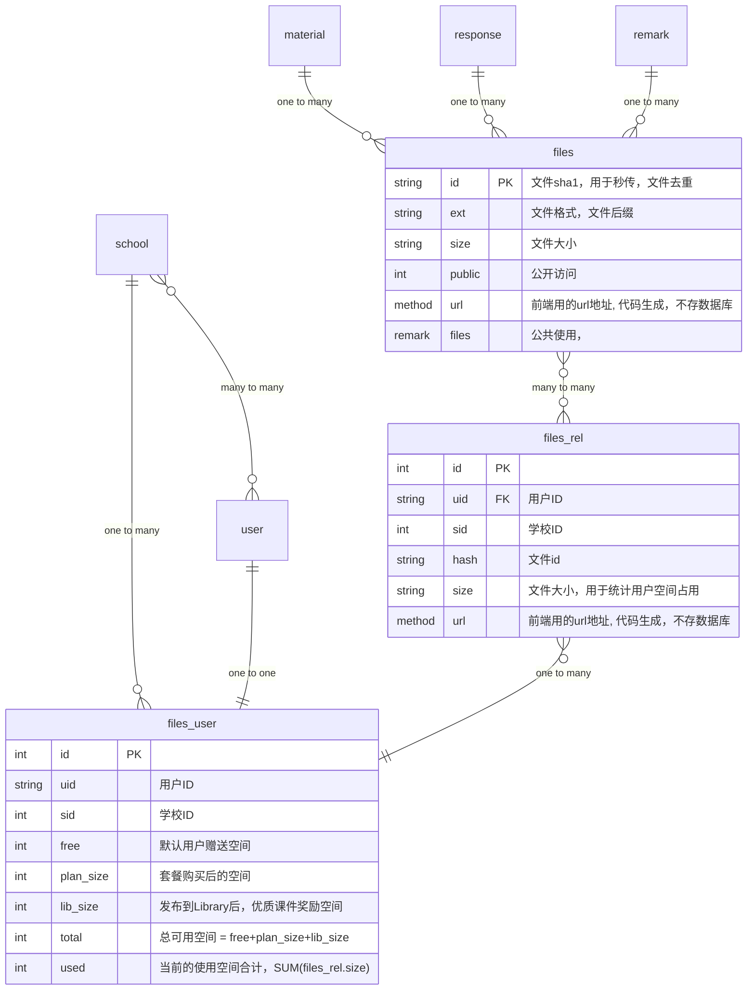

### 文件服务

```mermaid
erDiagram

school }o--o{ user : "many to many"
school ||--o{ files_user : "one to many"
user ||--|| files_user : "one to one"
files }o--o{ files_rel : "many to many"
files_rel }o--|| files_user : "one to many"
material ||--o{ files : "one to many"
response ||--o{ files : "one to many"
remark ||--o{ files : "one to many"

files {
  string id PK "文件sha1，用于秒传，文件去重"
  string ext "文件格式，文件后缀"
  string size "文件大小"
  int public "公开访问"
  method url "前端用的url地址, 代码生成，不存数据库"
  remark files "公共使用，"
}

files_rel {
  int id PK
  string uid FK "用户ID"
  int sid "学校ID"
  string hash "文件id"
  string size "文件大小，用于统计用户空间占用"
  method url "前端用的url地址, 代码生成，不存数据库"
}
files_user {
  int id PK ""
  string uid "用户ID"
  int sid "学校ID"
  int free "默认用户赠送空间"
  int plan_size "套餐购买后的空间"
  int lib_size "发布到Library后，优质课件奖励空间"
  int total "总可用空间 = free+plan_size+lib_size"
  int used "当前的使用空间合计，SUM(files_rel.size)"
}


```