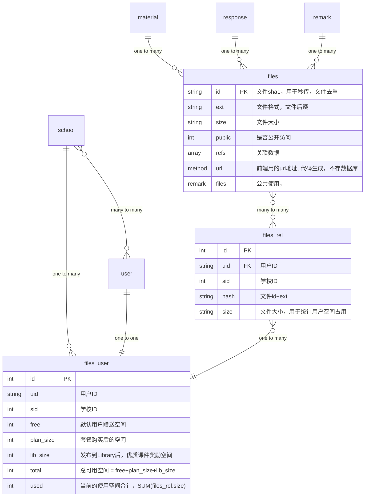

### 文件服务
> 媒体文件URL格式  
{CDNurl}/{sha1}.{ext}

> 媒体文件上传接口  
POST {API}/files?sha1={sha1}&ext={ext}  
form-data  file

> 媒体文件接口  
新增关联数据上报 {API}/files/{sha1}?add[]={db}{table}{id}&add[]=...  
删除关联数据上报 {API}/files/{sha1}?del[]={db}{table}{id}&del[]=...  
用户空间信息 {API}/files_user?uid={user_id}&sid={school_id}  

