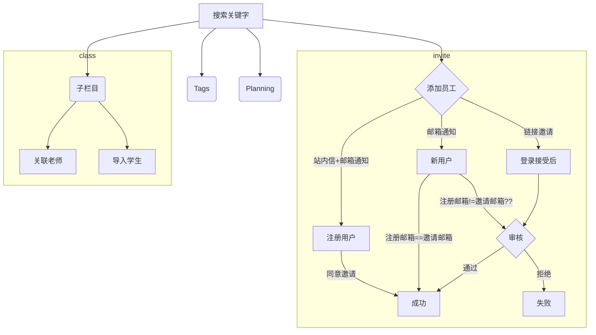

### 文件服务

> library各类内容子栏目
>
> 1. PD、Unit、Task各取10条优质内容
> 2. 排序按一周内PV最多的排序

> 优质内容（系统后台配置）
>
> 1. 认证作者的订阅量达到的标准
> 2. 该内容的购买量、收藏量、评级数据量设置

> 关键字联想搜索
>
> 1. 词向量判断（取3条） 
> 2. 文本框输入内容（content name、bigidea、deatils、sdg）
> 3. 系统存在的标签
> 4. PD、Unit、Task各取3条

> Search server: http://3.25.214.89/search?keyword=apple



```mermaid
erDiagram

MyContentVoView ||--|| StatBypurchases : "one to one"

MyContentVoView {
  String id PK
  String name "content name"
  int status "发布状态"
  int type "内容类型"
  createBy "作者"
}

StatBypurchases {
  int id PK
  String purchasesId "内容ID"
  int previews "预览量"
  int saved "收藏量"
  int sold "购买量"
  int reviewsCount "评价次数"
  int reviewsScore "评价总分"
}


```