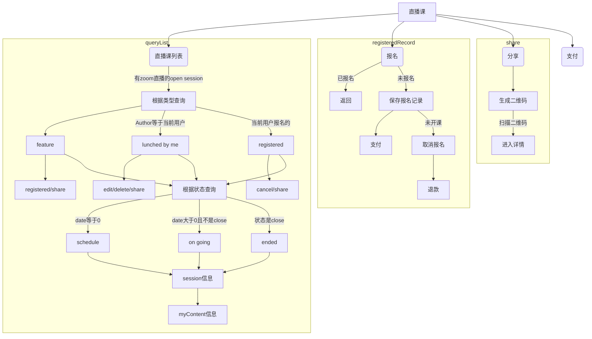

### 直播课

```mermaid
graph TD
A[直播课] --> A1(直播课列表)
A --> A2(报名)
A --> A3(分享)
A --> A4(支付)

  subgraph queryList
    direction TB
    A1 -->|有zoom直播的open session| A1_1[根据类型查询]
    A1_1 --> A1_1_1[feature]
    A1_1 -->|Author等于当前用户| A1_1_2[lunched by me]
    A1_1 -->|当前用户报名的| A1_1_3[registered]
    A1_1_1 --> A1_1_1_1[registered/share]
    A1_1_2 --> A1_1_2_1[edit/delete/share]
    A1_1_3 --> A1_1_3_1[cancel/share]
    A1_1_1 --> A1_2[根据状态查询]
    A1_1_2 --> A1_2
    A1_1_3 --> A1_2
    A1_2 -->|date等于0| A1_3_1[schedule]
    A1_2 -->|date大于0且不是close| A1_3_2[on going]
    A1_2 -->|状态是close| A1_3_3[ended]
    A1_3_1 --> A1_3[session信息]
    A1_3_2 --> A1_3
    A1_3_3 --> A1_3
    A1_3 --> A1_4[myContent信息]
  end

  subgraph registeredRecord
    direction TB
    A2 -->|已报名| A2_1[返回] 
    A2 -->|未报名| A2_2[保存报名记录] 
    A2_2 --> A2_3[支付] 
    A2_2 -->|未开课| A2_4[取消报名] 
    A2_4 --> A2_5[退款] 
  end

  subgraph share
    direction TB
    A3 --> A3_1[生成二维码] 
    A3_1 -->|扫描二维码| A3_2[进入详情] 
  end
```

