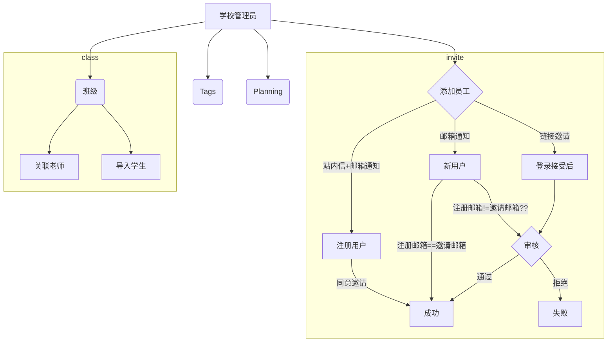

### 学校管理



```mermaid
erDiagram

school }o--o{ user : "many to many"
school ||--o{ invite : "one to many"
user ||--o{ invite : "one to many"
school ||--o{ class : "one to many"
class ||--o{ students : "one to many"

invite {
  int id PK
  string code "邀请码，用于生成邀请地址, 只有状态==0时有效，除非重新邀请"
  string name "用户姓名"
  string uid "用户ID"
  int school_id "学校ID"
  int status "状态, 0:pedding, 1:success, 2:review, 3:reject, 4:resigned"
  string invite_email "邀请邮箱"
  string reg_email "注册邮箱"
}

```