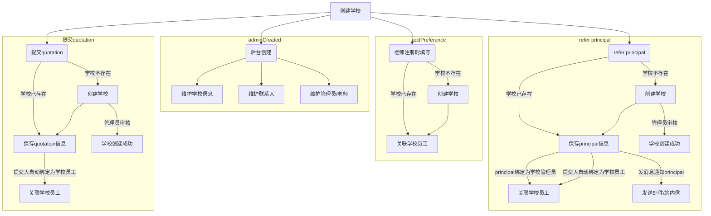
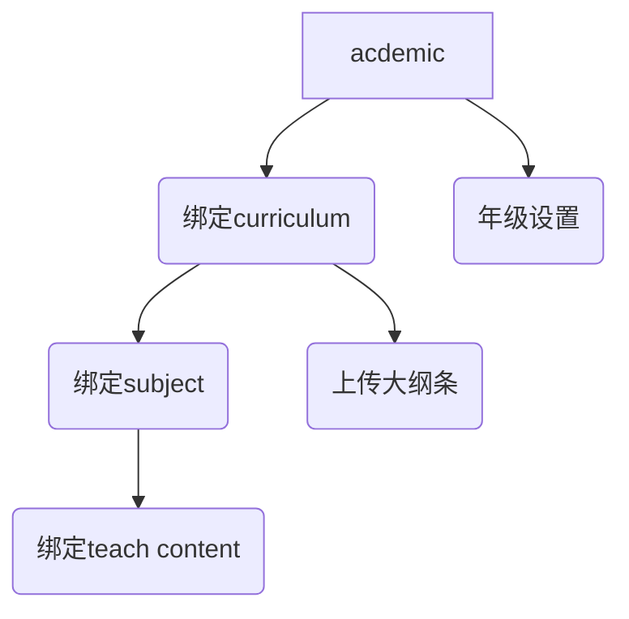
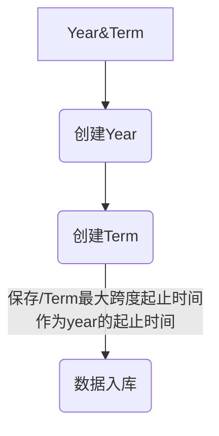

## 学校管理

### 老师管理逻辑

- 老师加入学校的方法
  - 1、注册账号的时候关联学校（需要审核，来源: 注册关联）
  - 2、管理员后台添加邮箱账户（如果是已经注册的用户，同时发送站内信邀请）
    - 老师点击邮件链接进行加入, 需要判断 登录邮箱与邀请邮箱是否一致
    - 一致则无需审核，自动加入成功
    - 不一致（需要审核，来源: 邮箱邀请）
  - 3、邀请链接加入（需要审核，来源: 链接邀请）

### 学校-记录
> 学校销售跟进记录

- 状态翻译：
Applied 申请中
Created 创建
Trial 试用中
School Plan 开通中
Expired 套餐过期

| 类型 | 状态 | 操作人 | 内容 | 操作逻辑 |
| :-- | :-- | :-- | :-- | --: |
| ~~Create school~~ | 创建 | -- | {nickname} create "{schoolName}" | 仅通过后台管理员创建 |
| ~~注册关联学校  User registered~~ | 创建 | -- |  | 用户注册的时候关联学校， 记录太多，无需记录 |
| 推荐校长 Refer principal | 创建 | -- | Refer principal {firstname lastname}  Contact: {code}+{phone}, {email}; | 由用户推荐 |
| 获取报价 Quote | 申请中  | -- | Contact: {code}+{phone}, {email}; Form {country},{city},{address}; For: {School or Group}; Mark: {备注} | 官网提交 |
| 领取学校 Claimed | 不更新状态 | -- | Claimed | 仅通过后台操作 |
| 释放学校 Released | 不更新状态 | -- | Expired release | 过期未跟进自动释放 |
| 释放学校 Released | 不更新状态 | -- | Manually release from {nickname} | 后台人工主动释放 |
| 沟通记录 Communicate | 不更新状态 | -- | {沟通内容} | 仅通过后台操作 |
| 开通试用 Open trial | 试用中 | -- | Open trial | 仅通过后台操作 |
| 开通正式 Fully paid | 开通中 | -- | Successfully paid | 仅通过后台操作 |
| 自助付费开通 Self paid | 开通中 | -- | Self-service payment activation | 由用户自行操作 |
| 套餐过期 Expired | Expired | -- | Plan Expired  | 计划任务判断是否过期 |

#### 接口逻辑
- ~~Create school~~
  - 创建操作日志
    - 类型：Create school
    - 操作人：操作人昵称
  - 后台创建学校，名称不重复
- Refer principal
  - 创建操作日志
    - 类型：Refer principal
    - 扩展数据：提交的学校JSON对象
  - 学校存在，则不更新
  - 学校不存在，更新学校的数据
- Quote
  - 创建操作日志
    - 类型：Create school
    - 扩展数据：提交的学校JSON对象
  - 学校存在，只更新操作时间
  - 学校不存在，更新学校的数据
- 领取学校 / 沟通记录
  - 创建操作日志
    - 类型：Claimed / Communicate
  - 更新操作时间，释放倒计时重新计算
- 释放学校
  - 创建操作日志
    - 类型：Released
  - 更新操作时间
  - 

### acdemic

### Year&Term

