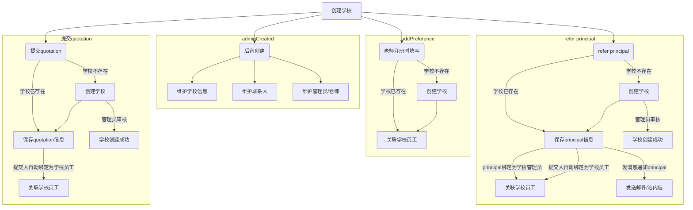
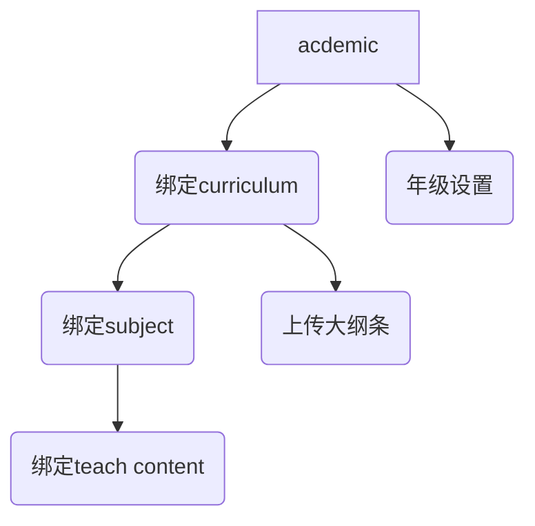
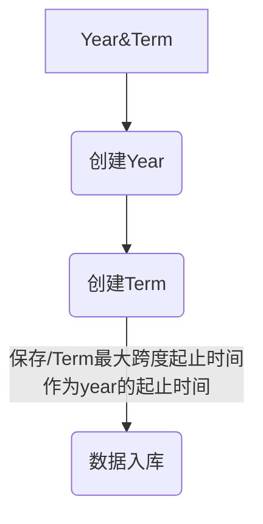

## 学校管理

### 老师管理逻辑

- 老师加入学校的方法
  - 1、注册账号的时候关联学校（需要审核，来源: 注册关联）
  - 2、管理员后台添加邮箱账户（如果是已经注册的用户，同时发送站内信邀请）
    - 老师点击邮件链接进行加入, 需要判断 登录邮箱与邀请邮箱是否一致
    - 一致则无需审核，自动加入成功
    - 不一致（需要审核，来源: 邮箱邀请）
  - 3、邀请链接加入（需要审核，来源: 链接邀请）

### 学校-记录
> 学校销售跟进记录

| 类型 | 操作人 | 时间 | 内容 | 操作逻辑 | 逻辑备注 |
| :-- | :-- | :-- | :-- | --: | --: |
| Create school | -- | -- | -- | 仅通过后台管理员创建 |
| Quotation | -- | -- | --  | 官网提交 |
| Refer principal | -- | -- | -- | 由用户推荐 |
| 注册关联学校 | -- | -- | --  | 用户注册 |
| 自助付费开通 | -- | -- | -- | 由用户自行操作 |
| 开通试用 | -- | -- | -- | 仅通过后台操作 |
| 试用延期 | -- | -- | -- | 仅通过后台操作 |
| 开通正式 | -- | -- | -- | 仅通过后台操作 |
| 沟通记录 | -- | -- | -- | 仅通过后台操作 |

#### 接口逻辑
- Create school
  - 创建操作日志
    - 类型：Create school
    - 操作人：操作人昵称
    - 内容格式：{nickname} create "{schoolName}"
  - 后台创建学校，名称不重复
- Quotation
  - 创建操作日志
    - 类型：Create school
    - 操作人：{nickname}
    - 内容格式：{nickname} create "{schoolName}"
    - 扩展数据：提交的学校JSON对象
  - 学校存在，则不更新
  - 学校不存在，更新学校的数据
- Refer principal
  - 创建操作日志
    - 类型：Refer principal
    - 操作人：{nickname}
    - 内容格式：{nickname} Refer principal "{schoolName}"
    - 扩展数据：提交的学校JSON对象
  - 学校存在，则不更新
  - 学校不存在，更新学校的数据

### acdemic

### Year&Term

