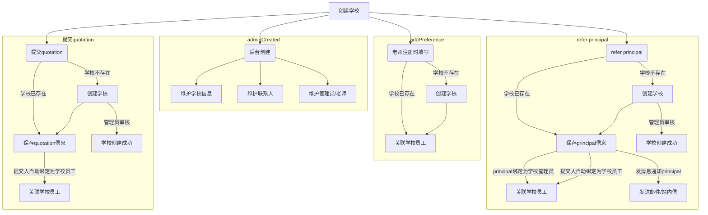
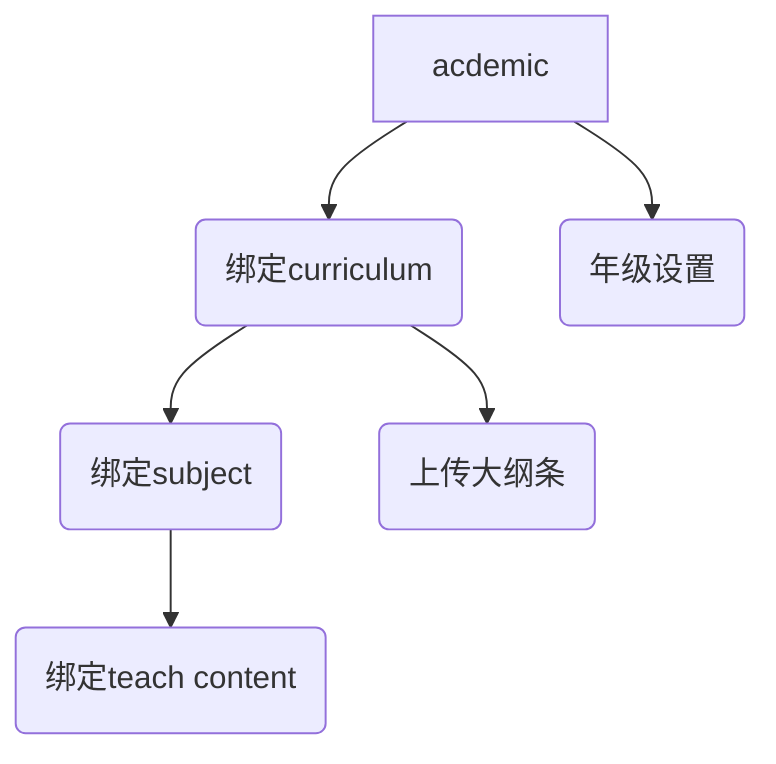
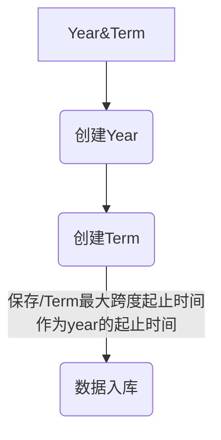

### 学校管理

```mermaid
graph TD
A[创建学校] --> A1(后台创建)
A --> A2(老师注册时填写)
A --> A3(提交quotation)
A --> A4(refer principal)

  subgraph adminCreated
    direction TB
    A1 --> A1_1[维护学校信息]
    A1 --> A1_2[维护联系人]
    A1 --> A1_3[维护管理员/老师]
  end

  subgraph addPreference
    direction TB
    A2 -->|学校不存在| A2_1[创建学校] 
    A2_1 --> A2_B[关联学校员工]
    A2 -->|学校已存在| A2_B
  end

  subgraph 提交quotation
    direction TB
    A3 -->|学校不存在| A3_1[创建学校] 
    A3_1 --> A3_B[保存quotation信息]
    A3 -->|学校已存在| A3_B
    A3_B -->|提交人自动绑定为学校员工| A3_C[关联学校员工]
    A3_1 --> |管理员审核| A3_D[学校创建成功]
  end
  
  subgraph refer principal
    direction TB
    A4 -->|学校不存在| A4_1[创建学校] 
    A4_1 --> A4_B[保存principal信息]
    A4 -->|学校已存在| A4_B
    A4_B -->|提交人自动绑定为学校员工| A4_C[关联学校员工]
    A4_B -->|principal绑定为学校管理员| A4_C[关联学校员工]
    A4_B -->|发消息通知principal| A4_D[发送邮件/站内信]
    A4_1 --> |管理员审核| A4_E[学校创建成功]
  end
```

### acdemic

```mermaid
graph TD
A[acdemic] --> B(绑定curriculum)
B --> C(绑定subject)
A --> D(年级设置)
C --> E(绑定teach content)
B --> F(上传大纲条)

```

### Year&Term

```mermaid
graph TD
A[Year&Term] --> B(创建Year)
B --> C(创建Term)
C --> |保存/Term最大跨度起止时间作为year的起止时间| D(数据入库)


```
