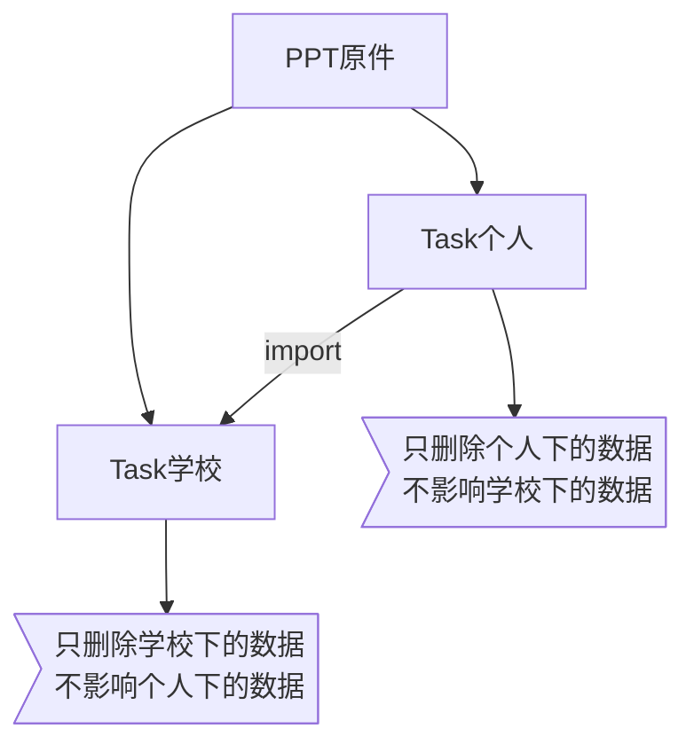
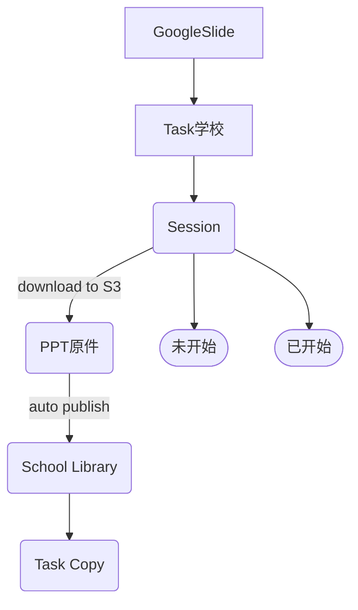
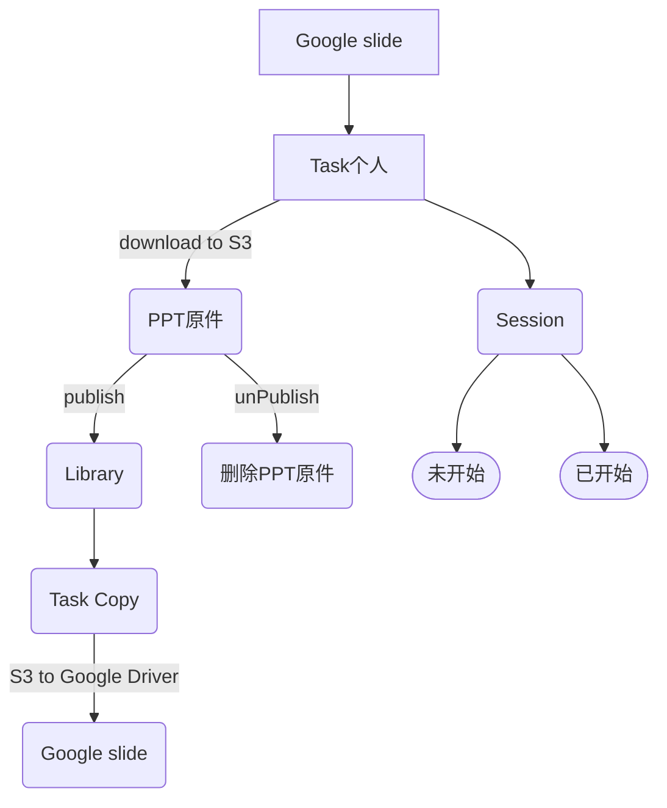

## 学校权限管理

### Session删除
- 未开始的Session
  - 老师可以直接删除
- 已经开始的Session
  - 老师不允许删除，有权限的才能删除

### 课件删除
- 发布的课件
  - 强制删除提示，询问删除同时会下架课件
- 创建过Session的课件
  - 未开始的Session，强制删除提示，询问删除同时会删除相关所有的Session
  - 已经开始的Session，无权限不允许删除
- 默认课件，直接删除

|  | Slide快照图片 | PPT原件 | 学生互动数据 | 合计 |
| :---  | :---  | :--  | :--: | :--: |
| Task | 1Mb | 2Mb | | 3Mb |
| Task Session | 1Mb | / | 100Mb | 101Mb |
| Task Copy | 1Mb | 2Mb | | 3Mb |
| Task Copy Session | 1Mb | / | 50Mb | 51Mb |
