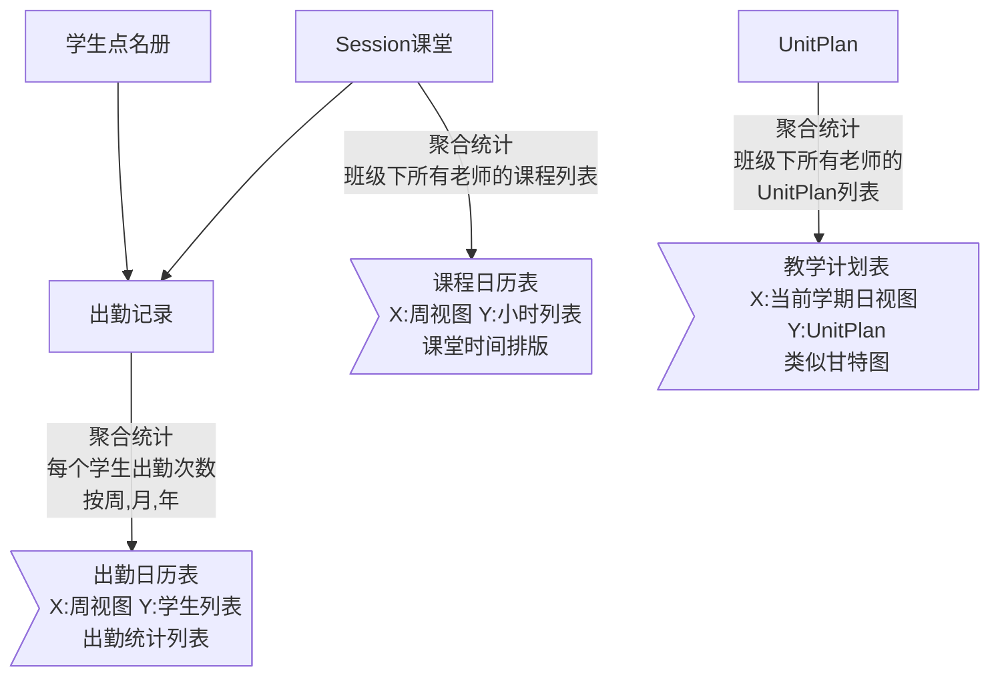
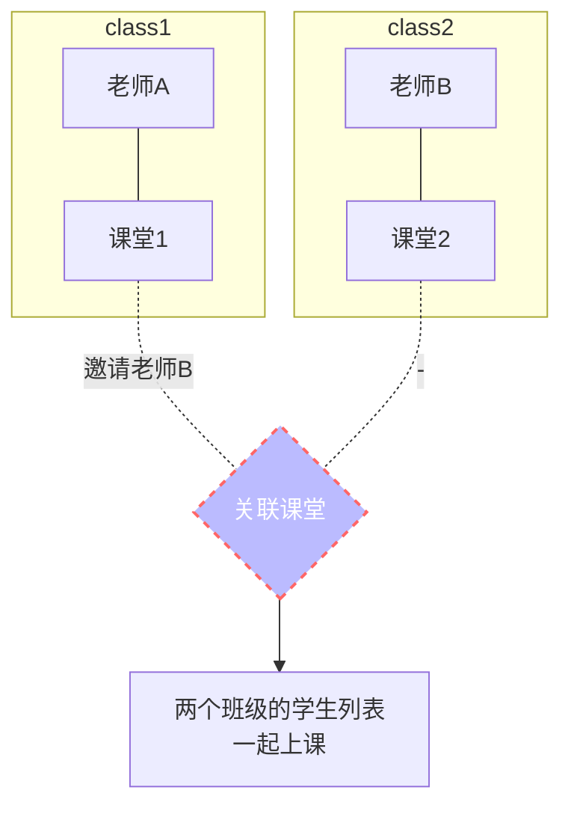
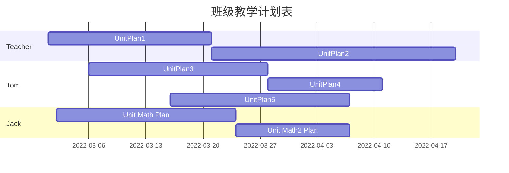
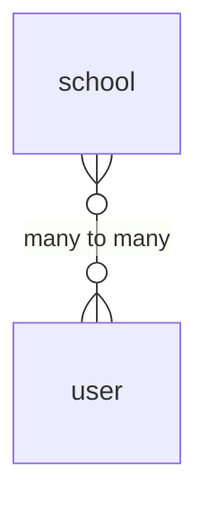

### session

> 只要课件安排过考试作业，就标记为适合自学习
> 发布的时候自动勾选为自学习课件

| 名称 | Upcoming (未开始)  | Ongoing (进行中) | Expired (过期)  | Ending (结束) |
| :---  | :---  | :--  | :--: | :--: |
| 学生课堂端 | × | √ | × | × |
| 老师课堂端 | √ | √ | √ | √ |

> 班级出勤表  
按周、月、年统计  
Overall Presence 87.15%,  
1 student with perfect attendance,  
8 student with more than 90% presence,  
10 student with less than 90% presence

| Students | Present | Absent | Late | Presence (in %) |
| :--  | :-- | :-- | :-- | :--: |
| Anaisha | 49 | 7 | 0 | 87.5 |
| Arham | 53 | 4 | 0 | 93 |
| Jack | 50 | 4 | 3 | 93 |

