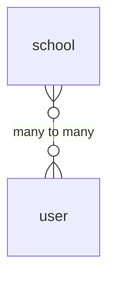

### session 状态

| 名称 | Upcoming (未开始)  | Ongoing (进行中) | Expired (过期)  | Ending (结束) |
| :---  | :---  | :--  | :--: | :--: |
| 学生课堂端 | × | √ | × | × |
| 老师课堂端 | √ | √ | √ | √ |

```mermaid
erDiagram

school }o--o{ user : "many to many"

```