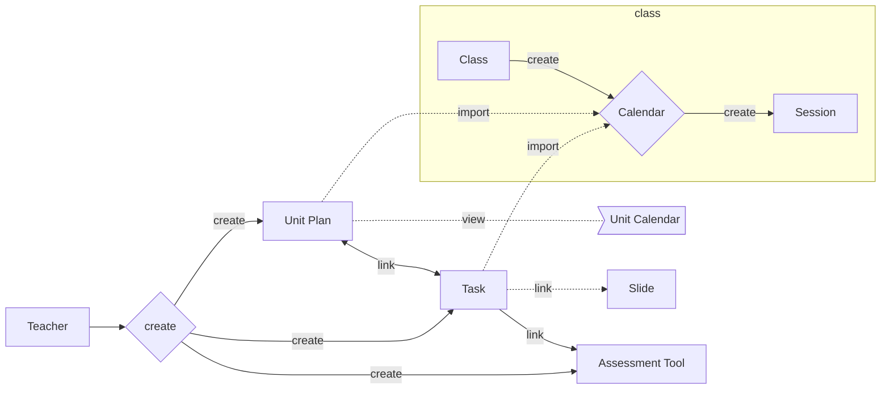
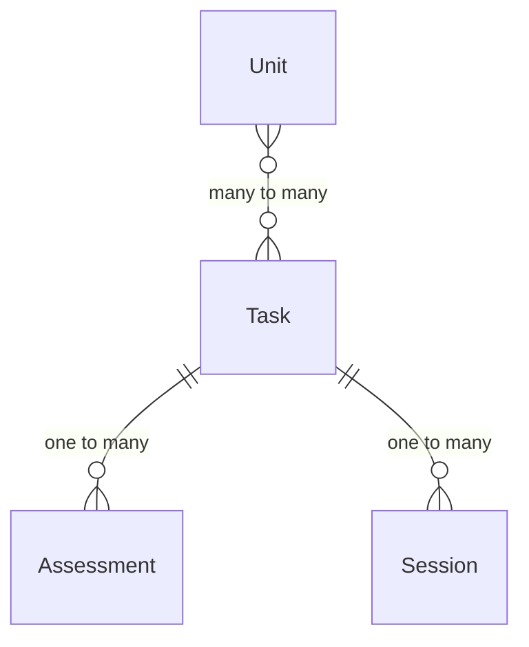

### Unit Plan

```mermaid
flowchart LR
A[Teacher] --> C{create}
C -->|create| U[Unit Plan]
U -..-|view| Uc>Unit Calendar]
C -->|create| T[Task]
T -.->|link| G[Slide]
C -->|create| As[Assessment Tool]
T -->|link| As
U <-->|link| T
T -.->|import| Cd
U -.->|import| Cd
  subgraph class
    Sc[Class]
    Cd{Calendar}
    S[Session]
    Sc -->|create| Cd
    Cd -->|create| S
  end
```

```mermaid
erDiagram

Unit }o--o{ Task : "many to many"
Task ||--o{ Assessment : "one to many"
Task ||--o{ Session : "one to many"

```