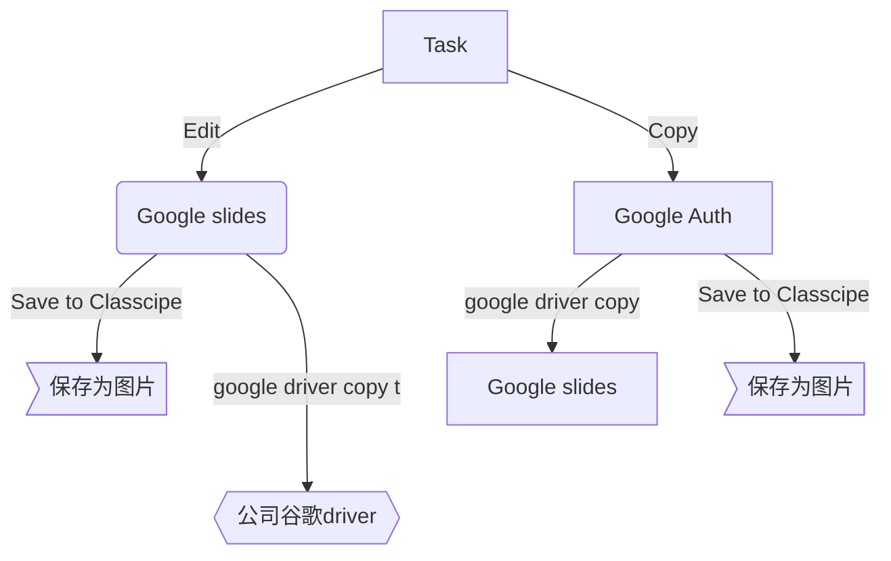
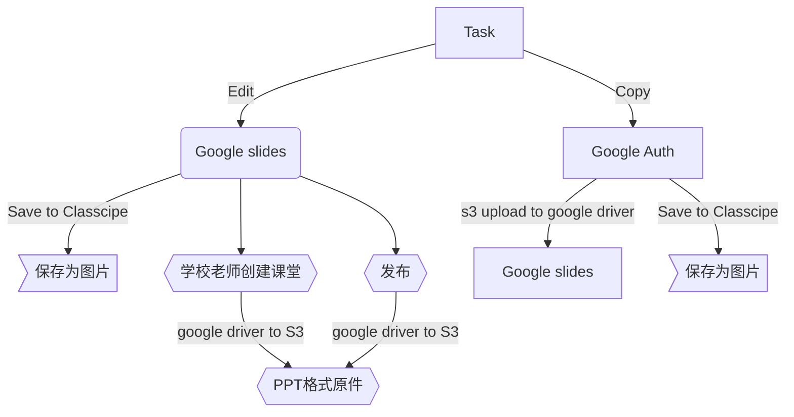
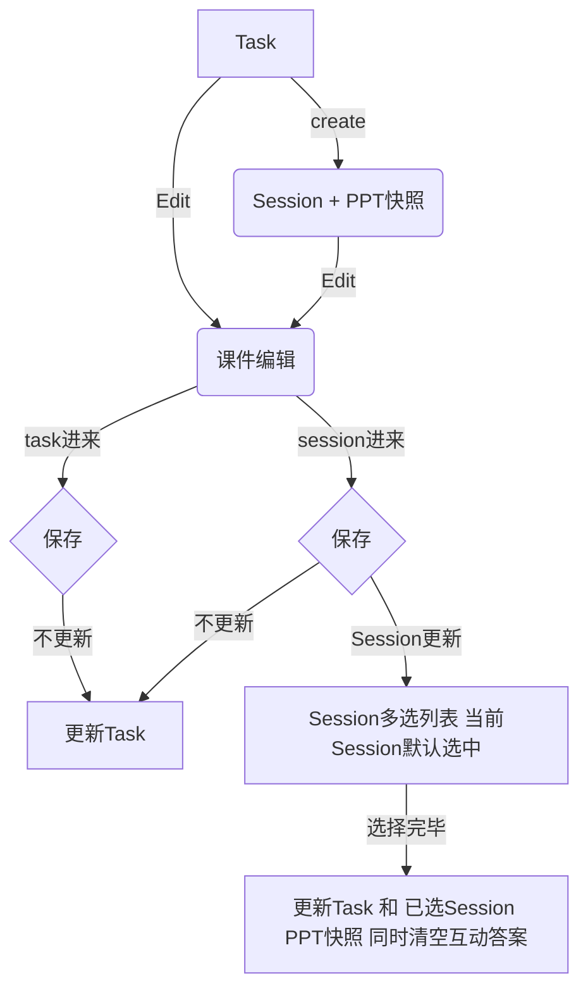
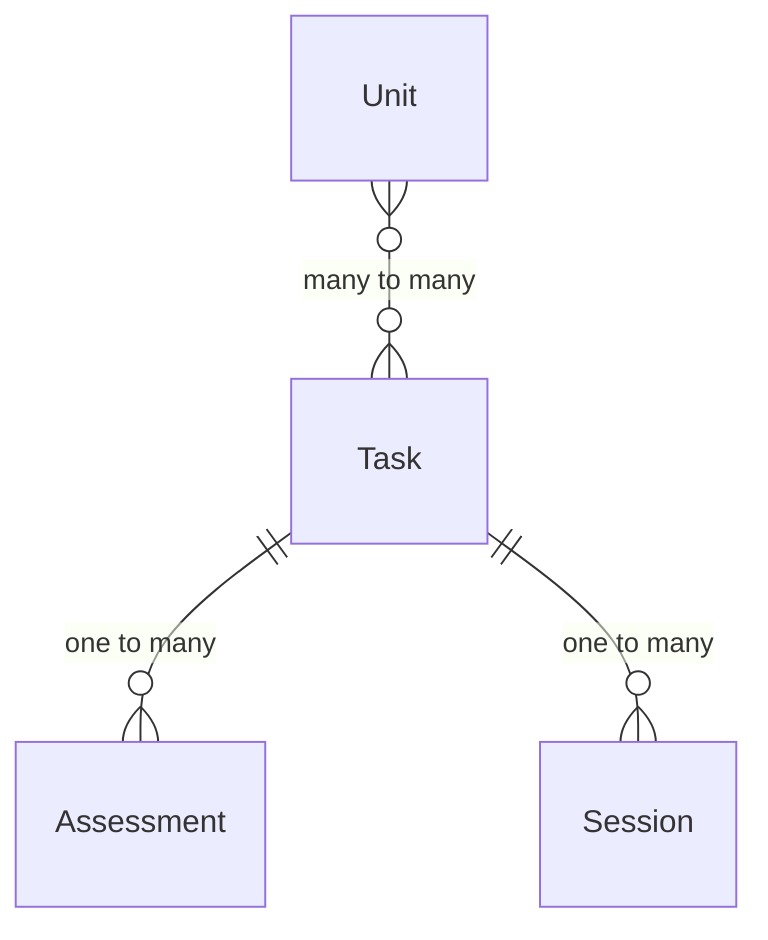

### Unit Plan

| 名称\关系 | UnitPlan | Task | Session | AssessmentTool | Video |
| :---  | :---  | :--  | :--: | :--: | :--: |
| UnitPlan | db | link | / | / | / | / |
| Task | link | db | snapshot | link | link |
| Session | / | snapshot | db | db | link |
| AssessmentTool | / | link | db | db | / |
| Video | / | link | link | / | S3 |

| 功能\名称 | 免费老师 | 收费老师 | 学校老师 | 班主任 | 学科组长 | 学校管理员 | 备注 |
| :---  | :---  | :--  | :--: | :--: | :--: | :--: | :--: |
| 存储空间 | 1G | 5G | 1000G | 1000G | 1000G | 1000G | 按学生计算出对应容量，可以额外增加 |
| 公开课堂 | Y | Y | Y | Y | Y | Y |
| 班级课堂 | / | Y | Y | Y | Y | Y |
| 学生附件 | / | 100Mb | 200Mb | | | | comment, mdeia题型下音视频图片附件大小 |
| 班级管理 | / | 10个 | 不限 | 不限 | 不限 | 不限 |
| 课堂数据保留 | 7天 | 3个月 | 1年 | 1年 | 1年 | 1年 |
| 课堂评估 | / | Y | Y | Y | Y | Y |
| Feedback | / | Y | Y | Y | Y | Y |
| LockScreen | / | Y | Y | Y | Y | Y |
| 学生管理 | / | 500个 | | | | | 学校身份由收费的时候设置 |
| 学生报告 | / | / | Y | Y | Y | Y |
| 课件下载 | / | / | / | / | / | Y | 数据部分json存储，将所有附件都打包为Zip，可以后期导入 |
| 出勤管理 | / | / | Y | Y | Y | Y |
| 老师管理 | / | / | / | / | / | Y |
| 发布公告 | / | / | / | 发布给该班级 关联所有老师 | 发布给自己 学科下老师 | 可发布给全校 任何老师 |
| Insight权限 | / | / | 只对自己教 的Unit做点评 | 只对自己教 的Unit做点评 | 该学科下所有 Unit做reflection 环节点评 | 全校所有 Unit做点评 |

> 付费老师、学校空间不够可以升级空间，单独计算费用和账单

### 存储空间计算
- 课件里的所有附件数据需要统计大小，计算在老师的空间上
- 课堂里学生产生的所有附件数据需要统计大小，都计算在开课老师的空间上
- 学校老师之间，共享学校总空间

### PPT原件

### session保存

