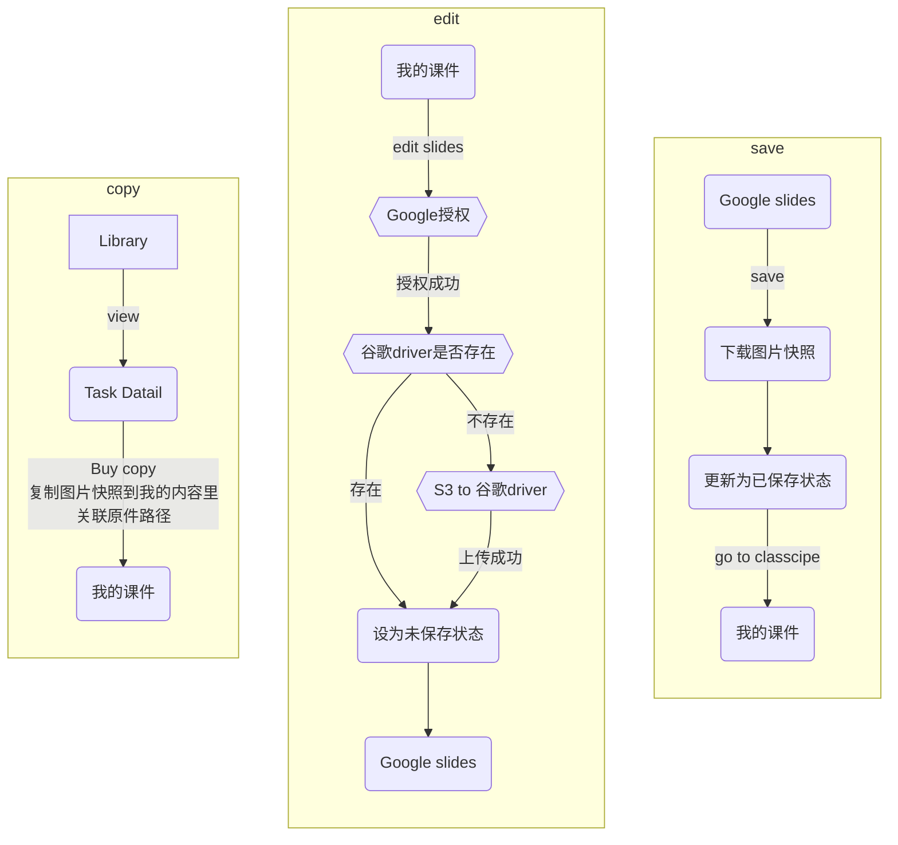
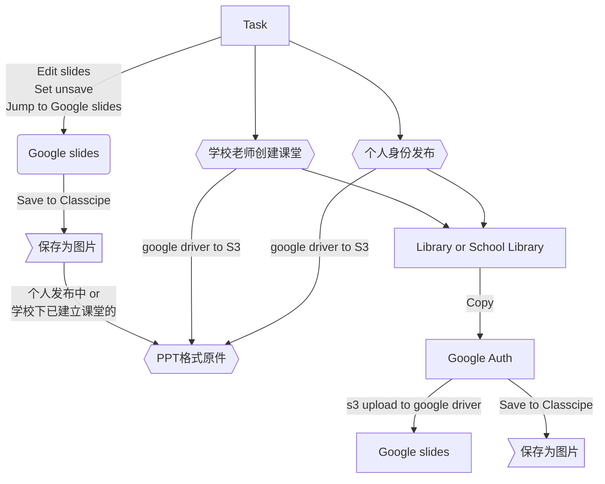
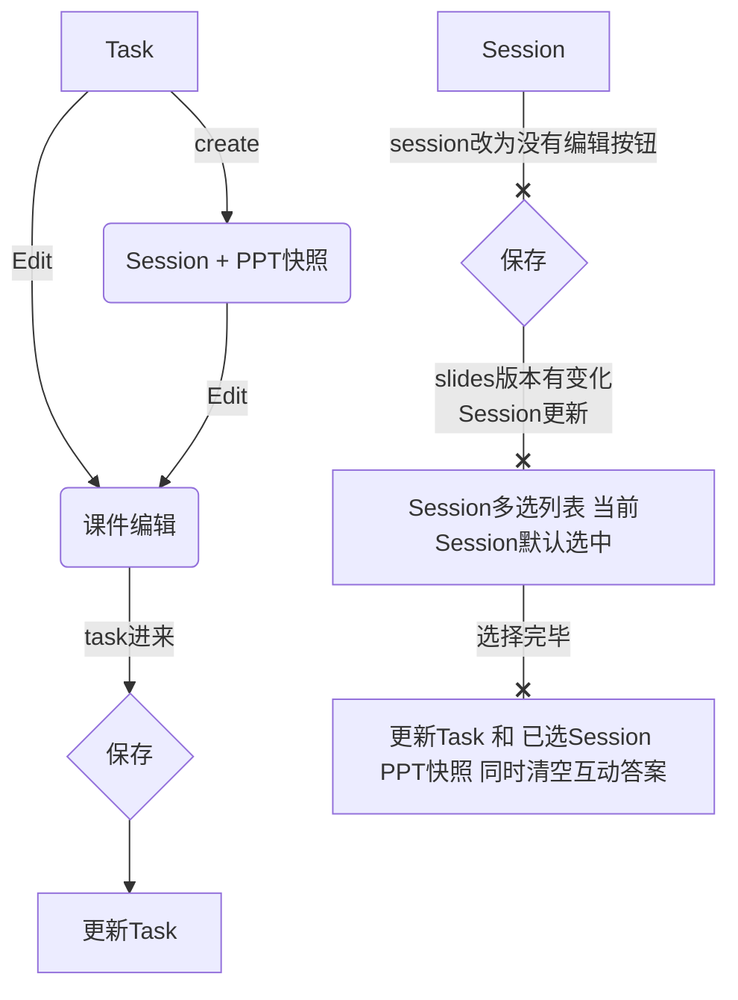
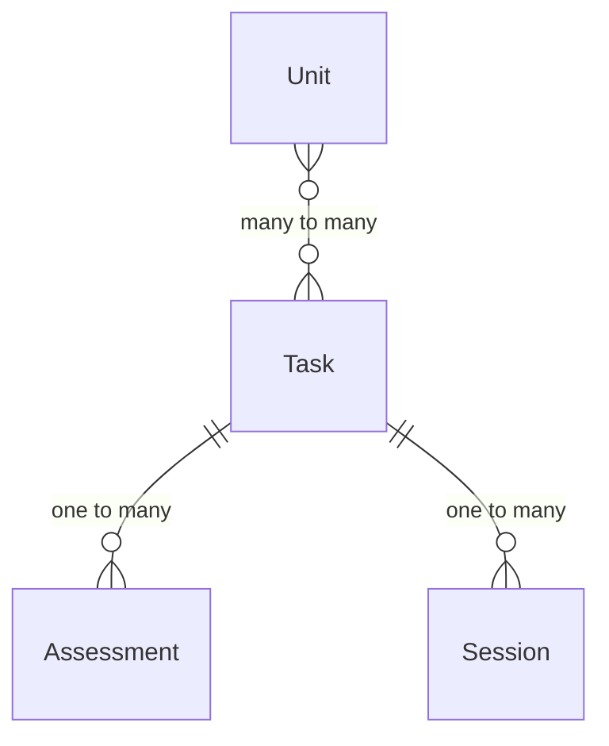

### Unit Plan

| 名称\关系 | UnitPlan | Task | Session | AssessmentTool | Video |
| :---  | :---  | :--  | :--: | :--: | :--: |
| UnitPlan | db | link | / | / | / | / |
| Task | link | db | snapshot | link | link |
| Session | / | snapshot | db | db | link |
| AssessmentTool | / | link | db | db | / |
| Video | / | link | link | / | S3 |

- 表单功能区别

| 功能\名称 | 免费套餐 | 个人套餐 | 个人高级 | 学校套餐 | 备注 | 后端接口判断 |
| :---  | :---  | :--  | :--: | :--: | :--: | :--: |
| 存储空间 | 1G | 5G | 10G | 1000G | 按学生计算出对应容量 可以额外增加 | Y |
| 公开课堂 | Y | Y | Y | Y |
| 班级课堂 | / | Y | Y | Y |
| 学生附件 | / | 100Mb | 100Mb | 200Mb | comment, mdeia题型下 音视频图片附件大小 | Y |
| 班级管理 | / | 10个 | 20个 | 不限 | | Y |
| 课堂评估 | / | Y | Y | Y |
| Feedback | / | Y | Y | Y |
| LockScreen | / | Y | Y | Y |
| 学生管理 | / | 300个 | 500个 | 2000个 |学校身份由收费的时候设置 | Y |
| 学生报告 | / | / | Y | Y |
| 课件下载 | / | / | Y | Y | 数据部分json存储，将所有附件都 打包为Zip，可以后期导入 |
| 出勤管理 | / | / | Y | Y |
| 老师管理 | / | / | Y | Y |
| Insight权限 | / | / | Y | Y |
| Co-design | Y | Y | Y | Y |
| 协同上课 | X | X | Y | Y |
| 直播 | Y | Y | Y | Y |
| 云端视频录制/剪辑 | X | Y | Y | Y |

- 课堂/插件功能区别

| 功能\名称 | 免费套餐 | 个人套餐 | 个人高级 | 学校套餐 | 备注 |
| :---  | :---  | :--  | :--: | :--: | :--: |
| 课堂数据保留 | 7天 | 3个月 | 1年 | 1年 | 需要根据保留时长计划任务删除 删除前一周，发邮件提醒和刺激升级 |
| 文本题型 | Y | Y | Y | Y |
| 选择题 | 单题 | 多题 | 多题 | 多题 |
| Web | Y | Y | Y | Y |
| Comment | Y | Y | Y | Y |
| Media | X | Y | Y | Y |
| 填充题 | X | Y | Y | Y |
| 配对题 | X | Y | Y | Y |
| 数学画图 | Y | Y | Y | Y |
| 画板 | X | 单人画板 | 多人画板 | 多人画板 |
| 虚拟实验室 | X | X | Y | Y |
| 全景画板 | X | X | Y | Y |
| 学生分组 | X | Y | Y | Y |
| 上课人数 | 10 | 25 | 50 | 可定制 | 超过人数不可进入 |

- 学校角色区别

| 功能\名称 | 学校老师 | 班主任 | 学科组长 | 学校管理员 | 备注 |
| :--- | :--: | :--: | :--: | :--: | :--: |
| 课件删除 | / | / | / | Y | 删除权限可配置 |
| Session删除 | / | / | / | Y | 删除权限可配置 |
| 课件下载 | / | / | / | Y | 数据部分json存储，将所有附件都打包为Zip，可以后期导入 |
| 发布公告 | / | 发布给该班级 关联所有老师 | 发布给自己 学科下老师 | 可发布给全校 任何老师 |
| Insight权限 | 只对自己教 的Unit做点评 | 只对自己教 的Unit做点评 | 该学科下所有 Unit做reflection 环节点评 | 全校所有 Unit做点评 | 前后端都要根据学校下的角色进行判断 |

> 付费老师、学校空间不够可以升级空间，单独计算费用和账单

### 存储空间计算
- 课件里的所有附件数据需要统计大小，计算在老师的空间上
- 课堂里学生产生的所有附件数据需要统计大小，都计算在开课老师的空间上
- 学校老师之间，共享学校总空间

### PPT原件

- PPT原件下载到S3的触发条件
  - 个人身份
    - 发布课件到library时
    - 已经发布的课件 点击save to classcipe 按钮
  - 学校身份
    - 给班级安排课程的时候
    - 已经安排过课程的课件 点击save to classcipe 按钮
  - 以上四个条件触发的时候都要从google driver下载ppt原件到S3
- 个人身份下的课件 导入复制到 学校身份下的课件后，之后的ppt更新维护都独立保存
- 特殊学校library 自动发布到 平台Library的处理
  - 学校身份下发布到 平台library的课件
    - 作者为 学校的logo + 学校名称
    - 付费收入归平台所有
  - 个人身份下已经发布的课件，学校下相同的课件不会自动发布

### PPT推荐
- 推荐规则
  - bloom难度同级以上
  - 大纲、标签、知识点相似
  - 老师编辑中按页推荐（付费）
  - 学生自学习可以按题目推荐（）

### Session保存  (弃用)
> Session无法跳转编辑

