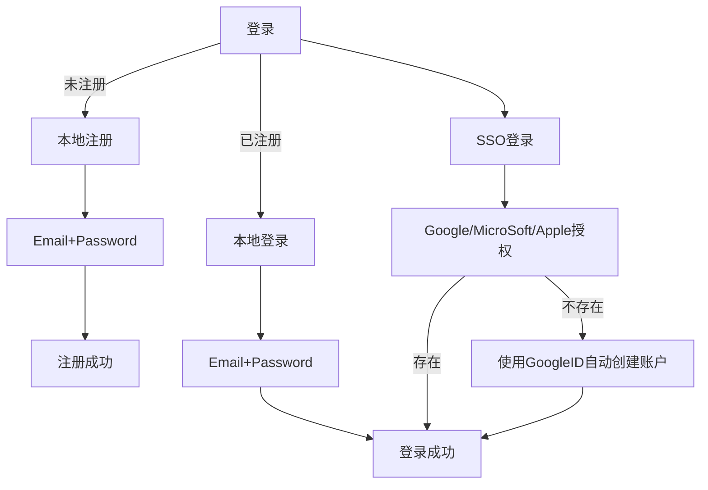
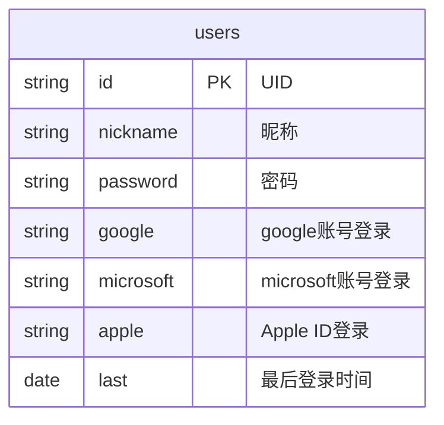

### 用户体系

| 名称 |  登录方式 | 存储 | Pay |  |
| :---  | :---  | :--  | :--: | :--: |
| Local | Email+Password | S3 | Credit (Visa/mastercard) | |
| google | Google Account | Google Driver | Google Pay | |
| microsoft | Microsoft Account | One Driver | | |
| apple | Apple Id |  | Apple Pay |  |

