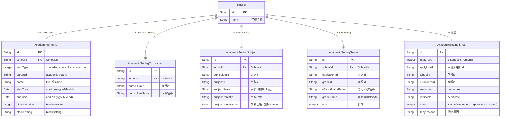

### academic setting UML

```mermaid
erDiagram

School {
  String id PK
  String name "学校名称"
}
School ||--||AcademicTermInfo : "Add Year/Term"
AcademicTermInfo{
  String id PK
  String schoolId FK "School.id"
  Integer termType "1:academic year;2:academic term"
  String parentId "academic year id"
  String name "title 或 name"
  Date startTime "start on (yyyy-MM-dd)"
  Date endTime "end on (yyyy-MM-dd)"
  Integer blockDuration "blockDuration"
  String blockSetting "blockSetting"
}

School ||--||AcademicSettingCurriculum : "Curriculum Setting"
AcademicSettingCurriculum{
  String id PK
  String schoolId FK "School.id"
  String curriculumId "大纲id"
  String curriculumName "大纲名称"
}

School ||--||AcademicSettingSubject : "Subject Setting"
AcademicSettingSubject{
  String id PK
  String schoolId FK "School.id"
  String curriculumId "大纲id"
  String subjectId "学科id"
  String subjectName "学科（如Biology）"
  String subjectParentId "学科上级"
  String subjectParentName "学科上级（如Science）"
}

School ||--||AcademicSettingGrade : "Grade Setting"
AcademicSettingGrade{
  String id PK
  String schoolId FK "School.id"
  String curriculumId "大纲id"
  String gradeId "年级id"
  String officialGradeName "官方年级名称"
  String gradeName "自定义年级名称"
  Integer sort "排序"
}

School ||--||AcademicSettingIbAuth : "IB 授权"
AcademicSettingIbAuth{
  String id PK
  Integer applyType "1:School/2:Personal"
  String applyUserId "申请人用户id"
  String schoolId "学校id"
  String curriculumId "大纲id"
  String resources "resources"
  String certificate "certificate"
  Integer status "Status(1:Pending/2:Approved/3:Denied)"
  String denyReason "拒绝原因"
}

```
