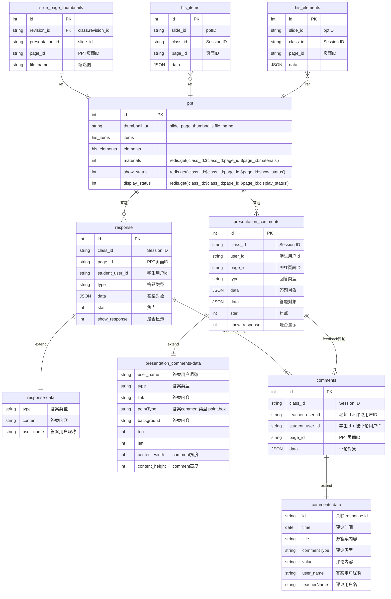

### 答题UML

```mermaid
erDiagram

ppt {
  int id PK
  string thumbnail_url "slide_page_thumbnails.file_name"
  his_items items ""
  his_elements elements ""
  int materials "redis.get('class_id:$class_id:page_id:$page_id:materials')"
  int show_status "redis.get('class_id:$class_id:page_id:$page_id:show_status')"
  int display_status "redis.get('class_id:$class_id:page_id:$page_id:display_status')"
}
slide_page_thumbnails ||--|| ppt : "ref"
slide_page_thumbnails {
  int id PK
  string revision_id FK "class.revision_id"
  string presentation_id "slide_id"
  string page_id  "PPT页面ID"
  string file_name "缩略图"
}
his_items }o--|| ppt : "ref"
his_items {
  int id PK
  string slide_id "pptID"
  string class_id "Session ID"
  string page_id "页面ID"
  JSON data
}
his_elements }o--|| ppt  : "ref"
his_elements{
  int id PK
  string slide_id "pptID"
  string class_id "Session ID"
  string page_id "页面ID"
  JSON data
}

ppt ||--o{ response  : "答题"
response{
  int id PK
  string class_id "Session ID"
  string page_id "PPT页面ID"
  string student_user_id "学生用户id"
  string type "答题类型"
  JSON data "答案对象"
  int star "焦点"
  int show_response "是否显示"
}
response ||--|| response-data : "extend"
response-data{
  string type "答案类型"
  string content "答案内容"
  string user_name "答案用户昵称"
}

ppt ||--o{ presentation_comments : "答题"
presentation_comments{
  int id PK
  string class_id "Session ID"
  string user_id "学生用户id"
  string page_id "PPT页面ID"
  string type "回答类型"
  JSON data "答题对象"
  JSON data "答题对象"
  int star "焦点"
  int show_response "是否显示"
}

presentation_comments ||--|| presentation_comments-data  : "extend"
presentation_comments-data{
  string user_name "答案用户昵称"
  string type "答案类型"
  string link "答案内容"
  string pointType "答案comment类型 point,box"
  string background "答案内容"
  int top
  int left
  int content_width "comment宽度"
  int content_height "comment高度"
}

response ||--|{ comments  : "feedback评论"
presentation_comments ||--|{ comments  : "feedback评论"
comments{
  int id PK
  string class_id           "Session ID"
  string teacher_user_id    "老师id > 评论用户ID"
  string student_user_id    "学生id > 被评论用户ID"
  string page_id  "PPT页面ID"
  JSON data  "评论对象"
}

comments ||--|| comments-data  : "extend"
comments-data{
  string id  "关联 response.id"
  date time  "评论时间"
  string title       "源答案内容"
  string commentType "评论类型"
  string value       "评论内容"
  string user_name   "答案用户昵称"
  string teacherName "评论用户名"
}

```