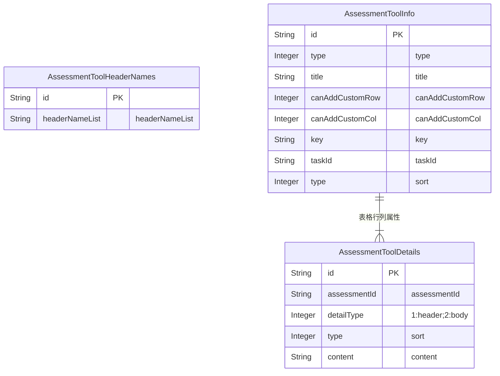

### AssessmentTool UML

```mermaid
erDiagram

AssessmentToolHeaderNames {
  String id PK
  String headerNameList "headerNameList"
}

AssessmentToolInfo{
  String id PK
  Integer type "type"
  String title "title"
  Integer canAddCustomRow "canAddCustomRow"
  Integer canAddCustomCol "canAddCustomCol"
  String key "key"
  String taskId "taskId"
  Integer type "sort"
}

AssessmentToolInfo ||--|{AssessmentToolDetails : "表格行列属性"
AssessmentToolDetails{
  String id PK
  String assessmentId "assessmentId"
  Integer detailType "1:header;2:body"
  Integer type "sort"
  String content "content"
}

```
