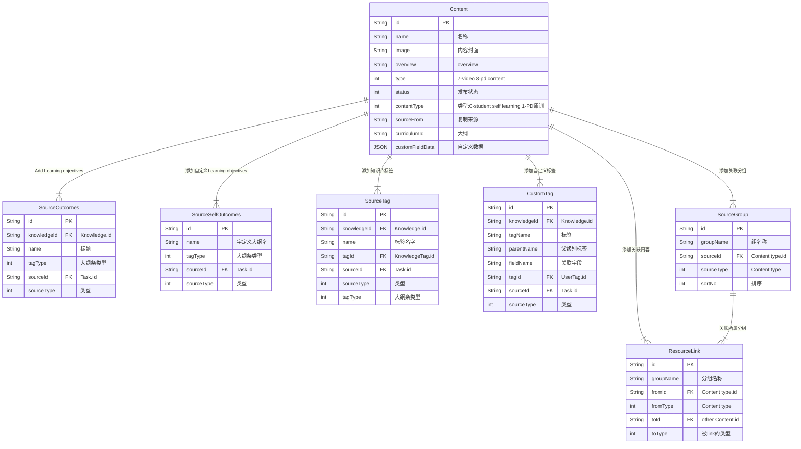

### Task UML

```mermaid
erDiagram

Content {
    String id PK
    String name "名称"
    String image "内容封面"
    String overview "overview"
    int type "7-video 8-pd content"
    int status "发布状态"
    int contentType "类型:0-student self learning 1-PD师训"
    String sourceFrom "复制来源"
    String curriculumId "大纲"
    JSON customFieldData "自定义数据"
}
Content ||--|{SourceOutcomes : "Add Learning objectives"
Content ||--|{SourceSelfOutcomes : "添加自定义Learning objectives"
Content ||--|{SourceTag : "添加知识点标签"
Content ||--|{CustomTag : "添加自定义标签"


SourceOutcomes{
    String id PK
    String knowledgeId FK "Knowledge.id"
    String name "标题"
    int tagType "大纲条类型"
    String sourceId FK "Task.id"
    int sourceType  "类型"
}
SourceSelfOutcomes{
   String id PK
    String name "字定义大纲名"
    int tagType "大纲条类型"
    String sourceId FK "Task.id"
    int sourceType  "类型"
}
SourceTag{
    String id PK
    String knowledgeId FK "Knowledge.id"
    String name "标签名字"
    String tagId FK "KnowledgeTag.id"
    String sourceId FK "Task.id"
    int sourceType  "类型"
    int tagType "大纲条类型"
}

CustomTag {
    String id PK
    String knowledgeId FK "Knowledge.id"
    String tagName "标签"
    String parentName "父级别标签"
    String fieldName "关联字段"
    String tagId FK "UserTag.id"
    String sourceId FK "Task.id"
    int sourceType  "类型"
}

Content ||--|{ResourceLink : "添加关联内容"
Content ||--|{SourceGroup : "添加关联分组"
SourceGroup ||--|{ResourceLink : "关联所属分组"

ResourceLink {
    String id PK
    String groupName "分组名称"
    String fromId FK "Content type.id"
    int fromType  "Content type"
    String toId FK "other Content.id"
    int toType  "被link的类型"
}

SourceGroup {
    String id PK
    String groupName "组名称"
    String sourceId FK "Content type.id"
    int sourceType  "Content type"
    int sortNo "排序"
}

```
