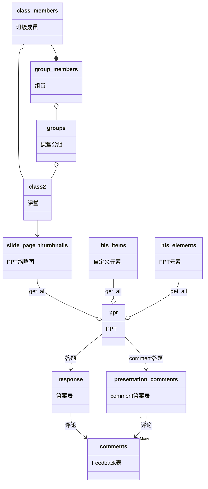

### 答题UML

```mermaid
classDiagram

group_members o-- groups : 
class_members --* group_members : 
class_members o-- class2 : 
groups o-- class2 : 
class2 -->  slide_page_thumbnails : 
slide_page_thumbnails --o  ppt : get_all
his_items --o  ppt : get_all
his_elements --o  ppt : get_all
ppt -->  response : 答题
ppt -->  presentation_comments : comment答题
response -->  comments: 评论
presentation_comments "1" --> "Many"  comments: 评论

class groups{ 课堂分组 }
class group_members{ 组员 }
class class2{ 课堂 }
class class_members{ 班级成员 }
class ppt{ PPT }
class slide_page_thumbnails{ PPT缩略图 }
class his_items~~{ 自定义元素 }
class his_elements{ PPT元素 }
class presentation_comments{ comment答案表 }
class response{ 答案表 }
class comments{ Feedback表 }


```
