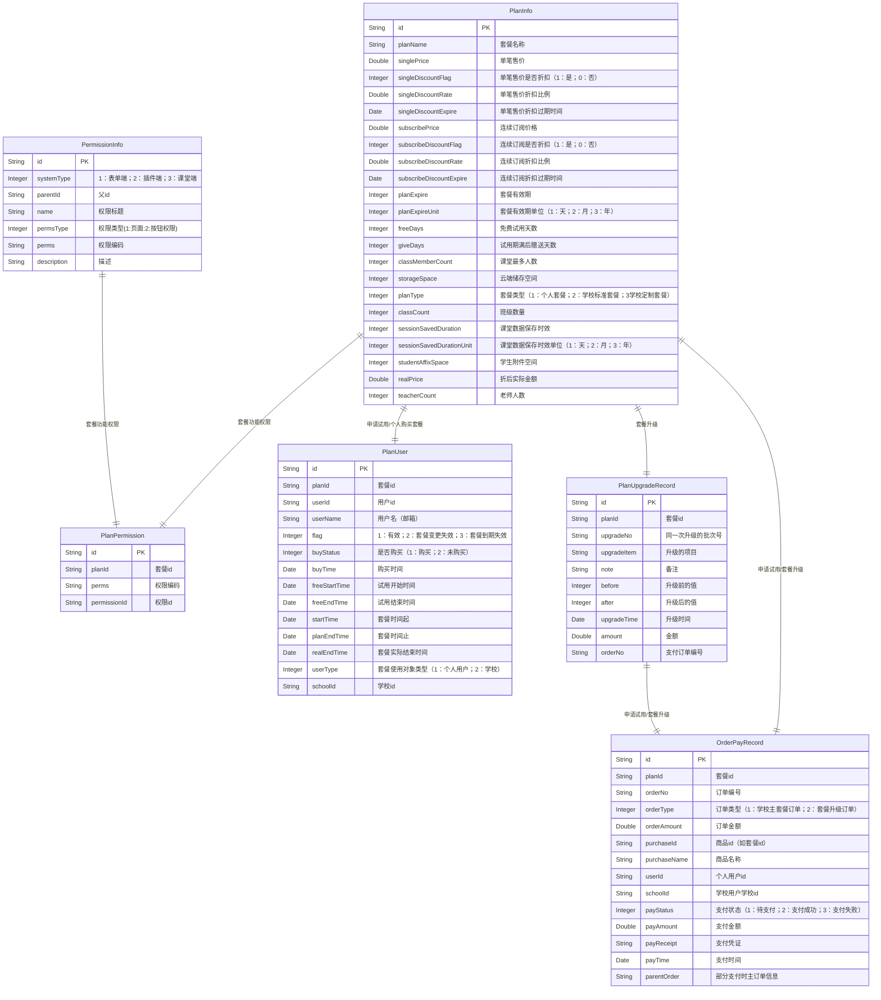

### 套餐 UML

```mermaid
erDiagram

PlanInfo {
  String id PK
  String planName "套餐名称"
  Double singlePrice "单笔售价"
  Integer singleDiscountFlag "单笔售价是否折扣（1：是；0：否）"
  Double singleDiscountRate "单笔售价折扣比例"
  Date singleDiscountExpire "单笔售价折扣过期时间"
  Double subscribePrice "连续订阅价格"
  Integer subscribeDiscountFlag "连续订阅是否折扣（1：是；0：否）"
  Double subscribeDiscountRate "连续订阅折扣比例"
  Date subscribeDiscountExpire "连续订阅折扣过期时间"
  Integer planExpire "套餐有效期"
  Integer planExpireUnit "套餐有效期单位（1：天；2：月；3：年）"
  Integer freeDays "免费试用天数"
  Integer giveDays "试用期满后赠送天数"
  Integer classMemberCount "课堂最多人数"
  Integer storageSpace "云端储存空间"
  Integer planType "套餐类型（1：个人套餐；2：学校标准套餐；3学校定制套餐）"
  Integer classCount "班级数量"
  Integer sessionSavedDuration "课堂数据保存时效"
  Integer sessionSavedDurationUnit "课堂数据保存时效单位（1：天；2：月；3：年）"
  Integer studentAffixSpace "学生附件空间"
  Double realPrice "折后实际金额"
  Integer teacherCount "老师人数"
}


PermissionInfo {
  String id PK
  Integer systemType "1：表单端；2：插件端；3：课堂端"
  String parentId "父id"
  String name "权限标题"
  Integer permsType "权限类型(1:页面:2:按钮权限)"
  String perms "权限编码"
  String description "描述"
}


PlanInfo ||--||PlanPermission : "套餐功能权限"
PermissionInfo ||--||PlanPermission : "套餐功能权限"

PlanPermission{
  String id PK
  String planId "套餐id"
  String perms "权限编码"
  String permissionId "权限id"
}


PlanInfo ||--||PlanUser : "申请试用/个人购买套餐"
PlanUser{
  String id PK
  String planId "套餐id"
  String userId "用户id"
  String userName "用户名（邮箱）"
  Integer flag "1：有效；2：套餐变更失效；3：套餐到期失效"
  Integer buyStatus "是否购买（1：购买；2：未购买）"
  Date buyTime "购买时间"
  Date freeStartTime "试用开始时间"
  Date freeEndTime "试用结束时间"
  Date startTime "套餐时间起"
  Date planEndTime "套餐时间止"
  Date realEndTime "套餐实际结束时间"
  Integer userType "套餐使用对象类型（1：个人用户；2：学校）"
  String schoolId "学校id"
}


PlanInfo ||--||PlanUpgradeRecord : "套餐升级"
PlanUpgradeRecord{
  String id PK
  String planId "套餐id"
  String upgradeNo "同一次升级的批次号"
  String upgradeItem "升级的项目"
  String note "备注"
  Integer before "升级前的值"
  Integer after "升级后的值"
  Date upgradeTime "升级时间"
  Double amount "金额"
  String orderNo "支付订单编号"

}


PlanInfo ||--||OrderPayRecord : "申请试用/套餐升级"
PlanUpgradeRecord ||--||OrderPayRecord : "申请试用/套餐升级"
OrderPayRecord{
  String id PK
  String planId "套餐id"
  String orderNo "订单编号"
  Integer orderType "订单类型（1：学校主套餐订单；2：套餐升级订单）"
  Double orderAmount "订单金额"
  String purchaseId "商品id（如套餐id）"
  String purchaseName "商品名称"
  String userId "个人用户id"
  String schoolId "学校用户学校id"
  Integer payStatus "支付状态（1：待支付；2：支付成功；3：支付失败）"
  Double payAmount "支付金额"
  String payReceipt "支付凭证"
  Date payTime "支付时间"
  String parentOrder "部分支付时主订单信息"
}


```
