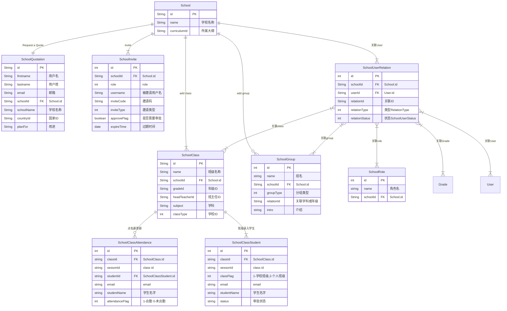

### 学校 UML

```mermaid
erDiagram

School {
  String id PK
  String name "学校名称"
  String curriculumId "所属大纲"
}
School ||--||SchoolQuotation : "Request a Quote"
SchoolQuotation{
  String id PK
  String firstname "用戶名"
  String lastname "用户姓"
  String email "邮箱"
  String schoolId FK "School.id"
  String schoolName "学校名称"
  String countryId "国家ID"
  String planFor "用途"
}
SchoolInvite{
 int id PK
 String schoolId FK "School.id"
 int role "role"
 String username "被邀请用户名"
 String inviteCode "邀请码"
 int inviteType "邀请类型"
 boolean approveFlag "是否需要审批"
 date expireTime "过期时间"
}
School ||--|{SchoolInvite : "invite"
School ||--|{SchoolClass : "add class"
School ||--|{SchoolUserRelation : "关联User"
SchoolClass{
   String id PK
   String name "班级名称"
   String schoolId FK "School.id"
   String gradeId "年级ID"
   String headTeacherId "班主任ID"
   String subject "学科"
   int classType "学校ID"
}
  
SchoolClass ||--o{ SchoolClassAttendance : "点名册更新"
SchoolClassAttendance {
  int id PK
  string classId FK "SchoolClass.id"
  string sessonId "class id"
  string studentId  FK "SchoolClassStudent.id"
  string email "email"
  string studentName "学生名字"
  int attendanceFlag "1-出勤 0-未出勤"
}

SchoolClass ||--|{ SchoolClassStudent : "班级录入学生"
SchoolClassStudent{
  int id PK
  string classId FK "SchoolClass.id"
  string sessonId "class id"
  int classFlag  "1-学校班级,2-个人班级"
  string email "email"
  string studentName "学生名字"
  string status "审批状态"
}
School ||--o{SchoolGroup : "add group"
SchoolGroup{
  int id PK
  string name "组名"
  String schoolId FK "School.id"
  int groupType  "分组类型"
  String relationId "关联学科或年级"
  string intro "介绍"
}

SchoolRole{
  int id PK
  string name "角色名"
  String schoolId FK "School.id"
}

SchoolUserRelation{
  int id PK
  String schoolId FK "School.id"
  String userId FK "User.id"
  String relationId "关联ID"
  int relationType "类型RelationType"
  int relationStatus "状态SchoolUserStatus "
}
SchoolUserRelation |{--|{SchoolRole : "关联role"
SchoolUserRelation |{--|{SchoolGroup : "关联group"
SchoolUserRelation |{--|{SchoolClass : "关联class"
SchoolUserRelation |{--|{Grade : "关联Grade"
SchoolUserRelation |{--|{User : "关联User"


```
