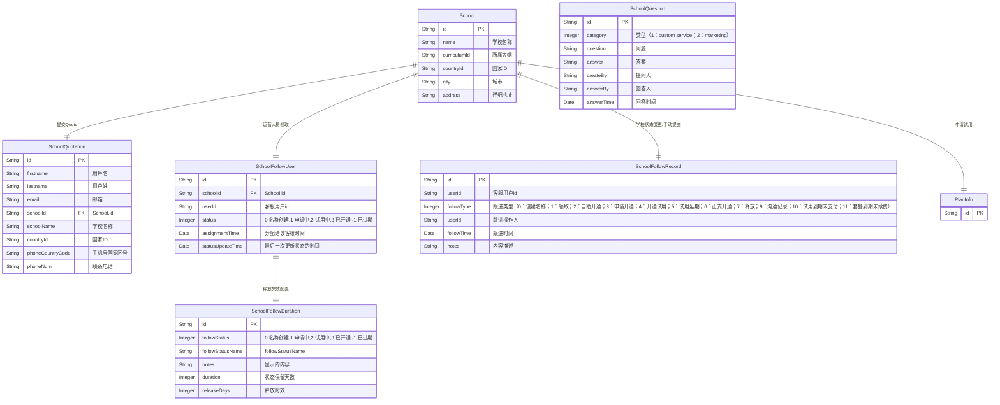

### 学校运营 UML

```mermaid
erDiagram

School {
  String id PK
  String name "学校名称"
  String curriculumId "所属大纲"
  String countryId "国家ID"
  String city "城市"
  String address "详细地址"
}
School ||--||SchoolQuotation : "提交Quote"
SchoolQuotation{
  String id PK
  String firstname "用戶名"
  String lastname "用户姓"
  String email "邮箱"
  String schoolId FK "School.id"
  String schoolName "学校名称"
  String countryId "国家ID"
  String phoneCountryCode "手机号国家区号"
  String phoneNum "联系电话"
}


School ||--||SchoolFollowUser : "运营人员领取"
SchoolFollowUser{
  String id PK
  String schoolId FK "School.id"
  String userId "客服用户id"
  Integer status "0 名称创建,1 申请中,2 试用中,3 已开通,-1 已过期"
  Date assignmentTime "分配给该客服时间"
  Date statusUpdateTime "最后一次更新状态的时间"
}


School ||--||SchoolFollowRecord : "学校状态变更/手动提交"
SchoolFollowRecord {
  String id PK
  String userId "客服用户id"
  Integer followType "跟进类型（0：创建名称；1：领取；2：自助开通；3：申请开通；4：开通试用；5：试用延期；6：正式开通；7：释放；9：沟通记录；10：试用到期未支付；11：套餐到期未续费）"
  String userId "跟进操作人"
  Date followTime "跟进时间"
  String notes "内容描述"
}


SchoolFollowUser ||--||SchoolFollowDuration : "释放失效配置"
SchoolFollowDuration {
  String id PK
  Integer followStatus "0 名称创建,1 申请中,2 试用中,3 已开通,-1 已过期"
  String followStatusName "followStatusName"
  String notes "显示的内容"
  Integer duration "状态保留天数"
  Integer releaseDays "释放时效"
}


School ||--||PlanInfo : "申请试用"
PlanInfo {
  String id PK
}


SchoolQuestion {
  String id PK
  Integer category "类型（1：custom service；2：marketing）"
  String question "问题"
  String answer "答案"
  String createBy "提问人"
  String answerBy "回答人"
  Date answerTime "回答时间"
}

```
