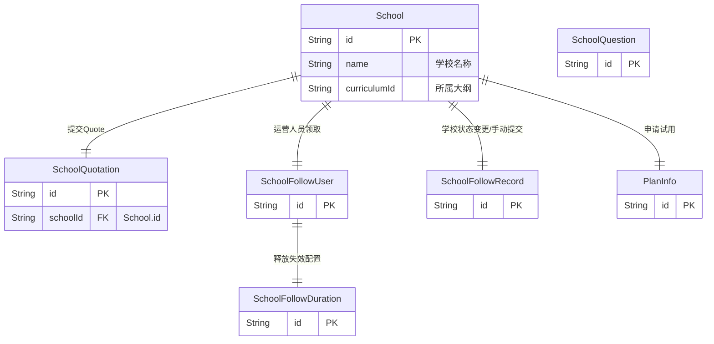

### 学校运营 UML

```mermaid
erDiagram

School {
  String id PK
  String name "学校名称"
  String curriculumId "所属大纲"
}
School ||--||SchoolQuotation : "提交Quote"
SchoolQuotation{
  String id PK
  String schoolId FK "School.id"
}


School ||--||SchoolFollowUser : "运营人员领取"
SchoolFollowUser{
  String id PK
}


School ||--||SchoolFollowRecord : "学校状态变更/手动提交"
SchoolFollowRecord {
  String id PK
}


SchoolFollowUser ||--||SchoolFollowDuration : "释放失效配置"
SchoolFollowDuration {
  String id PK
}


School ||--||PlanInfo : "申请试用"
PlanInfo {
  String id PK
}


SchoolQuestion {
  String id PK
}

```
