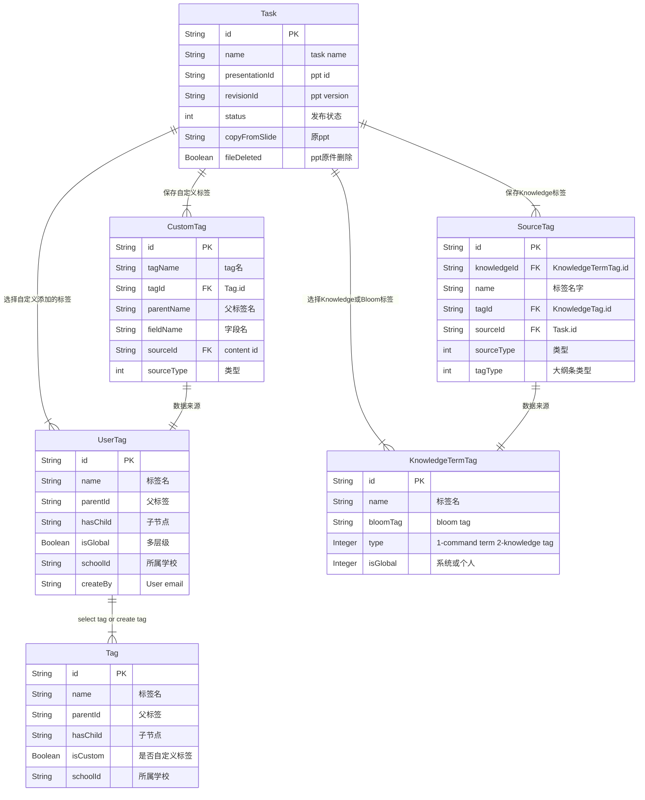

### Tag UML

```mermaid
erDiagram

Task {
  String id PK
  String name "task name"
  String presentationId "ppt id"
  String revisionId "ppt version"
  int status "发布状态"
  String copyFromSlide "原ppt"
  Boolean fileDeleted "ppt原件删除"
}

Tag {
    String id PK
    String name "标签名"
    String parentId "父标签"
    String hasChild "子节点"
    Boolean isCustom "是否自定义标签"
   	String schoolId "所属学校"
}


UserTag {
    String id PK
    String name "标签名"
    String parentId "父标签"
    String hasChild "子节点"
    Boolean isGlobal "多层级"
   	String schoolId "所属学校"
   	String createBy "User email"
}

Task ||--|{ CustomTag : "保存自定义标签"
Task ||--|{ SourceTag : "保存Knowledge标签"
Task ||--|{ KnowledgeTermTag : "选择Knowledge或Bloom标签"
Task ||--|{ UserTag : "选择自定义添加的标签"

UserTag ||--|{ Tag : "select tag or create tag"

CustomTag {
    String id PK
    String tagName "tag名"
    String tagId FK "Tag.id"
    String parentName "父标签名"
    String fieldName "字段名"
 	String sourceId FK "content id"
    int sourceType  "类型"
}

CustomTag ||--|| UserTag : "数据来源"

SourceTag {
    String id PK
    String knowledgeId FK "KnowledgeTermTag.id"
    String name "标签名字"
    String tagId FK "KnowledgeTag.id"
    String sourceId FK "Task.id"
    int sourceType  "类型"
    int tagType "大纲条类型"
}
SourceTag ||--|| KnowledgeTermTag : "数据来源"

KnowledgeTermTag{
 	String id PK
    String name "标签名"
    String bloomTag "bloom tag"
    Integer type "1-command term 2-knowledge tag"
    Integer isGlobal "系统或个人"
}


```
