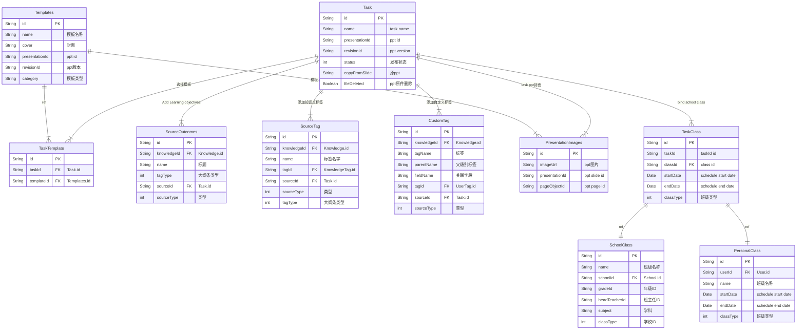

### Task UML

```mermaid
erDiagram

Task {
    String id PK
    String name "task name"
    String presentationId "ppt id"
    String revisionId "ppt version"
    int status "发布状态"
    String copyFromSlide "原ppt"
    Boolean fileDeleted "ppt原件删除"
}
Task ||--|{TaskTemplate : "选择模板"
Task ||--|{SourceOutcomes : "Add Learning objectives"
Task ||--|{SourceTag : "添加知识点标签"
Task ||--|{CustomTag : "添加自定义标签"
Task ||--|{PresentationImages : "task ppt封面"
TaskTemplate{
     String id PK
     String taskId FK "Task.id"
     String templateId FK "Templates.id"
}
Templates ||--|{TaskTemplate : "ref"
Templates{
     String id PK
     String name  "模板名称"
     String cover "封面"
     String presentationId "ppt id"
     String revisionId "ppt版本"
     String category "模板类型"
}
Templates ||--|{PresentationImages : "模板 ppt封面"
SourceOutcomes{
    String id PK
    String knowledgeId FK "Knowledge.id"
    String name "标题"
    int tagType "大纲条类型"
    String sourceId FK "Task.id"
    int sourceType  "类型"
}
SourceTag{
    String id PK
    String knowledgeId FK "Knowledge.id"
    String name "标签名字"
    String tagId FK "KnowledgeTag.id"
    String sourceId FK "Task.id"
    int sourceType  "类型"
    int tagType "大纲条类型"
}
PresentationImages{
 String id PK
 String imageUrl "ppt图片"
 String presentationId "ppt slide id"
 String pageObjectId "ppt page id"
}

CustomTag {
    String id PK
    String knowledgeId FK "Knowledge.id"
    String tagName "标签"
    String parentName "父级别标签"
    String fieldName "关联字段"
    String tagId FK "UserTag.id"
    String sourceId FK "Task.id"
    int sourceType  "类型"
}
Task ||--|{TaskClass : "bind school class"
TaskClass{
    String id PK
    String taskId "taskId id"
    String classId FK "class id"
    Date startDate "schedule start date"
    Date endDate "schedule end date"
    int classType "班级类型"
}
TaskClass ||--||SchoolClass : "ref"
TaskClass ||--||PersonalClass : "ref"
PersonalClass{
    String id PK
    String userId FK "User.id"
    String name "班级名称"
    Date startDate "schedule start date"
    Date endDate "schedule end date"
    int classType "班级类型"
}
SchoolClass{
    String id PK
    String name "班级名称"
    String schoolId FK "School.id"
    String gradeId "年级ID"
    String headTeacherId "班主任ID"
    String subject "学科"
    int classType "学校ID"
}

```
