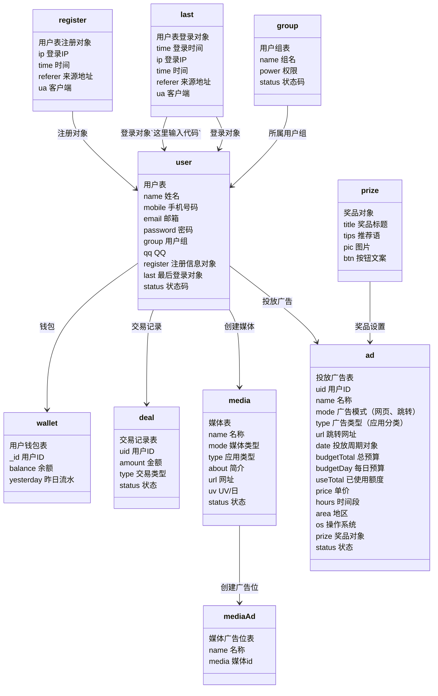

### 答题UML

```mermaid
classDiagram
register -->  user : 注册对象
last -->  user : 登录对象`这里输入代码`
group -->  user: 所属用户组
user -->  wallet: 钱包
user --> deal: 交易记录
user --> media : 创建媒体
media -->  mediaAd : 创建广告位
last -->  user : 登录对象
user -->  ad : 投放广告
prize -->  ad : 奖品设置

group : 用户组表
group : name    组名
group : power   权限
group : status  状态码

user : 用户表
user : name     姓名
user : mobile   手机号码
user : email    邮箱
user : password 密码
user : group    用户组
user : qq       QQ
user : register 注册信息对象
user : last     最后登录对象
user : status   状态码

wallet : 用户钱包表
wallet : _id 用户ID
wallet : balance 余额
wallet : yesterday 昨日流水

deal : 交易记录表
deal : uid 用户ID
deal : amount 金额
deal : type   交易类型
deal : status 状态

register : 用户表注册对象
register : ip       登录IP
register : time     时间
register : referer  来源地址
register : ua       客户端

last : 用户表登录对象
last : time     登录时间
last : ip       登录IP
last : time     时间
last : referer  来源地址
last : ua       客户端

ad : 投放广告表
ad : uid    用户ID
ad : name   名称
ad : mode   广告模式（网页、跳转）
ad : type   广告类型（应用分类）
ad : url    跳转网址
ad : date   投放周期对象
ad : budgetTotal  总预算
ad : budgetDay    每日预算
ad : useTotal     已使用额度
ad : price  单价
ad : hours  时间段
ad : area   地区
ad : os     操作系统
ad : prize  奖品对象
ad : status 状态

prize : 奖品对象
prize : title 奖品标题
prize : tips  推荐语
prize : pic   图片
prize : btn   按钮文案

media : 媒体表
media : name    名称
media : mode    媒体类型
media : type    应用类型
media : about   简介
media : url     网址
media : uv      UV/日
media : status  状态

mediaAd : 媒体广告位表
mediaAd : name  名称
mediaAd : media 媒体id


```
